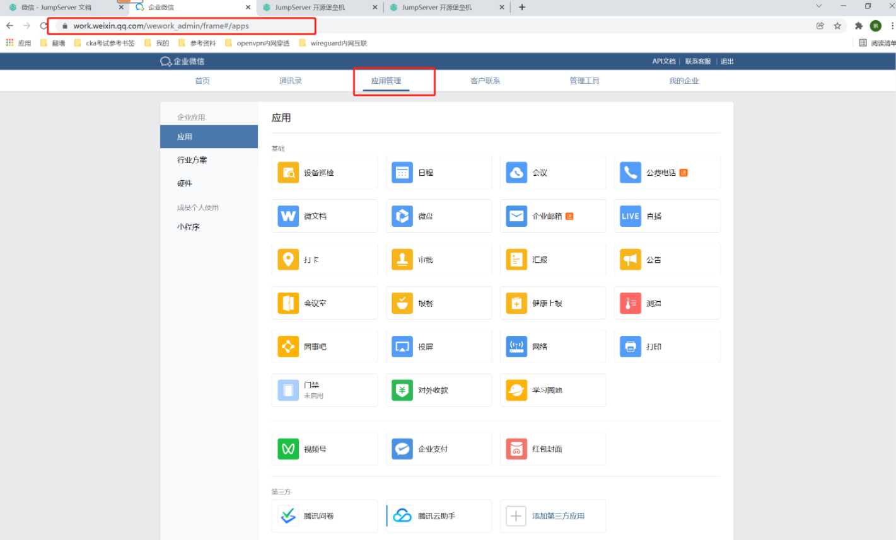
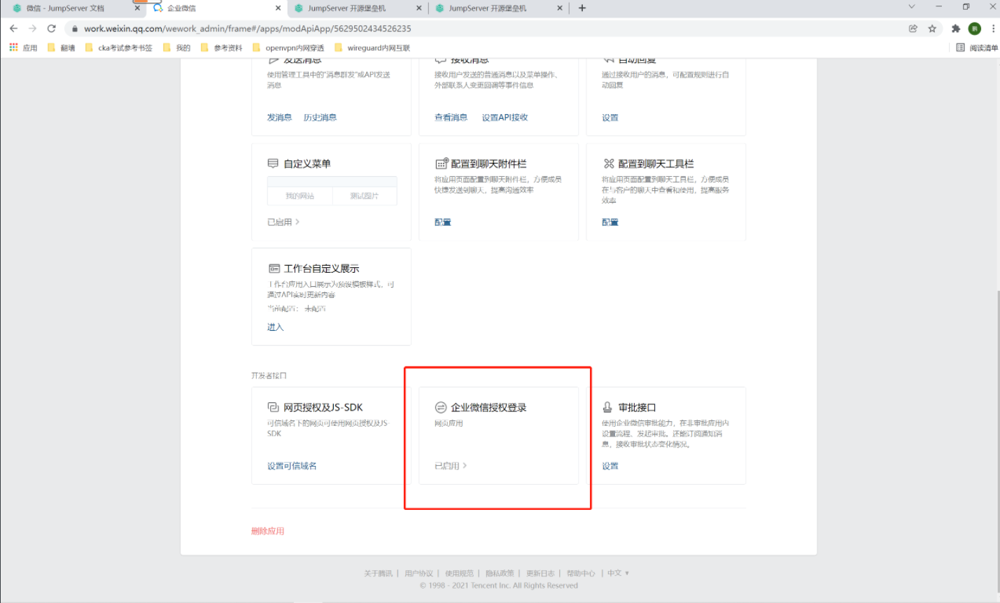
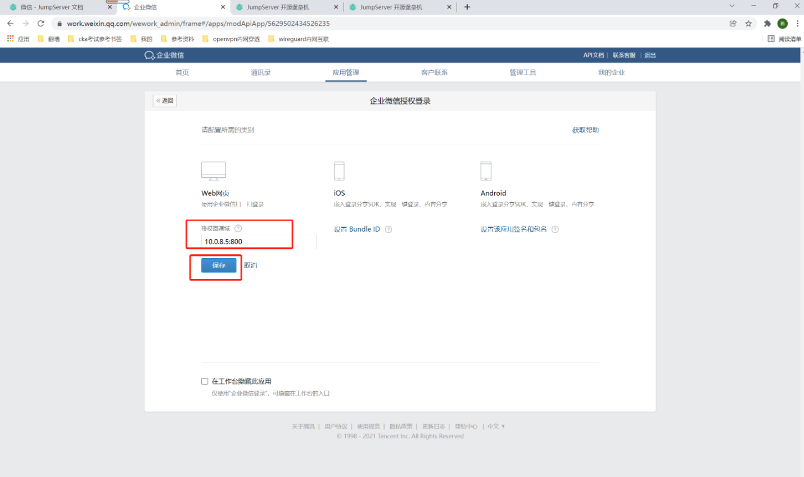
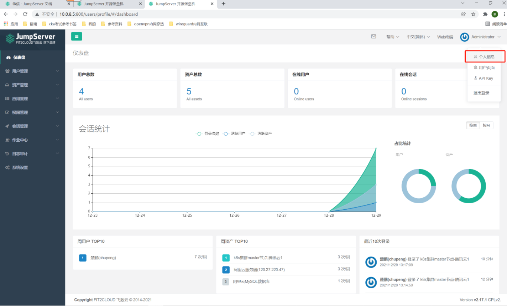
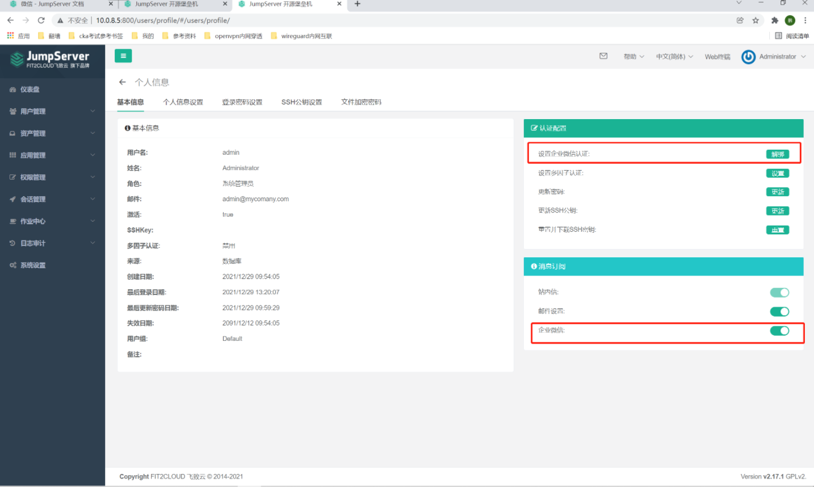

##1. 企业微信后台设置
```shell
# 登录企业微信后台设置
# 点击应用管理，找到jumpserver
```



```shell
# 点击企业微信授权登录
```


```shell
# 在web网页下，输入授权回调域：10.0.8.5:800 （内网IP：端口，只允许登录openvpn后才能访问！）
# 点击保存
```


##2. jumpserver设置
```shell
# 登录后，在右上角点击自己名字，下拉列表中点击个人信息！
```


```shell
# 在右侧设置企业微信认证，点击右侧的绑定
# 下面的订阅消息也可以设置上！
```


```shell
# 使用手机的企业微信扫描弹出的二维码即可！！！！
```