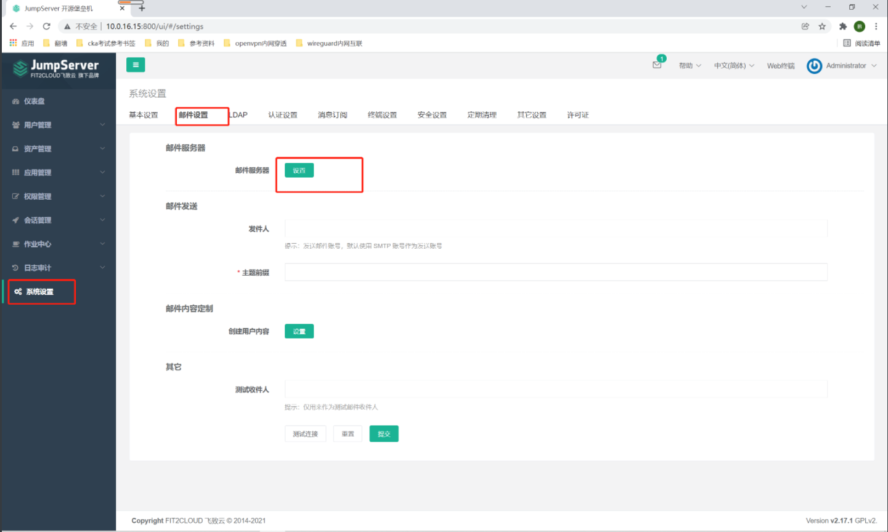
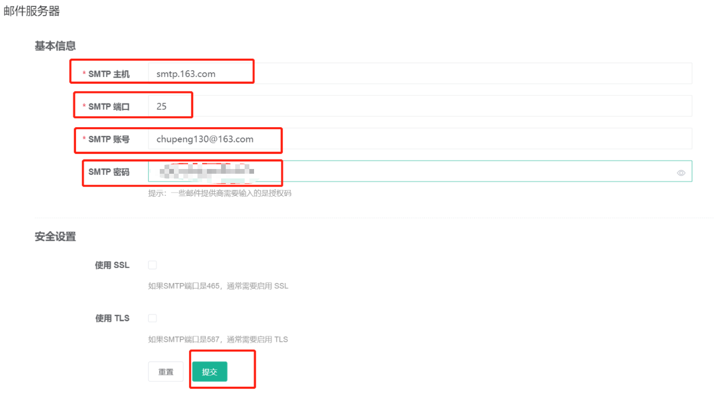
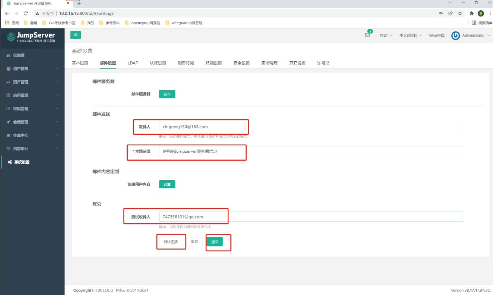
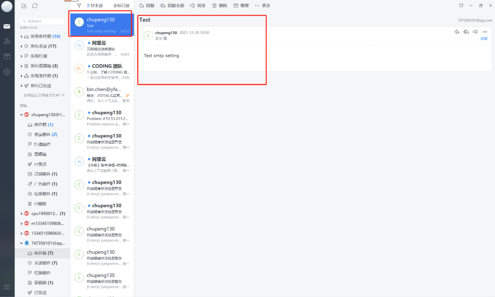

##1.邮箱服务器设置
```shell
#### 1.邮箱服务器设置
```


```shell
#1. stmp主机：smtp.163.com
#2. smtp端口：25
#3. smtp账号：chupeng130@163.com
#4. smtp密码： #邮箱授权码
```

##2. 测试邮件连接
```shell
#1. 发件人： chupeng130@163.com
#2. 主题前缀：楚鹏的jumpserver服务器信息
#3. 测试收件人：747356101@qq.com
#4. 点击测试连接
```


```shell
# 收到邮件，说明没问题
# 点击提交即可！
```

