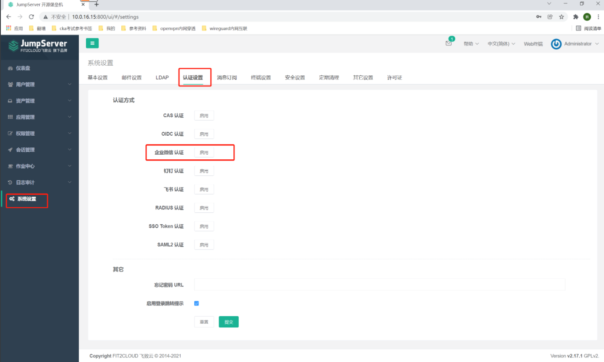
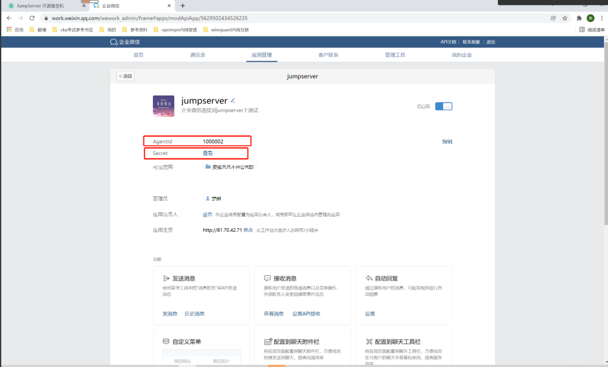
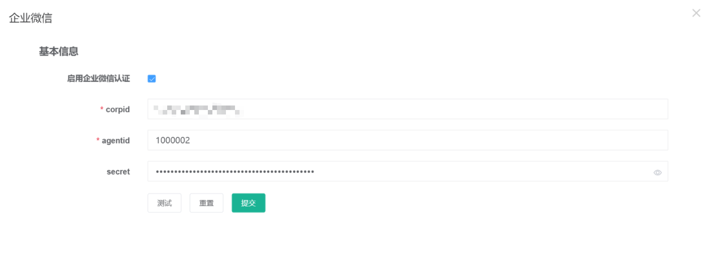

##1. 启用企业认证
```shell
# 点击认证设置，在企业微信认证后面点击启用
# 需要3个信息
```

##2. 查看相关信息
```shell
# 登录企业微信网页版后台，点击应用管理，找到jumpserver，然后查看agentid和secret
#1. agentid： 1000002

# 手机端登录企业微信查看secret
#2. secret：
```

```shell
# 点击我的企业，在下方可以看到企业id
# 企业ID： ww934ca669c395d3ec
```
##3. 填写企业微信认证信息
```shell
corpid：
agentid：1000002
secret：
# 点击测试，提示测试成功后，点击提交
```
