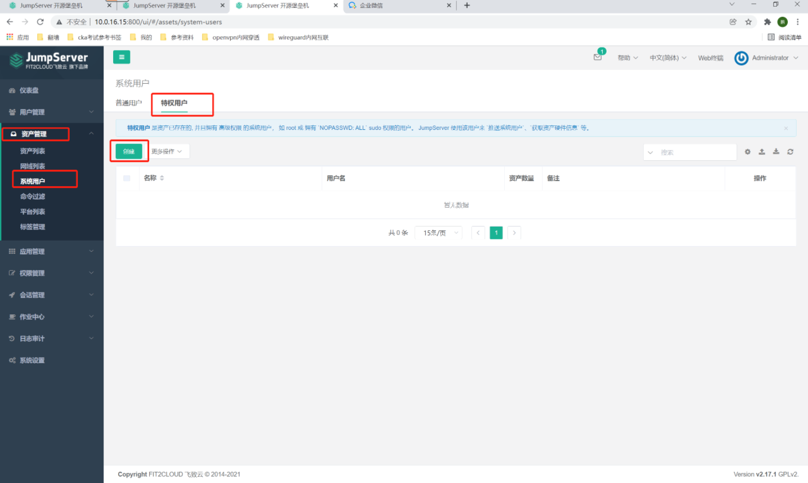
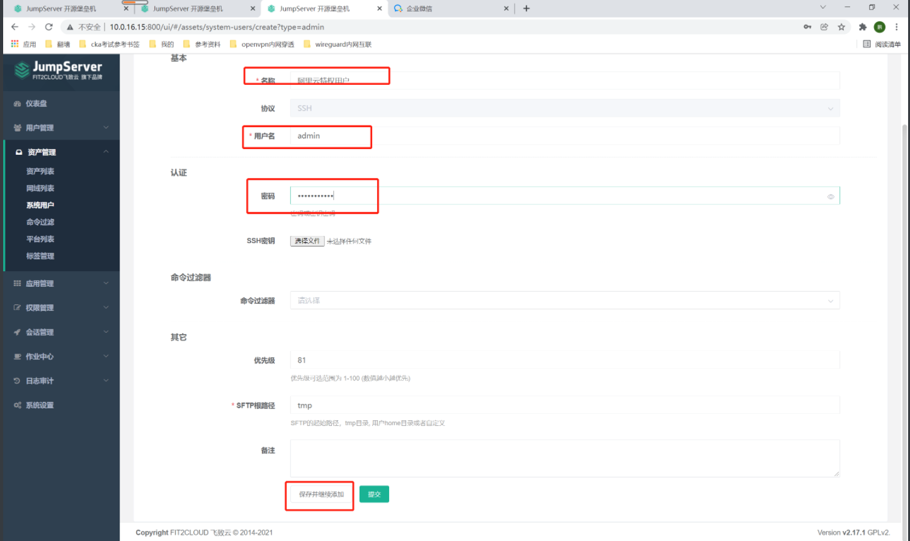
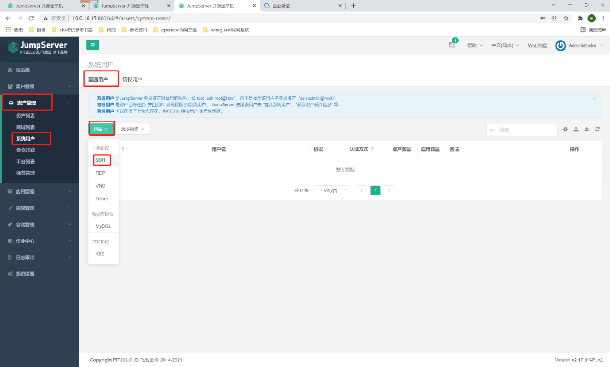
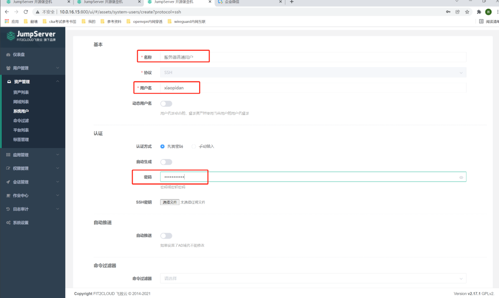

##1. 特权用户
```shell
# 资产管理-系统用户-特权用户-创建
```


```shell
#1. 名称：阿里云特权用户
# 用户：admin          #这是我的阿里云服务器的管理员用户名
# 密码：
# 点击保存并继续添加
```


```shell
# 按上面步骤添加其他
#2. 腾讯云1特权用户

#3. 腾讯云2特权用户

#4. 腾讯云3特权用户

#5. 亚马逊云特权用户
```
##2. 普通用户
```shell
# 资产管理-系统用户-普通用户-创建-SSH
```


```shell
# 名称：服务器普通用户
# 用户名：xiaopidan
# 密码： 
# 点击提交
```

