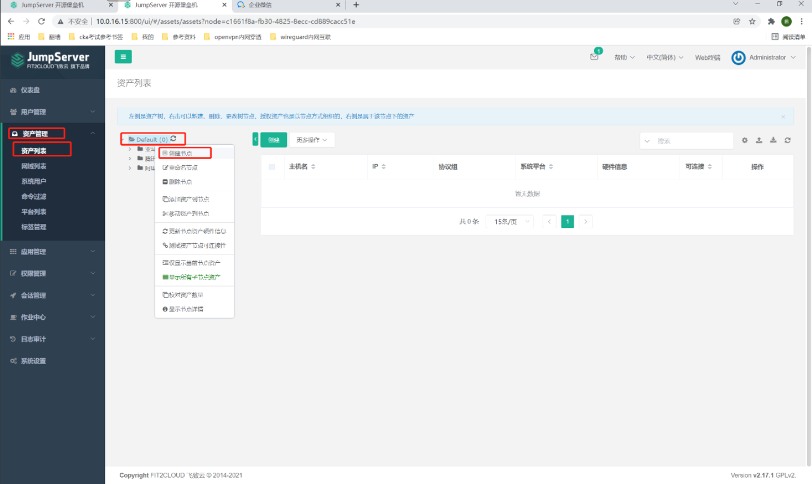

##1. 添加资产分组
```shell
# 点击资产管理-资产列表，右键点击default，创建节点
# 阿里云
# 腾讯云
# 亚马逊云
```

##2. 创建资产
```shell
# 资产管理-资产列表-创建
#1. 主机名：阿里云服务器
# IP：10.0.8.1      
# 特权用户：阿里云特权用户
# 节点：阿里云服务器
# 点击保存并继续
```

```shell

#2. 主机名：腾讯云1服务器
# IP：10.0.8.2
# 特权用户：腾讯云1特权用户
# 节点：腾讯云服务器
# 点击保存并继续

#3. 主机名：腾讯云2服务器
# IP：10.0.8.3
# 特权用户：腾讯云2特权用户
# 节点：腾讯云服务器
# 点击保存并继续


#4. 主机名：腾讯云3服务器
# IP：10.0.8.4
# 特权用户：腾讯云3特权用户
# 节点：腾讯云服务器
# 点击保存并继续

#5. 主机名：亚马逊云服务器
# IP：10.0.8.5
# 特权用户：亚马逊云特权用户
# 节点：亚马逊云服务器
# 点击保存并继续
```
##3. 查看
```shell
# 点击资产列表，等待一段时间后，可以看到是否可连接！
```

```shell
# 如果显示x，可以点击对应的主机名
# 在右侧点击测试连接，等待几秒钟后，会在弹出的对话框中显示连接成功与否！
```
