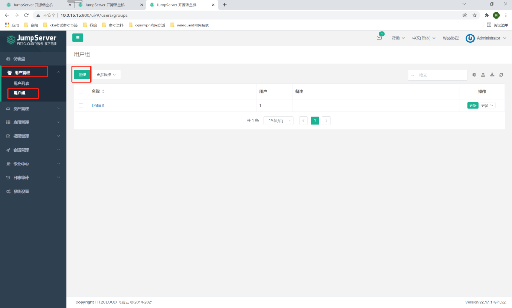
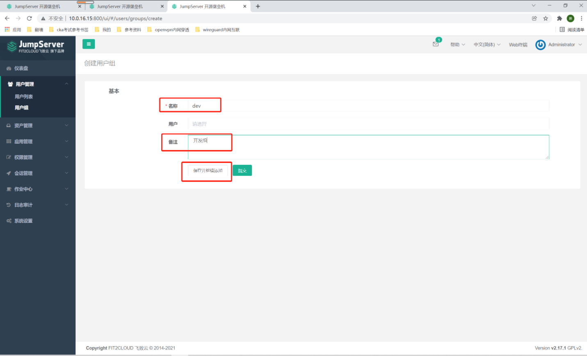
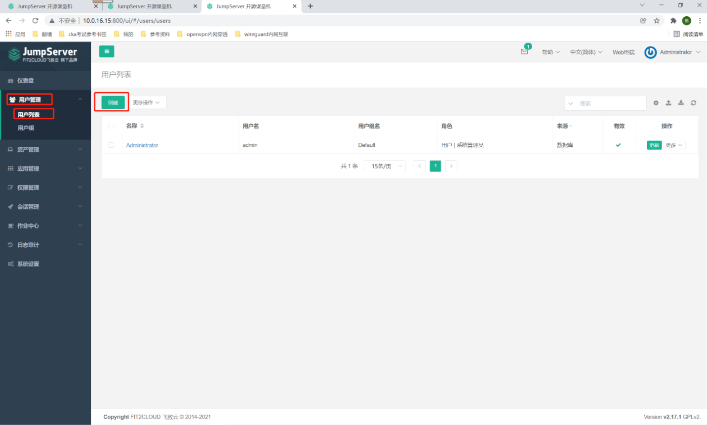
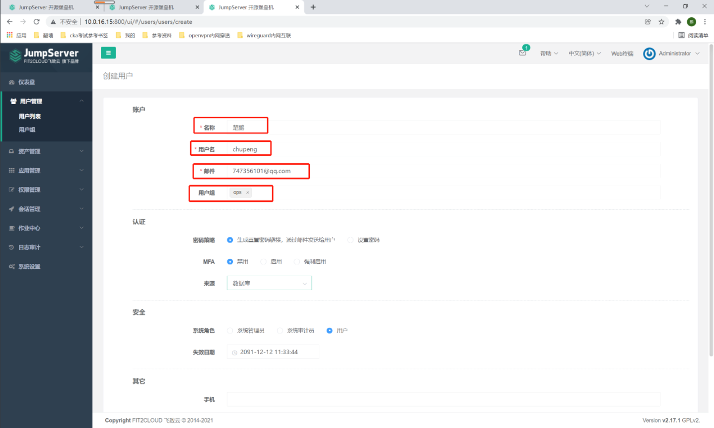
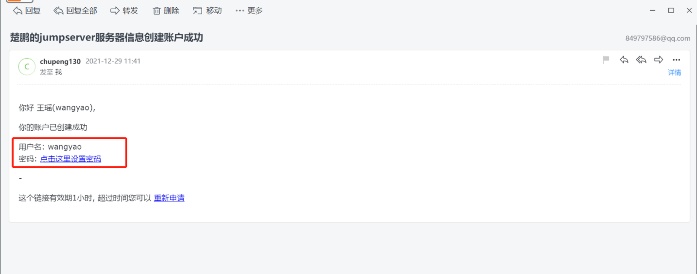
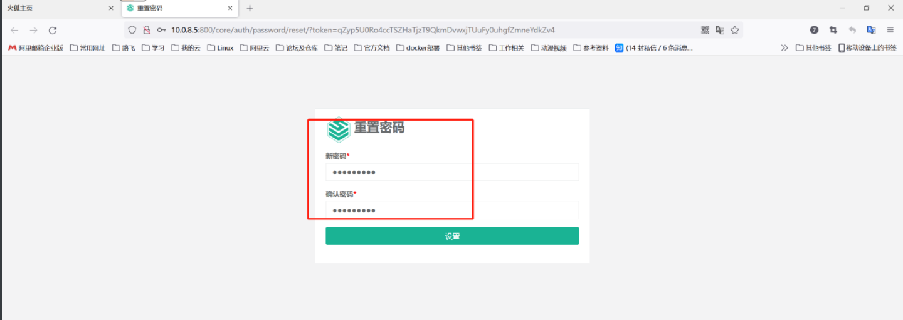
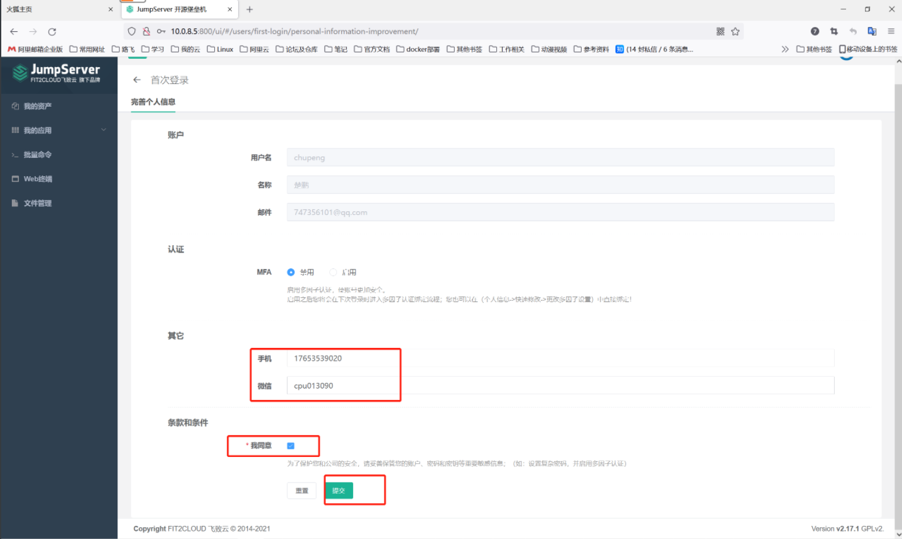

##1. 用户组
```shell
# 用户管理-用户组-创建
```

```shell
#1. 名称：dev
# 备注：开发组
# 点击保存并继续添加
#2. 名称：ops
# 备注：运维组
# 点击提交
```

```shell
##2. 用户

# 用户管理-用户列表-创建
```


```shell
#1. 名称：楚鹏
# 用户名：chupeng
# 邮件：747356101@qq.com
# 用户组：ops
# 点击保存并继续添加
```


```shell
#2. 名称：王瑶
# 用户名：wangyao
# 邮件：849797586@qq.com
# 用户组：ops
# 点击保存并继续添加

#3. 名称：皮蛋
# 用户名：pidan
# 邮件：1350697809@qq.com
# 用户组：ops
# 点击保存并继续添加
##3. 用户收到邮件后重置密码

# 登录vpn
# 收到邮件，点击邮件链接
```


```shell
# 新密码：abc123456
```


##4. 首次登录设置
```shell
# 可以填写手机号和微信
# 下面的我同意必须打勾，然后点击提交
```

