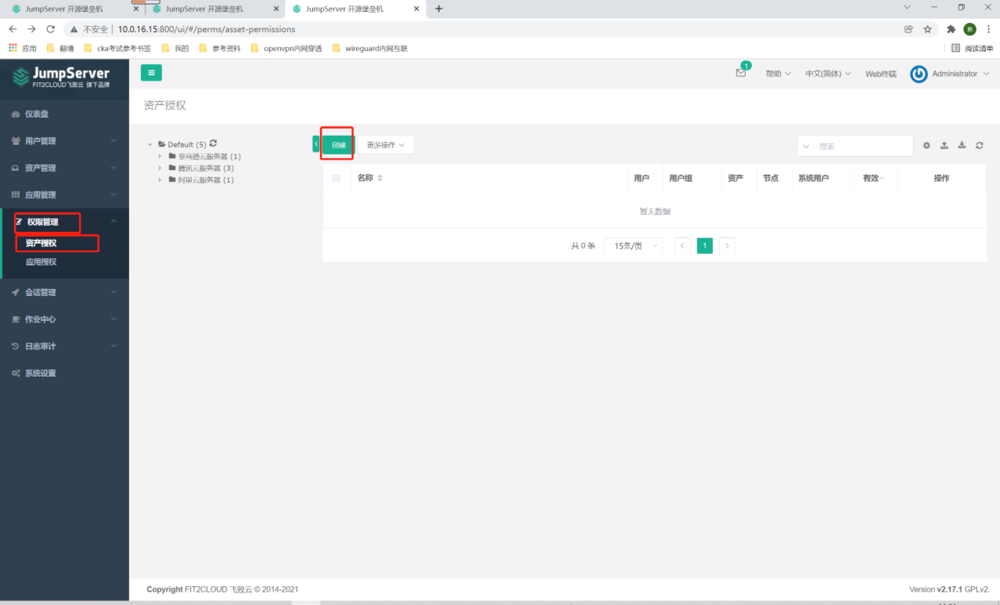
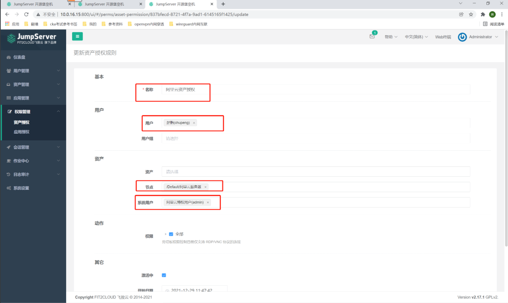
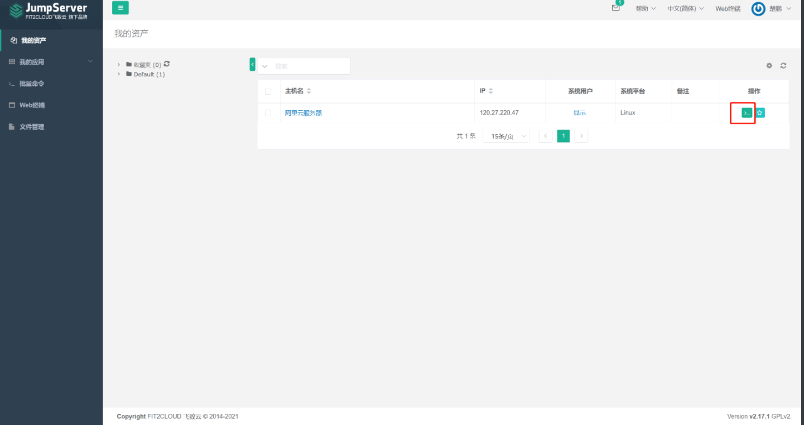
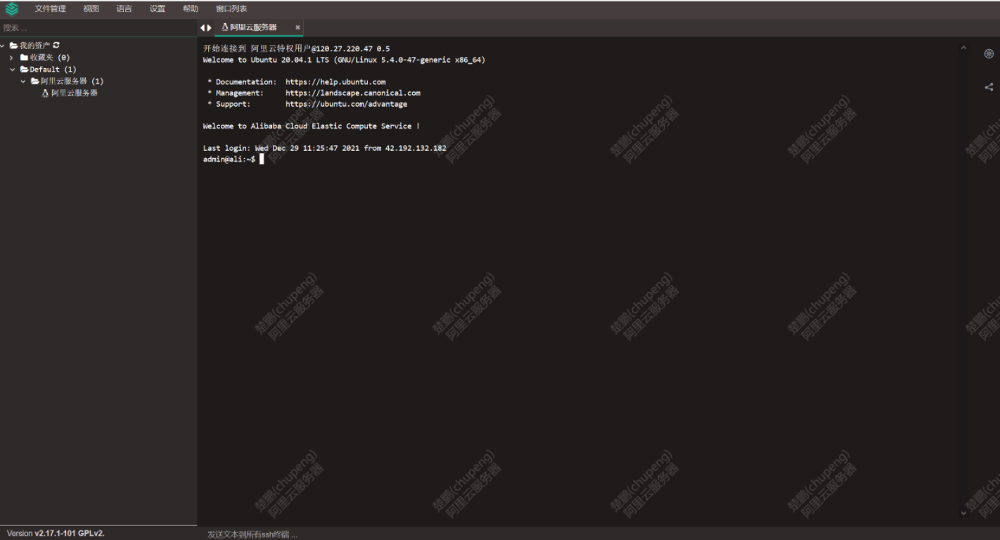

##1. 资产授权
```shell
# 权限管理-资产授权-创建
```


```shell
#1. 名称：阿里云资产授权
# 用户：chupeng，也可以选择用户组
# 节点：也可以只选择资产
# 系统用户：阿里云特权用户
# 保存并继续
```


```shell
#2. 名称：腾讯云资产授权
# 用户：wangyao(也可以选择用户组)
# 节点：也可以只选择资产
# 系统用户：腾讯云特权用户
# 保存并继续

#3. 名称：亚马逊云资产授权
# 用户：pidan，也可以选择用户组
# 节点：也可以只选择资产
# 系统用户：亚马逊云特权用户，不能用服务器普通用户！
# 提交
##2. 普通用户登录测试

# 登录chupeng，可以看到资产，点击右侧的登录
```


```shell
# 更改资产授权中的系统用户为特权用户后，登录成功！
# 也就是说需要在服务器中创建普通用户，然后再在jumpserver中设置普通用户登录？
```


