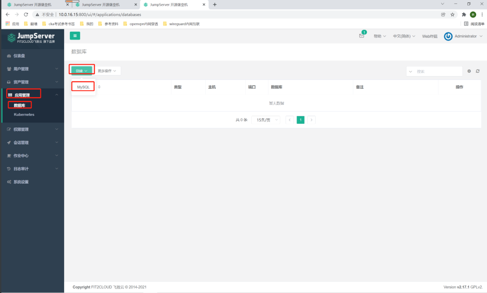
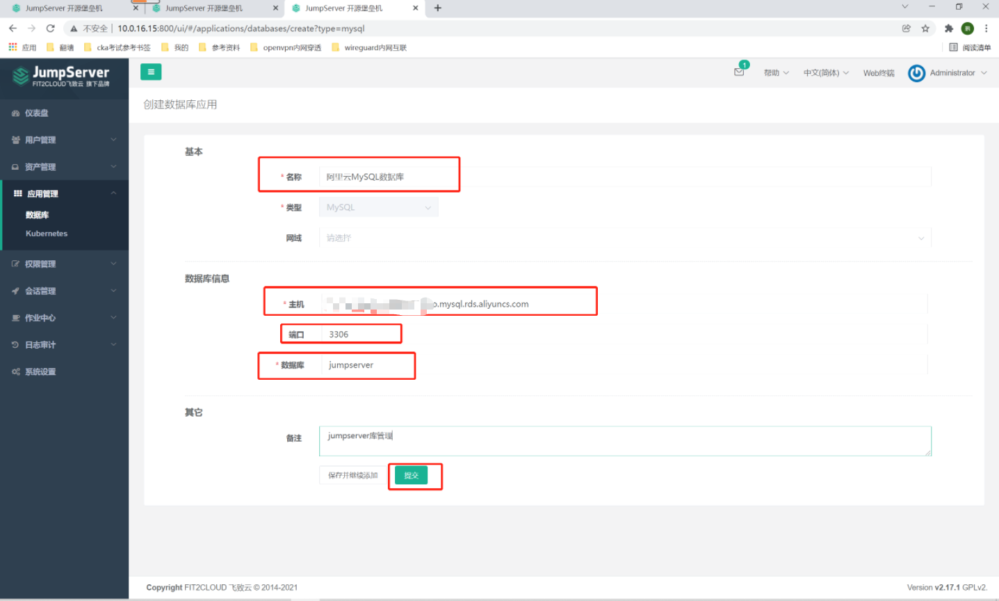
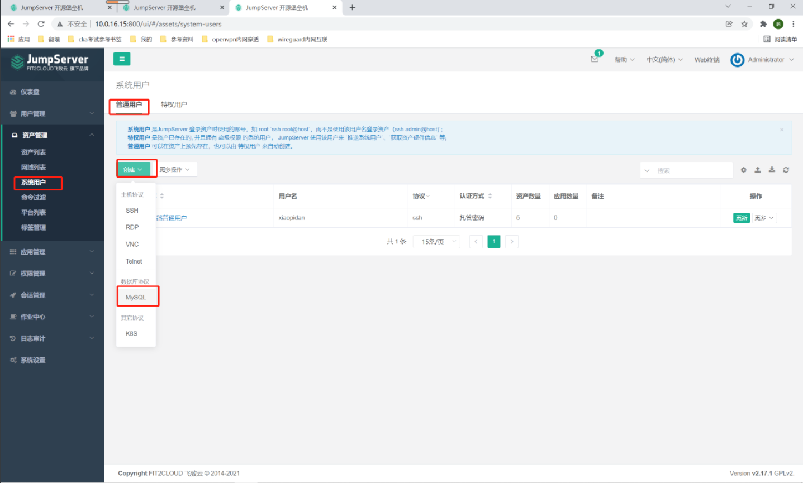
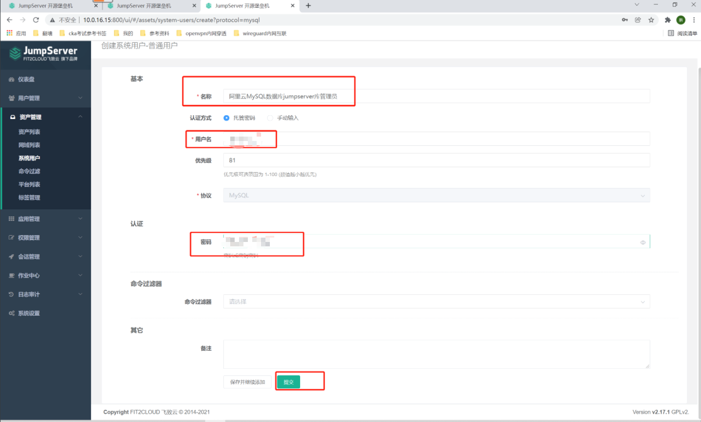
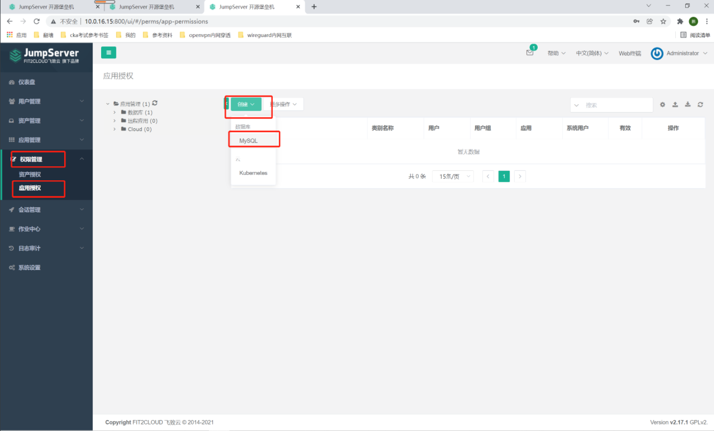
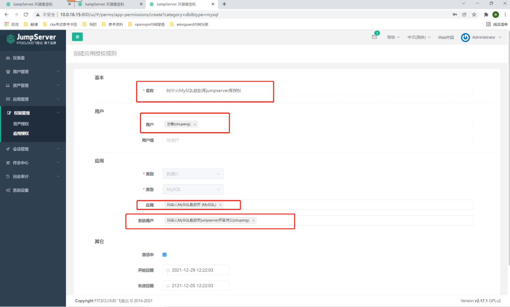
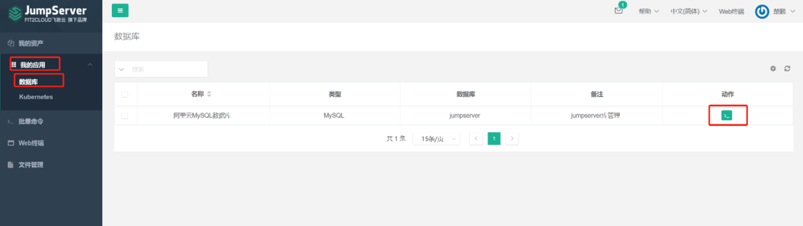
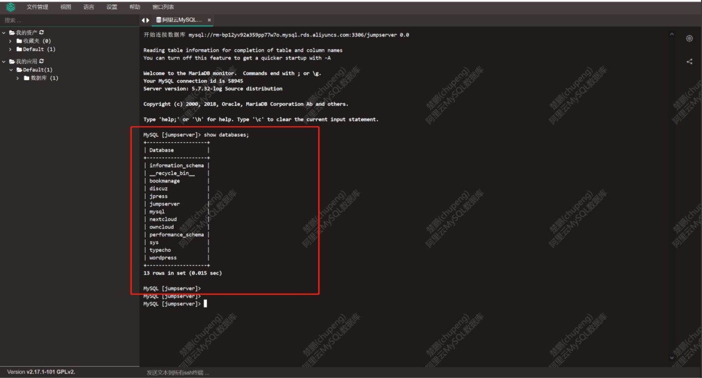

##1. 创建MySQL应用
```shell
# 应用管理-数据库-创建-MySQL
```


```shell
# 名称：阿里云MySQL数据库
# 主机：rm-sdfasdgasf.mysql.rds.aliyuncs.com
# 端口：3306
# 数据库：jumpserver
```


##2. 创建MySQL用户
```shell
# 资产管理-系统用户-普通用户-MySQL
```


```shell
# 名称：阿里云MySQL数据库jumpserver库管理员
# 用户名：  # 我的阿里云MySQL数据库的管理员账号密码，可以写对应库的对应密码！
# 密码：
```


##3. 应用授权
```shell
# 权限管理-应用授权-创建-mysql
```


```shell
# 名称：阿里云MySQL数据库jumpserver库授权
# 用户：楚鹏 （要将此库的权限交给谁管理）
# 应用：选择阿里云MySQL数据库
# 系统用户：选择阿里云MySQL数据库jumpserver库管理员
# 点击提交
```


##4. 登录用户测试
```shell
# 登录后，可以看到MySQL数据库资产，点击右侧的链接
```


```shell
# 看样子确实是：使用的什么账号就是什么权限！
```


