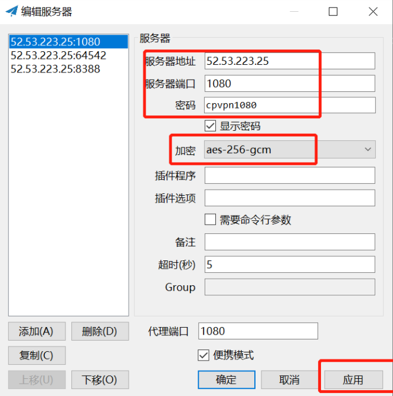
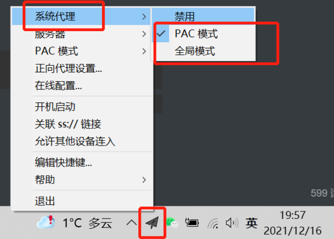
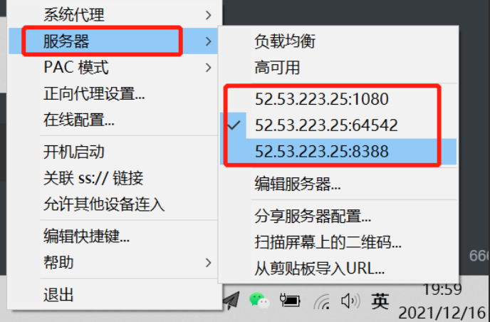
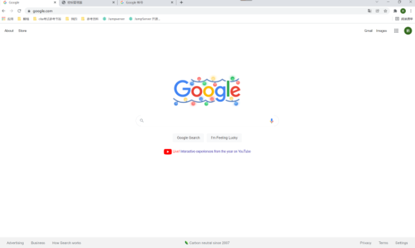
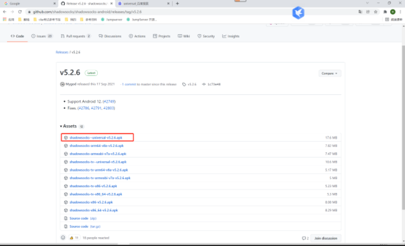
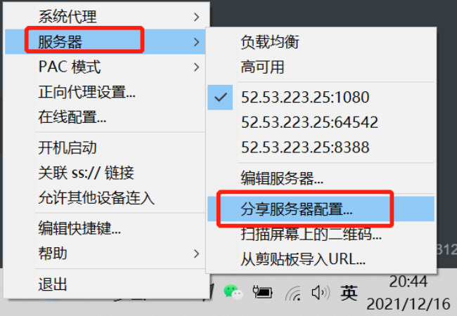
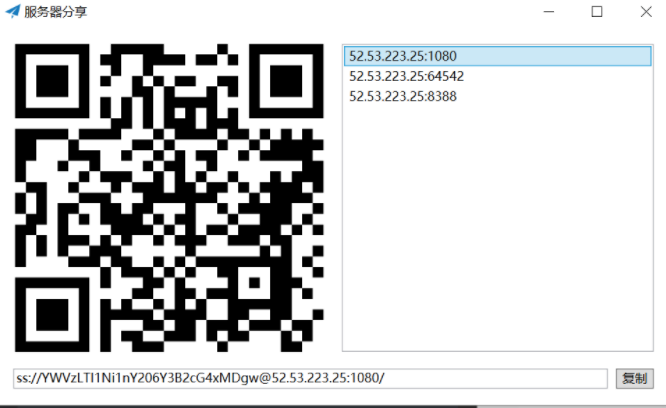
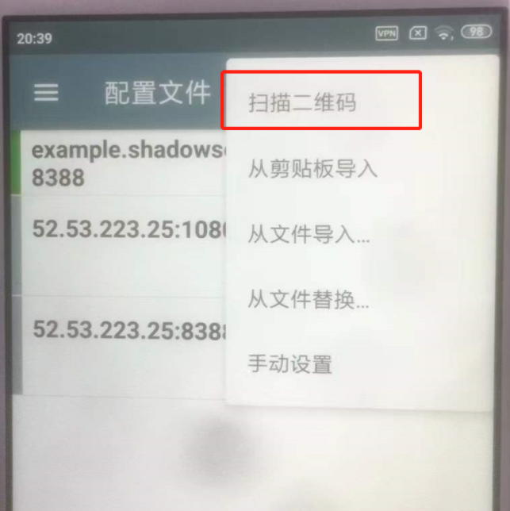
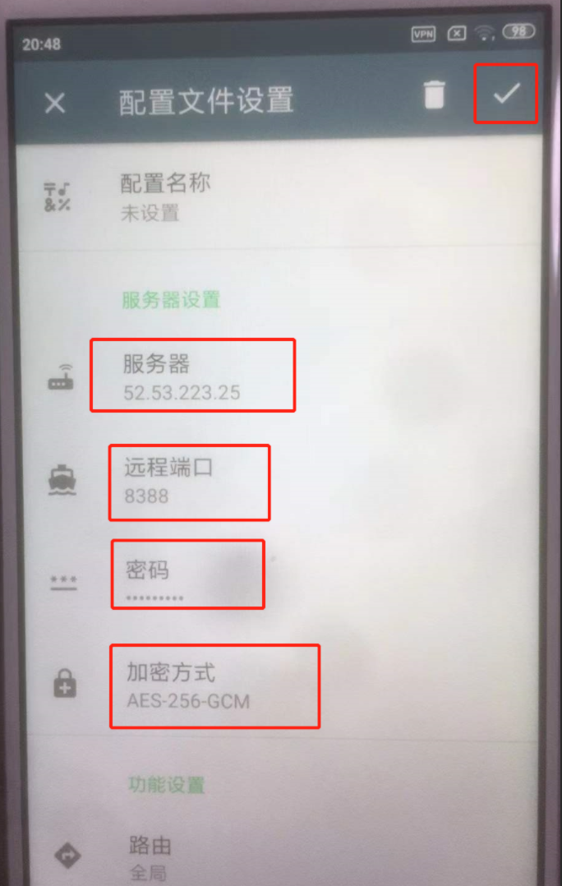
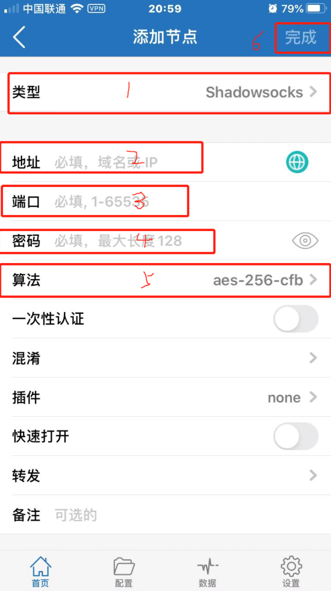

##1. 前提
```shell
#1. 申请一年的免费服务器

#2. 安装好docker

#3. 安全组开启相应端口的入规则
```
##2. 使用shadowsocks-libev镜像
```shell
#1. 运行
docker run -d --restart=always --name=vpn8388 -p 8388:8388 -p 8388:8388/udp shadowsocks/shadowsocks-libev ss-server -p 8388  -k cpvpn8388 -m aes-256-gcm

# 没太看懂啊！！！

#2. 查看日志
docker logs -f vpn8388
```
```shell
ubuntu@vpn:~$ #1. 运行
ubuntu@vpn:~$ docker run -d --restart=always --name=vpn8388 -p 8388:8388 -p 8388:8388/udp shadowsocks/shadowsocks-libev ss-server -p 8388  -k cpvpn8388 -m aes-256-gcm
5a6f40fece9bb16ecde44ba623fe96a24dbe91b7d9e37e940ad720615514c2d1
ubuntu@vpn:~$
ubuntu@vpn:~$ # 没太看懂啊！！！
ubuntu@vpn:~$
ubuntu@vpn:~$ #2. 查看日志
ubuntu@vpn:~$ docker logs -f vpn8388
 2021-12-16 11:49:53 INFO: initializing ciphers... aes-256-gcm
 2021-12-16 11:49:53 INFO: tcp server listening at 0.0.0.0:8388
 ```
##3. 使用shadowsocks-tiny镜像（推荐）
####1. 正常启动
```shell
#1. 运行
docker run -d --name "vpn64542"  -m 8m --cpus 0.1 --restart=always -p 64542:1080/tcp -p 1080:1080/udp -e PASSWORD='cpvpn64542' taterli/shadowsocks-tiny

#2. 查看日志
docker logs -f vpn8388
```
####1. 参数详解
```shell
# 可参考dockerhub：https://hub.docker.com/r/taterli/shadowsocks-tiny

# 命令参数详解
-d 放后台运行.
--name "shadowsocks-tiny" 指定一个容易查找的名字
-m 8m 限制最多占用8MB内存,如果不支持,请修改/etc/default/grub下的GRUB_CMDLINE_LINUX,添加cgroup_enable=memory swapaccount=1,然后update-grub,最后重启.
--cpus 0.1 限制使用0.1核CPU,也就是单核CPU的VPS只用10%,哪怕是Virmach都不会超标.
--restart=always 自动重启/万一被杀死/宿主系统重启都能自动重启,保证服务在线.
-p 64542:1080/tcp 用64542端口提供TCP服务.
-p 64542:1080/udp 用64542端口提供UDP服务.
-e PASSWORD='123' 设置密码123
taterli/shadowsocks-tiny:latest 镜像名
```


####2. 最简启动
```shell
docker run -d -p 1080:1080/tcp -e PASSWORD='cpvpn1080' taterli/shadowsocks-tiny:latest

# 疑问：这样是不是就没有限制了？这个是速度最快的？？？

#2. 查看日志
ubuntu@vpn:~$ docker logs -f wizardly_brattain
 2021-12-16 11:39:41 INFO: UDP relay enabled
 2021-12-16 11:39:41 INFO: initializing ciphers... aes-256-gcm  #从这里可以看出加密方法！
 2021-12-16 11:39:41 INFO: using nameserver: 8.8.8.8
 2021-12-16 11:39:41 INFO: tcp server listening at 0.0.0.0:1080
 2021-12-16 11:39:41 INFO: udp server listening at 0.0.0.0:1080
 2021-12-16 11:39:41 INFO: running from root user
```
##2. 客户端
####1. 下载windows客户端shadowsocks
```shell
# 从github下载：https://github.com/shadowsocks/shadowsocks-windows/releases/tag/4.4.0.0
# 下载zip格式的二进制包即可！解压即用！
```
####2. 运行软件
```shell
# 打开软件，输入信息
# 服务器地址：52.53.223.25
# 端口：1080
# 密码：cpvpn1080
# 加密：aes-256-gcm
```


####3. 设置启动代理
```shell
# 在桌面右下角，找到纸飞机的图标，然后右键单机，在第一行的系统代理右拉框中，选择PAC模式，或者全局模式，就是开启vpn了！
```


```shell
# 只要把所有的VPN信息都加好后，在服务器右拉框中，直接选择要连接的vpn即可，不用双击打开了！！！
```


####4. 测试
```shell
# windows打开cmd窗口，然后：ping google.com -------->发现ping不通！！！
# www.google.com    www.youtube.com --------------->浏览器访问可以!!!
```


##3. 安卓客户端
```shell
# 电脑下载下来安装包，然后微信发送到手机，手机上安装测试！
# 地址： https://github.com/shadowsocks/shadowsocks-android/releases/tag/v5.2.6
```


####1. 方法1
```shell
# 电脑上，右键点击飞机图标，然后服务器-分享服务器配置
```


```shell
# 得到配置二维码
```


```shell
# 手机端，打开软件，点击右上角的加号-扫描二维码
# 然后手机上就会出现连接信息，然后点击下方的飞机按钮，再点击左下角的测试！
# 此时配置就完成了！
```


####2. 方法2
```shell
# 手机端直接手动录入信息！点击右上角的手动设置，进入设置页面
# 手动输入4项内容
    1.服务器：52.53.223.25
    2.端口：8388
    3.密码：cpvpn8388
    4.加密方式：aes-256-gcm
# 然后点击右上角的确定即可
# 点击最下面的连接，然后测试，完成！
```

##4. 苹果客户端
####1. 下载shadowrocket
```shell
# 需要台湾或者国外的apple账号才能下载！可以淘宝或者bywave（2元）
```
####2. 软件配置
```shell
# 打开软件，点击右上角的+，添加节点
# 1.类型：shadowsocks
# 2.地址：52.53.223.25
# 3.端口：1080
# 4.密码：cpvpn1080
# 5.算法：aes-256-gcm（图中错了）
# 然后点击完成
# 点击测试，没问题后，就可以开启VPN啦！！！！
```
