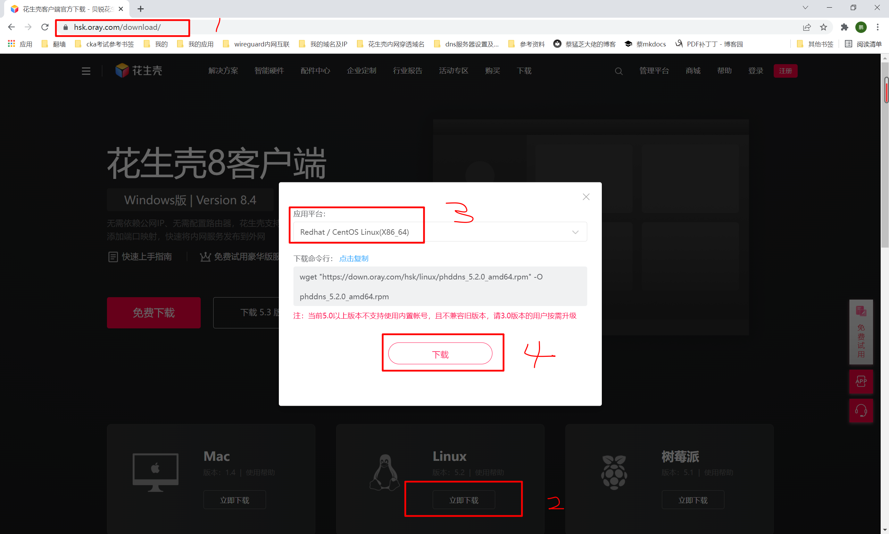
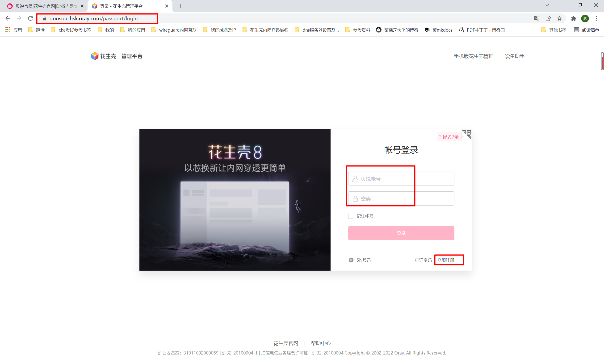
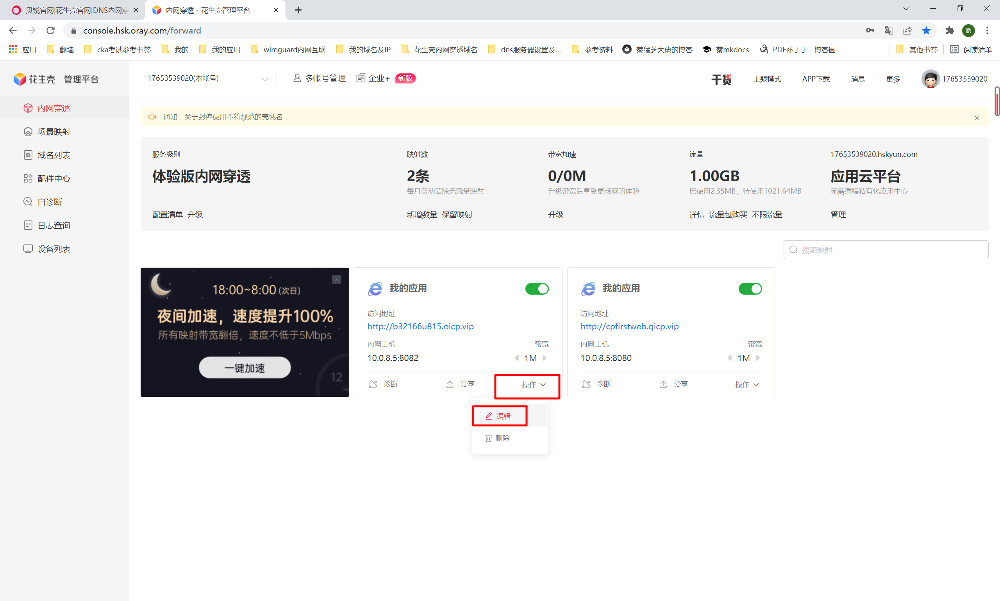
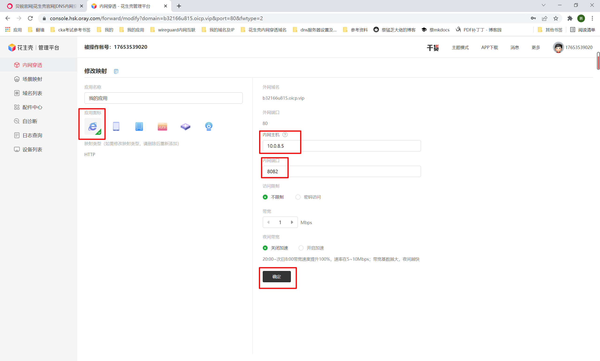
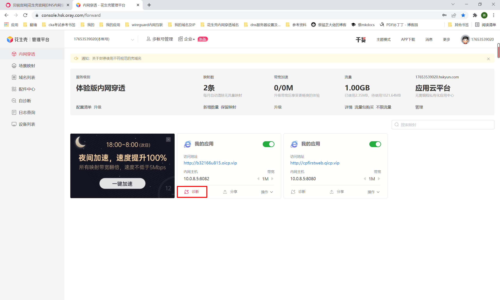
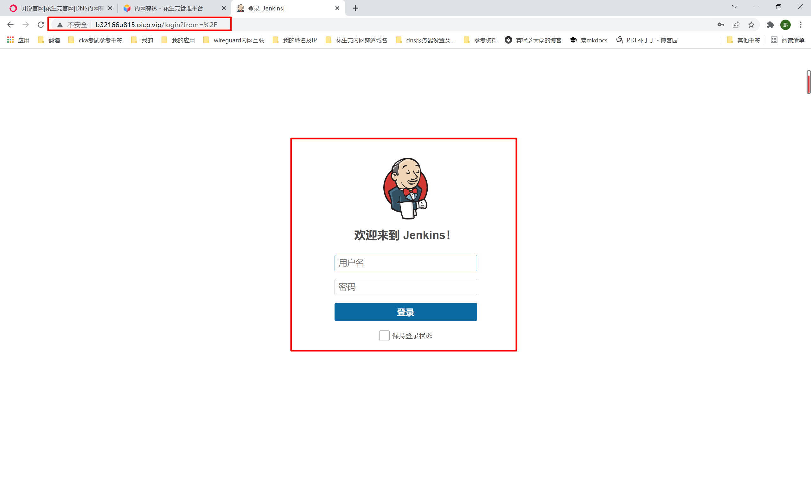

##1. 下载花生壳Linux版
https://hsk.oray.com/download/

```shell
1.输入网址，在页面最下方选择Linux版点击下载
2.然后选择centos 64版本，点击下载（也可以直接复制命令行，在服务器执行！）
```


```shell
3.服务器上创建目录，将rpm包上传到服务器此目录中！
[root@k8s-master ~]# mkdir /hsk
[root@k8s-master ~]# cd /hsk/
[root@k8s-master hsk]# ls
phddns-5.1.0.amd64.rpm
```
##2. 安装花生壳服务
```shell
[root@k8s-master hsk]# rpm -ivh phddns-5.1.0.amd64.rpm
Preparing...                          ################################# [100%]

+----------------Phtunnel start install--------------+

Updating / installing...
   1:phddns-5.1.0-1                   ################################# [100%]
Binary file /proc/1/cmdline matches
Created symlink from /etc/systemd/system/multi-user.target.wants/phtunnel.service to /usr/lib/systemd/system/phtunnel.service.
Created symlink from /etc/systemd/system/multi-user.target.wants/phddns_mini_httpd.service to /usr/lib/systemd/system/phddns_mini_httpd.service.

+-----------Phtunnel Service Install Success---------+


+--------------------------------------------------------+
|                Oray Phtunnel Linux 5.1.0               |
+--------------------------------------------------------+
|     SN:    Default password: admin     |
+--------------------------------------------------------+
| Usage: phddns(start|status|stop|restart|reset|version) |
+--------------------------------------------------------+
|       Remote Management Address http://b.oray.com      |
+--------------------------------------------------------+

[root@k8s-master hsk]#
```
##3. 启动花生壳服务
```shell
[root@k8s-master hsk]# phddns start
phtunnel service start success !
```
##4. 设置花生壳内网穿透
教程地址：https://service.oray.com/question/11630.html

```shell
1.浏览器访问：http://b.oray.com（或者：https://console.hsk.oray.com/passport/login），
然后注册，成功后输入自己的账号密码
```

```shell
2.选择url后点击操作------编辑
(花生壳会给一个免费的，还可以自己购买，第二个我是自己买的，6元99年)
```

```shell
3.输入要穿透的阿里云内网IP及端口等相关参数（通过ip a命令查看eth0的IP即为内网IP）
输入名称
选择映射类型为http
内网ip 
要映射的端口8082
点击确定
```

```shell
4.然后点击诊断，显示成功后，即可 
```

##5. 验证
####浏览器访问域名：http://b32166u815.oicp.vip 测试



内网映射成功！！！