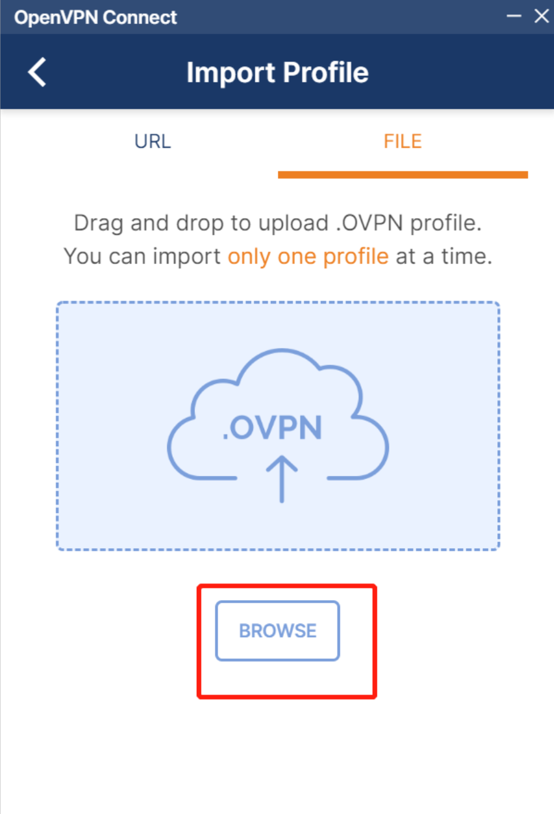

##0. 防火墙开启udp/1194
```shell
# 搭建openvpn要实现的目的
# 本云服务器（139.198.106.219 ，直接全部替换此处即可！大概16处），不想被外网访问到，将对应的防火墙端口关闭，所以想通过openvpn的方式，只有登录openvpn后，才能通过<内网IP+端口>的方式访问到！

    # 1. 防火墙入规则开启udp 1194 
    # 2. 说明：docker运行的openvpn容器占用内存非常少，只有0.4G！！！

# 首先需要搭建openvpn，见下面的步骤！
```
##1、使用openvpn生成配置文件
```shell
#1. 登录远程工具，切换到root用户
sudo -i

# 创建目录
mkdir -p /data/openvpn
chown -R ubuntu.ubuntu /data


docker run -v /data/openvpn:/etc/openvpn --rm kylemanna/openvpn:2.4 ovpn_genconfig -u udp://139.198.106.219

# 执行完命令后可在目录`/data/openvpn`中看到相应的配置文件；
```
##2、初始化密钥文件
```shell
ls /data/openvpn

docker run -v /data/openvpn:/etc/openvpn --rm -it kylemanna/openvpn:2.4 ovpn_initpki

# 执行过程中需要先设置ca密码（如cpu013090），
# Common Name可不设置直接按回车继续，
# 接着需要输入ca密码更新密钥库以及生成crl文件；
```
```shell
root@vpn:/data/openvpn# docker run -v /data/openvpn:/etc/openvpn --rm -it kylemanna/openvpn:2.4 ovpn_initpki

init-pki complete; you may now create a CA or requests.
Your newly created PKI dir is: /etc/openvpn/pki


Using SSL: openssl OpenSSL 1.1.1g  21 Apr 2020

Enter New CA Key Passphrase:    #1.这里输入ca密码，如：cpu013090
Re-Enter New CA Key Passphrase: #2.再次输入：cpu013090
Generating RSA private key, 2048 bit long modulus (2 primes)
.....+++++
......................+++++
e is 65537 (0x010001)
You are about to be asked to enter information that will be incorporated
into your certificate request.
What you are about to enter is what is called a Distinguished Name or a DN.
There are quite a few fields but you can leave some blank
For some fields there will be a default value,
If you enter '.', the field will be left blank.
-----
Common Name (eg: your user, host, or server name) [Easy-RSA CA]:    #3.这里可以不设置，直接回车继续

CA creation complete and you may now import and sign cert requests.
Your new CA certificate file for publishing is at:
/etc/openvpn/pki/ca.crt


Using SSL: openssl OpenSSL 1.1.1g  21 Apr 2020
Generating DH parameters, 2048 bit long safe prime, generator 2
This is going to take a long time
...........................................................................+..................+.................................+....................+....................................................+......................................................................+........................................................................................................................+.........................................................................................+....................+..........+......................................................................................................................+.....................................................+................................+.........+..........................................................................................................................................................................................................................+................................................................................................................................................................................................+....................+.............................................................................................++*++*++*++*

DH parameters of size 2048 created at /etc/openvpn/pki/dh.pem


Using SSL: openssl OpenSSL 1.1.1g  21 Apr 2020
Generating a RSA private key
.....................................................................................................................+++++
...........................................+++++
writing new private key to '/etc/openvpn/pki/easy-rsa-73.fGlaJI/tmp.ILKdAj'
-----
Using configuration from /etc/openvpn/pki/easy-rsa-73.fGlaJI/tmp.ecpHKE
Enter pass phrase for /etc/openvpn/pki/private/ca.key:  #4.再次输入密码：cpu013090
Check that the request matches the signature
Signature ok
The Subject's Distinguished Name is as follows
commonName            :ASN.1 12:'139.198.106.219'
Certificate is to be certified until Mar 24 05:34:39 2024 GMT (825 days)

Write out database with 1 new entries
Data Base Updated

Using SSL: openssl OpenSSL 1.1.1g  21 Apr 2020
Using configuration from /etc/openvpn/pki/easy-rsa-148.dlPOpi/tmp.CLJlKk
Enter pass phrase for /etc/openvpn/pki/private/ca.key:  #5.再次输入密码：cpu013090

An updated CRL has been created.
CRL file: /etc/openvpn/pki/crl.pem


root@vpn:/data/openvpn#
root@vpn:/data/openvpn# ls
ccd  openvpn.conf  ovpn_env.sh  pki         #5. 发现多出来一个pki文件夹！
```
```shell
##3、生成客户端证书

ls /data/openvpn

docker run -v /data/openvpn:/etc/openvpn --rm -it kylemanna/openvpn:2.4 easyrsa build-client-full openvpn-client nopass

# 其中`openvpn-client`为自定义名称，
# 生成的过程需要输入ca密码；
```
```shell
root@vpn:/data/openvpn# docker run -v /data/openvpn:/etc/openvpn --rm -it kylemanna/openvpn:2.4 easyrsa build-client-full openvpn-client nopass
Using SSL: openssl OpenSSL 1.1.1g  21 Apr 2020
Generating a RSA private key
........+++++
....+++++
writing new private key to '/etc/openvpn/pki/easy-rsa-1.hJEIed/tmp.iaNPKJ'
-----
Using configuration from /etc/openvpn/pki/easy-rsa-1.hJEIed/tmp.dlLelJ
Enter pass phrase for /etc/openvpn/pki/private/ca.key:  # 这里输入ca密码：cpu013090
Check that the request matches the signature
Signature ok
The Subject's Distinguished Name is as follows
commonName            :ASN.1 12:'openvpn-client'
Certificate is to be certified until Mar 24 05:35:34 2024 GMT (825 days)

Write out database with 1 new entries
Data Base Updated

root@vpn:/data/openvpn#
```
##4、导出客户端的配置文件openvpn-client-139.198.106.219.ovpn
```shell
ls /data/openvpn

docker run -v /data/openvpn:/etc/openvpn --rm kylemanna/openvpn:2.4 ovpn_getclient openvpn-client > /data/openvpn/openvpn-client-139.198.106.219.ovpn

# 注意`openvpn-client`名称需与第三步生成时命名一致，
# 此时生成的配置文件`openvpn-client-139.198.106.219.ovpn`即可用于客户端连接；
```
##5、启动openvpn容器
```shell
ls /data/openvpn

docker run  -v /data/openvpn:/etc/openvpn -d -p 1194:1194/udp --restart=always --name openvpn --cap-add=NET_ADMIN --sysctl net.ipv6.conf.all.disable_ipv6=0 --sysctl net.ipv6.conf.default.forwarding=1 --sysctl net.ipv6.conf.all.forwarding=1  kylemanna/openvpn:2.4 

# 需要注意防火墙规则，其中1194为udp端口，
# 可在其他机器上通过nc命令测试是否可连接
```
####nc测试
```shell

# nc命令安装（ubuntu系统貌似默认就有nc命令！）
yum install nc -y

# nc测试
nc -vuz 139.198.106.219 1194
```
```shell
#1. 本机测试
root@vpn:/data/openvpn# nc -vuz 139.198.106.219 1194
Connection to 139.198.106.219 1194 port [udp/openvpn] succeeded!
root@vpn:/data/openvpn#

#2. 别的机器测试
ubuntu@k8s-master:~$ nc -vuz 139.198.106.219 1194
Connection to 139.198.106.219 1194 port [udp/openvpn] succeeded!
```
##6、客户端：安装openvpn客户端openvpn-install-2.4.4-I601.exe
```shell
# 下载地址：https://openvpn.net/download-open-vpn/#
# 注意：可能需要翻墙才能下载！
# 点击windows版本即可！67M左右
# 安装好客户端后，导入openvpn客户端配置文件即可！
```


##7. 安装及使用
```shell
# openvpn-connect-3.3.4.2600_signed.msi
# 1. 安装：双击安装，直接下一步即可！
# 2. 使用方法：如下图，导入第4步生成的客户端文件openvpn-client-139.198.106.219.ovpn
```


```shell
# 导入后得到如下图所示信息，能看到你连到的服务器IP，点击连接即可！
```


##8. 测试
```shell
# 1. 查看内网IP：10.150.10.28
ifconfig eth0
```
```shell
root@qingyun:~# ifconfig eth0
eth0: flags=4163<UP,BROADCAST,RUNNING,MULTICAST>  mtu 1500
        inet 10.150.10.28  netmask 255.255.255.0  broadcast 10.150.10.255
        inet6 fe80::5054:96ff:fe09:348d  prefixlen 64  scopeid 0x20<link>
        ether 52:54:96:09:34:8d  txqueuelen 1000  (Ethernet)
        RX packets 160874  bytes 192838879 (192.8 MB)
        RX errors 0  dropped 0  overruns 0  frame 0
        TX packets 88690  bytes 8219101 (8.2 MB)
        TX errors 0  dropped 0 overruns 0  carrier 0  collisions 0
```
```shell
# 2. windows上使用cmd命令ping测试：ping 10.150.10.28
ping 10.150.10.28
```
```shell
# 内网穿透成功！！！
C:\Users\chupeng>ping 10.150.10.28

正在 Ping 10.150.10.28 具有 32 字节的数据:
来自 10.150.10.28 的回复: 字节=32 时间=55ms TTL=63
来自 10.150.10.28 的回复: 字节=32 时间=75ms TTL=63
来自 10.150.10.28 的回复: 字节=32 时间=52ms TTL=63
来自 10.150.10.28 的回复: 字节=32 时间=74ms TTL=63

10.150.10.28 的 Ping 统计信息:
    数据包: 已发送 = 4，已接收 = 4，丢失 = 0 (0% 丢失)，
往返行程的估计时间(以毫秒为单位):
    最短 = 52ms，最长 = 75ms，平均 = 64ms

C:\Users\chupeng>
```