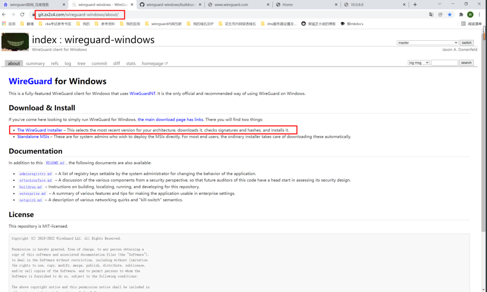
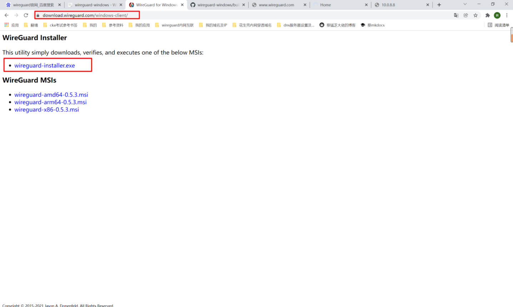
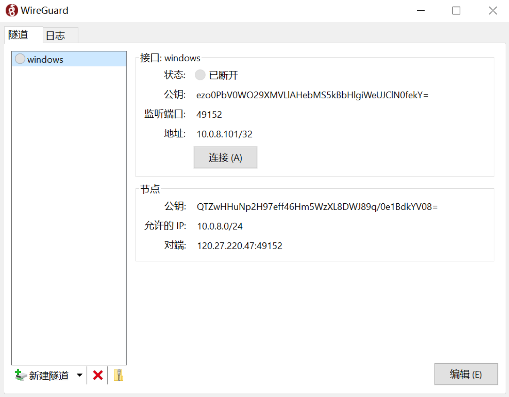
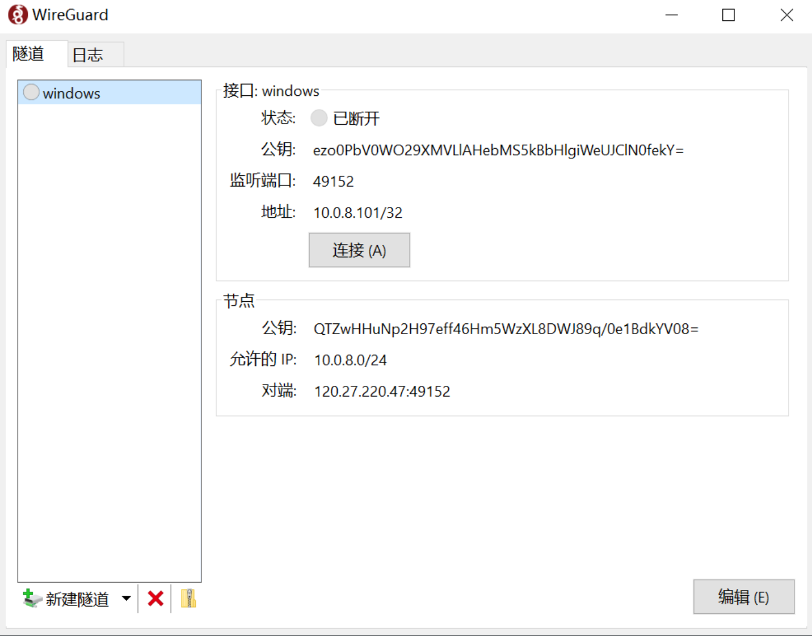
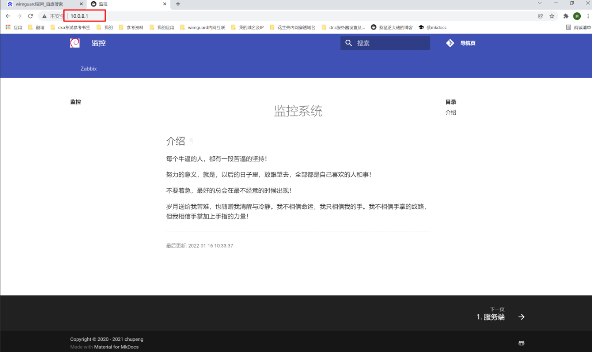

##1. 前提
```shell
# 所有云服务器已经使用wireguard组成内网
# wireguard服务端：10.0.8.1
# windows设置IP为：10.0.8.101（自己定义！）
```
##2. 资料
```shell
# github：https://github.com/WireGuard/wireguard-windows
# 官网：https://git.zx2c4.com/wireguard-windows/
# 参考资料：https://github.com/WireGuard/wireguard-windows/blob/master/docs/buildrun.md
```
##3. 下载windows客户端
```shell
# https://git.zx2c4.com/wireguard-windows/about/
# 直接点击如下绿色字体即可下载！
```


```shell

# 也可以输入链接下载：https://download.wireguard.com/windows-client/
```


##4. 安装
```shell
# 因为是exe文件，直接双击安装即可！！！
```
##5. 查看
```shell
# 安装完成后，打开windows客户端如下
```


##6. 生成公私钥
```shell
# 10.0.8.1
mkdir /etc/wireguard/client
cd /etc/wireguard/client
# 生成公私钥
wg genkey | tee temprikey | wg pubkey > tempubkey
```
####1. 查看公钥
```shell
root@ali:/etc/wireguard/client# cat tempubkey
ezo0PbV0WO29XMVLlAHebMS5kBbHlgiWeUJClN0fekY=
```
####2. 查看私钥
```shell
root@ali:/etc/wireguard/client# cat temprikey
EINBtJHdyd3SG/R7AuuEsiaR4Ax6wBaTWRX2KQz/H0s=
```
##7. 服务端配置
####1. 10.0.8.1 之前的配置如下
```shell
cat /etc/wireguard/wg0.conf
```
```shell
root@ali:~# cat /etc/wireguard/wg0.conf
[Interface]
Address = 10.0.8.1/32
SaveConfig = true
ListenPort = 49152
PrivateKey = KIwSZNjGR8nt6hPGDy20VpbRGMSZyYfvOksestb9D0g=

[Peer]
PublicKey = /RQdv4PgvrlO5E4Y3tDntYSSt4MXQQMdZN9hbpRzhWw=
AllowedIPs = 10.0.8.2/32


[Peer]
PublicKey = LH7tpf6/Os/ul8mH4pFu/0rnjosY3gcsiwKRJZyd1G4=
AllowedIPs = 10.0.8.3/32


[Peer]
PublicKey = WCaTti5cPes194M/sqKPhzwDHYD0FYbJH5LblA9QKDo=
AllowedIPs = 10.0.8.4/32


[Peer]
PublicKey = pV4NzZe2H9UteVkfoAWSUayT3o8hjaLU60jpcxZNmAQ=
AllowedIPs = 10.0.8.5/32


[Peer]
PublicKey = wPEOl9+9fFa3O6HHSmvxaxPlZy4HN4gCTY/q/vOZIS8=
AllowedIPs = 10.0.8.6/32


[Peer]
PublicKey = JVGUiRsVVg7VEVgZqnPhXCya0ZMC12xmX9CTiZL2imM=
AllowedIPs = 10.0.8.7/32


[Peer]
PublicKey = ojM/eHQ4By7WjNHeAxkH+Jzs7S0PuXrKZbZZx0zHTx8=
AllowedIPs = 10.0.8.8/32
```
####2. 添加10.0.8.101节点
```shell
# 10.0.8.1
vim wg0.conf
# 添加如下内容
[Peer]
PublicKey = ezo0PbV0WO29XMVLlAHebMS5kBbHlgiWeUJClN0fekY=    # 上一步生成的公钥
AllowedIPs = 10.0.8.101/32                                # 自定义的IP
```
##8. 客户端配置文件
```shell
vim /etc/wireguard/client/windows.conf
# 写入如下内容
[Interface]
Address = 10.0.8.101        # 自定义的IP
ListenPort = 49152
PrivateKey = EINBtJHdyd3SG/R7AuuEsiaR4Ax6wBaTWRX2KQz/H0s=           # 私钥      


[Peer]
PublicKey = QTZwHHuNp2H97eff46Hm5WzXL8DWJ89q/0e1BdkYV08=        # 10.0.8.1服务端的公钥
AllowedIPs = 10.0.8.0/24  
```  
##9. 打开windows上的wireguard客户端，导入配置文件
```shell
# 导入配置文件后，可以看到配置文件的信息，点击连接即可！
```


##10. 验证
```shell
# 访问内网内容
# 10.0.8.1 
# 可以访问，成功！！！
```


