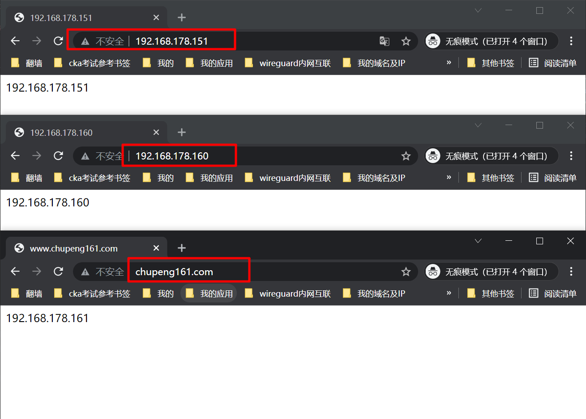
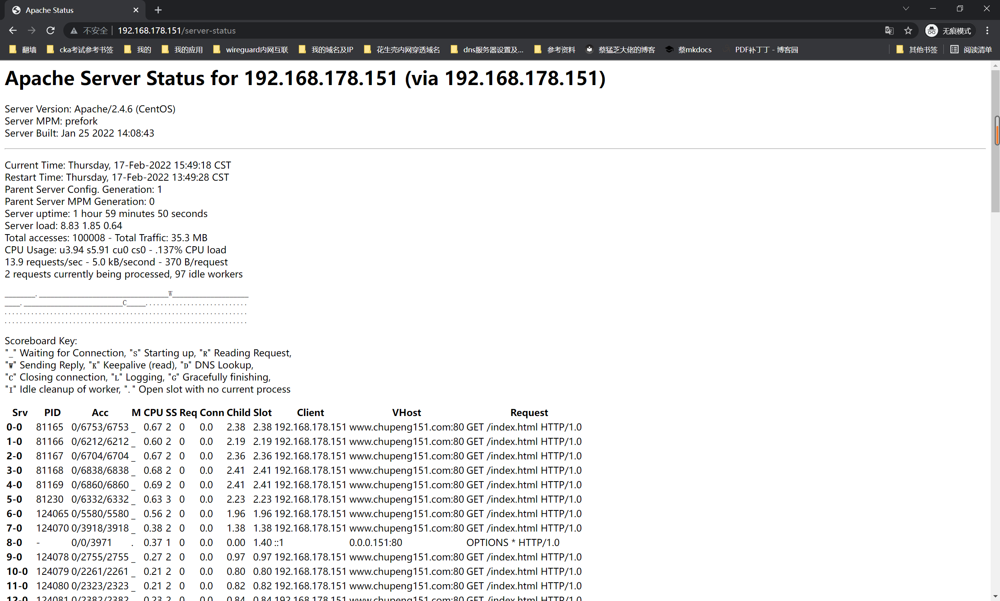
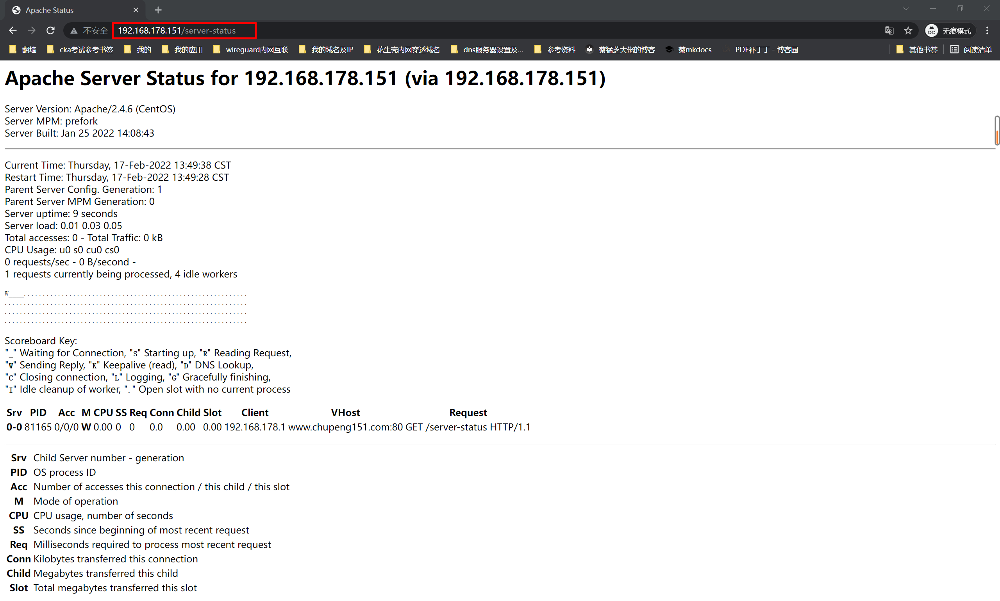

##1. userdir功能
```shell
#1.介绍
userdir模块可以很方便的和他人共享服务器的资料

#2.查看配置文件
该功能需要修改如下配置文件
cd /etc/httpd/conf.d/
cat userdir.conf |grep -Ev '^#|^$'
```
```shell
[root@151 conf.d]# cat userdir.conf |grep -Ev '^#|^$'
<IfModule mod_userdir.c>
    #
    # UserDir is disabled by default since it can confirm the presence
    # of a username on the system (depending on home directory
    # permissions).
    #
    UserDir disabled
    #
    # To enable requests to /~user/ to serve the user's public_html
    # directory, remove the "UserDir disabled" line above, and uncomment
    # the following line instead:
    #
    #UserDir public_html
</IfModule>
<Directory "/home/*/public_html">
    AllowOverride FileInfo AuthConfig Limit Indexes
    Options MultiViews Indexes SymLinksIfOwnerMatch IncludesNoExec
    Require method GET POST OPTIONS
</Directory>

#3. 修改配置文件
cp userdir.conf{,.bak}
vim userdir.conf
#3.1 注释掉如下，则代表开启此功能，也可以改为enabled
#     UserDir disabled

#3.2 设置共享目录权限
<Directory "/home/*/public_html">
    # 先将原来的内容注释掉
#    AllowOverride FileInfo AuthConfig Limit Indexes
#    Options MultiViews Indexes SymLinksIfOwnerMatch IncludesNoExec
#    Require method GET POST OPTIONS
    # 添加认证配置，使用账号密码访问
    authuserfile "/etc/httpd/passwd"
    authname "input your account"
    authtype basic
    require user cp
</Directory>

#4. 创建普通用户，设置共享目录
useradd cp
su - cp
mkdir public_html
chmod -Rf 755 public_html

#5. 创建共享文件
echo "welcome to linux" > public_html/index.html

#6.生成密码文件
htpasswd -c /etc/httpd/passwd cp
# 设置密码：123456

#7. 重启httpd
systemctl restart httpd

#8.浏览器访问测试
192.168.178.151:80/~cp/
```
##2. 基于域名+ip的多虚拟主机
```shell
#1.给服务器添加2个IP地址
ip a
# 添加
ip address add 192.168.178.160/24 dev ens33
ip address add 192.168.178.161/24 dev ens33
# 查看
ip a |grep 'inet 192.168.178'

#2. 创建站点目录，添加站点资料
mkdir -p /www/{151,160,161}
echo 192.168.178.151 >/www/151/index.html
echo 192.168.178.160 >/www/160/index.html
echo 192.168.178.161 >/www/161/index.html

chown -R apache.apache /www

#3.编辑配置文件
cp /etc/httpd/conf/httpd.conf{,.bak}
vim /etc/httpd/conf/httpd.conf
# 添加如下内容，注意：要把后面的注释去掉！不能放在后面！
<VirtualHost 192.168.178.151>       # VirtualHost 定义虚拟主机配置参数
DocumentRoot "/www/151"
ServerName "www.chupeng151.com"     # ServerName  定义虚拟主机对应的域名
<Directory "/www/151">
AllowOverride None          # 允许所有的访问权限
Require all granted
</Directory>
</VirtualHost>

<VirtualHost 192.168.178.160>
DocumentRoot "/www/160"
ServerName "www.chupeng160.com"
<Directory "/www/160">
AllowOverride None
Require all granted
</Directory>
</VirtualHost>


<VirtualHost 192.168.178.161>
DocumentRoot "/www/161"
ServerName "www.chupeng161.com"
<Directory "/www/161">
AllowOverride None
Require all granted
</Directory>
</VirtualHost>

#4.重启httpd
systemctl restart httpd

#5.windows上添加host解析
192.168.178.151 www.chupeng151.com
192.168.178.160 www.chupeng160.com
192.168.178.161 www.chupeng161.com

#6. 访问测试！
# 可以域名访问，可以IP访问！
```

##3. 访问权限设置
```shell
#1.修改配置文件
vim httpd.conf
# 修改上一步中的其中一个站点
<VirtualHost 192.168.178.161>
DocumentRoot "/www/161"
ServerName "www.chupeng161.com"
<Directory "/www/161">
# 把之前的注释
#AllowOverride None
#Require all granted
# 访问控制,可以只允许单个ip，也可以控制整个网段！
Order allow,deny
Allow from 192.168.178.0/24
</Directory>
</VirtualHost>

#2.访问测试（由于vmware虚拟机中网关在本机中，所以处于同一网段，本机不好测试，可以在云服务器上设置测试！）
```
##4. 访问日志格式设置
```shell
有时候需要定制apache默认的日志格式，增加或者减少日志记录的内容，更好的让运维人员掌握用户访问信息，
并且日志可能会给系统早晨大量的IO操作，造成较多的负担。

如果关闭日志功能，甚至可能提高40%的性能。但是实际不可能关闭日志，只能调整日志级别和增减日志记录内容。
```
####1. 日志设置
```shell
# httpd.conf中
ErrorLog "logs/error_log" # 错误日志
LogLevel warn # 日志级别
<IfModule log_config_module>    # 日志格式设置
    LogFormat "%h %l %u %t \"%r\" %>s %b \"%{Referer}i\" \"%{User-Agent}i\"" combined
    LogFormat "%h %l %u %t \"%r\" %>s %b" common
    CustomLog "logs/access_log" combined  # 访问日志及其格式
</IfModule>
```
####2. 日志级别
```shell
emerg：紧急，系统无法使用
alert：必须立即采取措施。
crit：致命情况。
error：错误情况。
warn：警告情况。
notice：一般重要情况。
info：普通信息。
debug：出错级别信息。
```
####3. 日志分析
```shell
# 从访问日志中提取一条查看
192.168.178.1 - - [17/Feb/2022:12:37:12 +0800] "GET / HTTP/1.1" 403 202 "-" "Mozilla/5.0 (Windows NT 10.0; Win64; x64) AppleWebKit/537.36 (KHTML, like Gecko) Chrome/98.0.4758.102 Safari/537.36"
 客户端ip地址    远程用户名      访问时间              请求首行信息    状态码         客户端请求信息
```
##5. apache状态页
```shell
#1.介绍
对于运维人员来说，需要实时监控httpd运行情况、负载情况、连接数等。需要mod_status模块

#2.开启方法
vim httpd.conf
# 添加如下内容
<Location /server-status>
SetHandler server-status
<RequireAll>
Require ip 192.168.178.0/24
</RequireAll>
</Location>

#3.重启
systemctl restart httpd

#4.访问
192.168.178.151/server-status
```


```shell
Server Version: Apache/2.4.6 (CentOS) # apache服务器版本
Server MPM: prefork                   # mpm工作模式
Server Built: Jan 25 2022 14:08:43    # 服务器安装时间
Current Time: Thursday, 17-Feb-2022 13:49:38 CST  # 目前系统时间
Restart Time: Thursday, 17-Feb-2022 13:49:28 CST  # apache重启时间
Parent Server Config. Generation: 1       # apache父进程
Parent Server MPM Generation: 0
Server uptime: 9 seconds
Server load: 0.01 0.03 0.05               # apache启动运行的系统平均负载
Total accesses: 0 - Total Traffic: 0 kB   # apache总共传输的数据量
CPU Usage: u0 s0 cu0 cs0                  # cpu使用情况
0 requests/sec - 0 B/second -
1 requests currently being processed, 4 idle workers


W____...........................................................    
................................................................
................................................................
................................................................
Scoreboard Key:
"_" Waiting for Connection, "S" Starting up, "R" Reading Request, 
"W" Sending Reply, "K" Keepalive (read), "D" DNS Lookup,
"C" Closing connection, "L" Logging, "G" Gracefully finishing,
"I" Idle cleanup of worker, "." Open slot with no current process
# 状态解释
-：等待连接  k：保持连接
s：启动中   D：查找DNS中
r：重读请求  L：写入日志
w：发出回应  G：正常进程结束
I：清理进程  .：没有进程


Srv PID Acc M   CPU SS  Req Conn    Child   Slot    Client  VHost   Request
0-0 81165   0/0/0   W   0.00    0   0   0.0 0.00    0.00    192.168.178.1   www.chupeng151.com:80   GET /server-status HTTP/1.1


Srv Child Server number - generation            # 子进程编号
PID OS process ID                               # 本进程ID
Acc Number of accesses this connection / this child / this slot   # 连接次数
M   Mode of operation                           # 目前进程状态
CPU CPU usage, number of seconds                # cpu消耗
SS  Seconds since beginning of most recent request                # 距离上次请求需要的时间
Req Milliseconds required to process most recent request          # 最后一次请求的耗时
Conn    Kilobytes transferred this connection                     # 本次连接传送的数据量
Child   Megabytes transferred this child                          # 子进程传送的数据量
Slot    Total megabytes transferred this slot                     # slot传送的数据量
```
```shell
# 安装压力测试工具
yum install httpd-tools -y

# 发送10w请求，100并发
ab -c 100 -n 100000 http://192.168.178.151/index.html

# 查看状态页
```

```shell
# 另起窗口，查看进程数
ps -ef|grep httpd |wc -l


# 压力测试时进程数慢慢变多，当结束后，慢慢开始减少进程
[root@151 conf]# ps -ef|grep httpd |wc -l
78
[root@151 conf]#
[root@151 conf]#
[root@151 conf]# ps -ef|grep httpd |wc -l
110
[root@151 conf]#
[root@151 conf]#
[root@151 conf]# ps -ef|grep httpd |wc -l
142
[root@151 conf]#
[root@151 conf]#
[root@151 conf]# ps -ef|grep httpd |wc -l
142
[root@151 conf]#
[root@151 conf]#
[root@151 conf]# ps -ef|grep httpd |wc -l
141
[root@151 conf]#
[root@151 conf]# ps -ef|grep httpd |wc -l
140
[root@151 conf]#
```