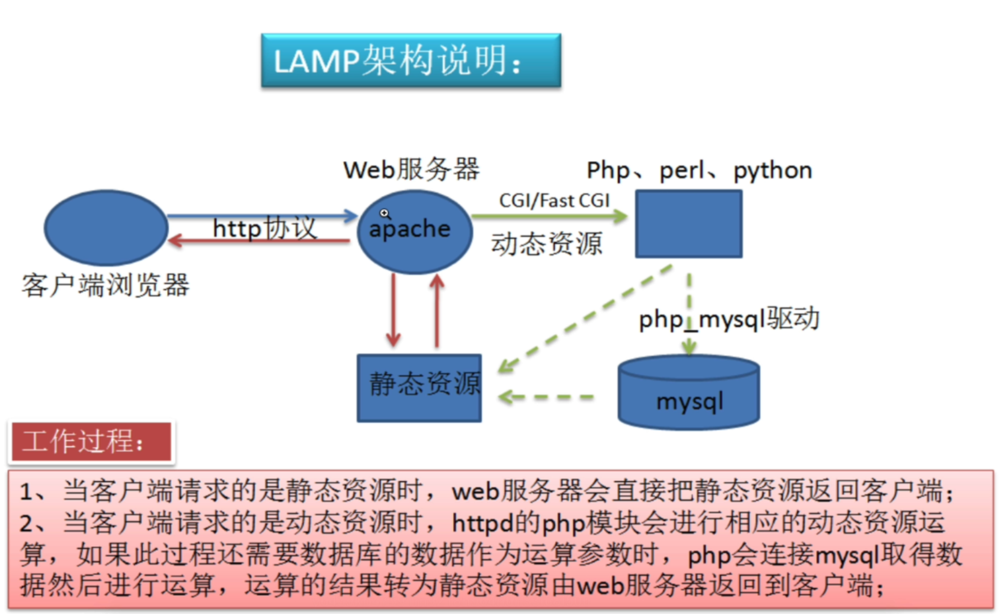

##lamp架构描述
```shell
lamp是一个c/s架构的平台，最初是web客户端基于tcp/ip协议发出http请求，服务端进行响应，
用户的请求可能是动态的，也可能是静态的。

web服务器的作用主要是接收请求、响应请求、转发动态请求

web服务器通过用户请求的url后缀，进行动静判断
静态请求，web server直接处理
动态请求，web server转发给后台应用服务器处理

apache和php所处的环境：
  如果安装在同一台服务器，默认使用系统共享内存通信
  如果安装在2台服务器，就得通过网络，进行socket网络套接字通信
```  

##0. 环境准备
```shell
# 192.168.178.122

##1. 关闭防火墙规则和服务
```shell
iptables -F
systemctl stop firewalld
systemctl disable firewalld

setenforce 0
vim /etc/selinux/config
# 改为disable
```
##2. 部署apache
```shell
yum install httpd -y

systemctl start httpd
systemctl enable httpd
```
##3. 部署MySQL（mariadb）
```shell
#1.安装mariadb
yum install mariadb-server mariadb -y
systemctl start mariadb
netstat -tunlp|grep mysql
ps -ef|grep mysql
systemctl status mariadb

#2.登录数据库测试
mysql -uroot -p #直接回车，默认没有密码

#3. 修改root密码
mysqladmin -uroot password "123456"

#4.再次登录测试
mysql -uroot -p123456
```
##4. 部署php
```shell
#1. 安装php依赖环境
yum install -y zlib-devel libxml2-devel libjpeg-devel libjpeg-turbo-devel libiconv-devel freetype-devel lib-ng-devel gd-devel libcurl-devel libxslt-devel libtool-ltdl-devel pcre pcre-devel apr apr-devel zlib-devel gcc make -y

#2.安装php解释器及php连接mysql驱动
yum install php php-mysql -y
```
##5. 修改apache配置文件，使其支持php代码
```shell

vim /etc/httpd/conf/httpd.conf

# 在DocumentRoot "/var/www/html"下面添加如下内容
DocumentRoot "/var/www/html"
TypesConfig /etc/mime.types
AddType application/x-httpd-php.php
AddType application/x-httpd-php-source.phps
DirectoryIndex index.php index.html
```
##6. 在apache网站根目录新建index.php
```shell
vim /var/www/html/index.php

<meta charset=utf8>
<?php 
phpinfo();
?>
7. 重启httpd¶

systemctl restart httpd
```
##8. 访问页面测试
```shell
# 192.168.178.122
```
##9. php连接MySQL设置
```shell

#1. 新建连接mysql的测试页面
vim /var/www/html/conn_mysql.php
#写入如下内容
<meta charset=utf8>
<?php
    $conn=mysql_connect('localhost','root','123456');
    if($conn)
        echo "success";
    else
        echo "failure";
    mysql_coles();
?>
```
##10. 访问页面测试
```shell
# 192.168.178.122/conn_mysql.php

# 返回成功的话，关闭mariadb
systemctl stop mariadb

# 再次刷新测试！
```