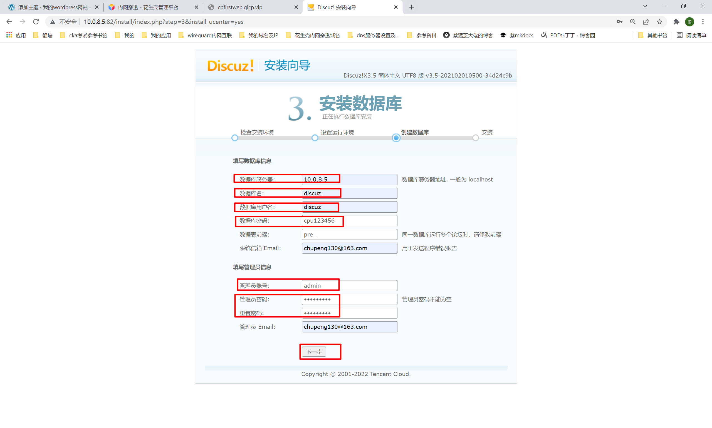
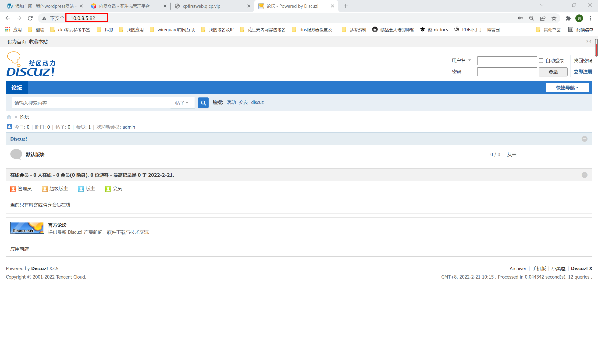

##1. 说明
```shell
之前是在lamp环境搭建的discuz，使用docker搭建更简单！！！
```
##2. 拉取镜像
```shell
docker pull tencentci/discuz
```
##3. 运行
```shell
docker run -d -p 82:80 --name discuz --restart always tencentci/discuz
```
##4. 查看
```shell
docker ps|grep discuz
```
##5. 创建discuz数据库
```shell
mysql -uroot -p123456

create database discuz;
grant all on discuz.* to discuz@'%' identified by 'cpu123456';
flush privileges;
```
##6. 浏览器访问
```shell
# 10.0.8.5:82
1. 点击我同意
2. 下一步
3. 全新安装
4. 填写数据库相关信息，等待安装完成！
```

```shell
5.安装完成后，点击访问，界面如下
```

