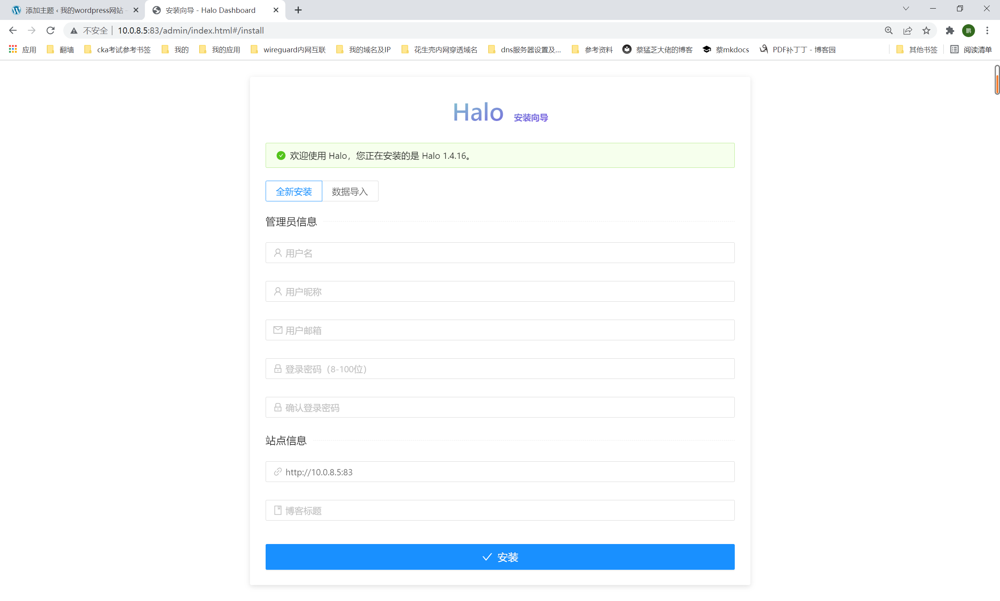
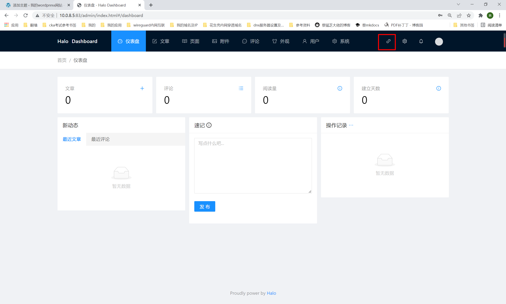
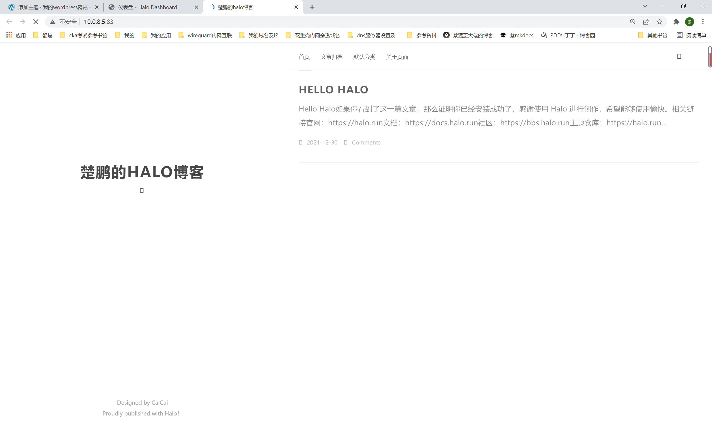
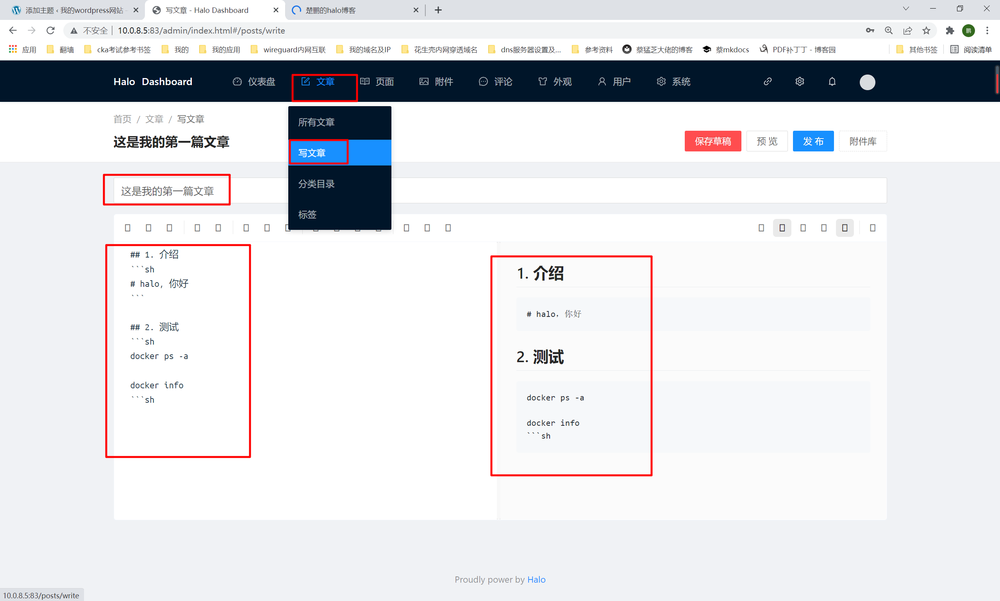

##1. 拉取镜像
```shell
# https://docs.halo.run/#docker
docker pull halohub/halo
```
##2. 运行
```shell
docker run -it -d --name halo -p 83:8090 -v ~/.halo:/root/.halo --restart=always halohub/halo
```
##3. 查看
```shell
docker ps|grep halo
```
##4. 访问
```shell
按照提示输入相关信息，
```

```shell
点击安装后，输入刚才设置的用户名和密码，就可以登录到后台
```

```shell
点击右上角，即可查看当前网站
```

##5. 写文章测试
```shell
点击写文章，可以看出，支持md格式，感觉适合在线写技术博客！
```
