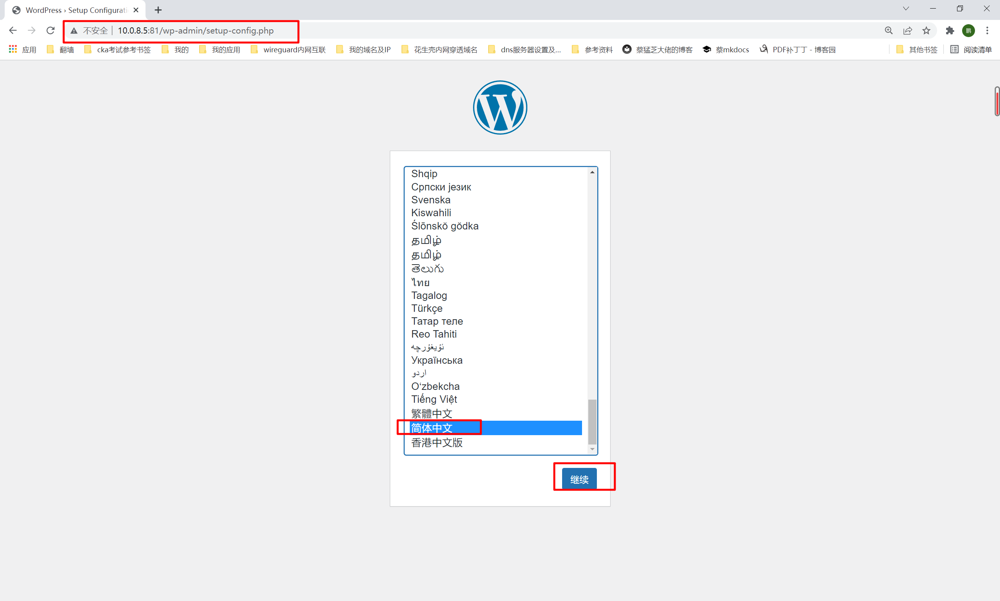
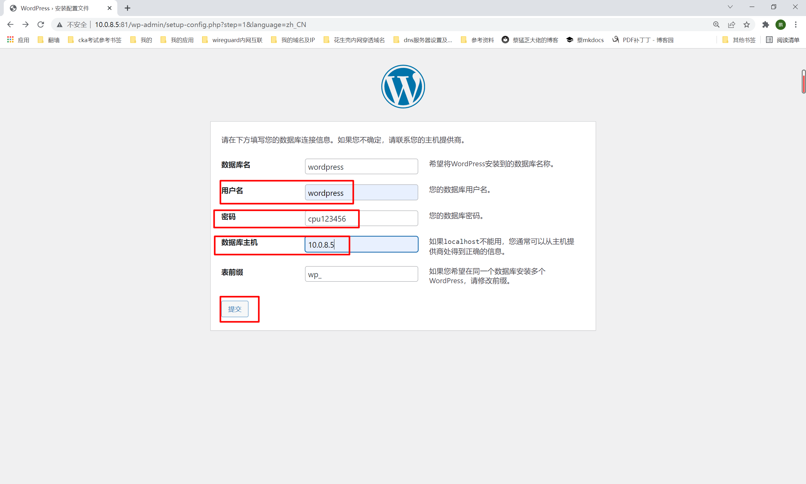
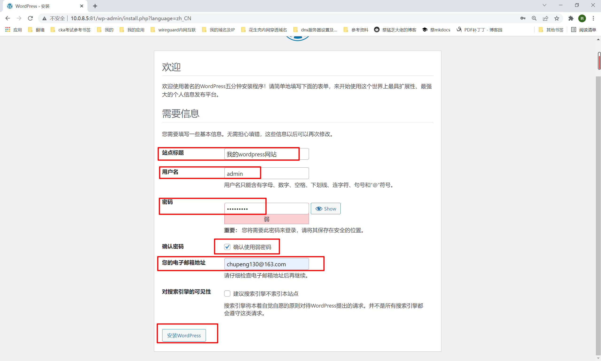
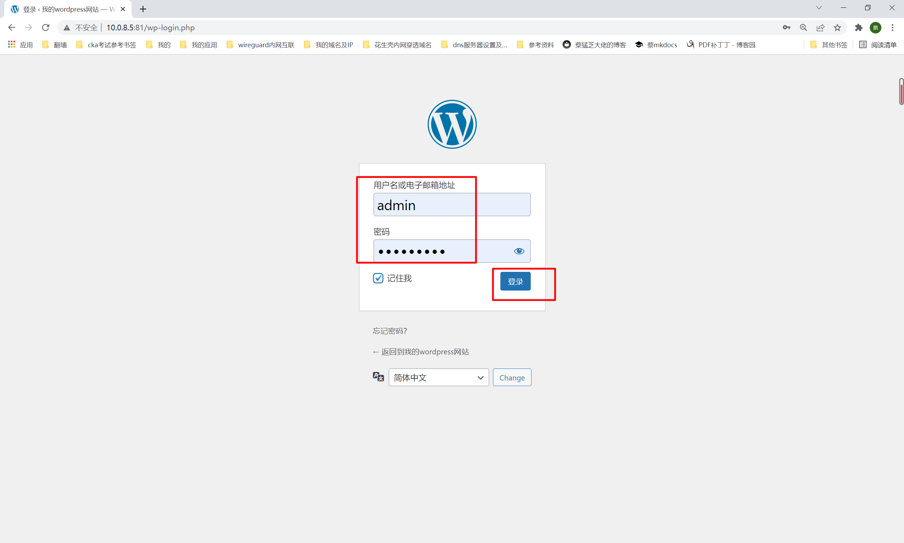
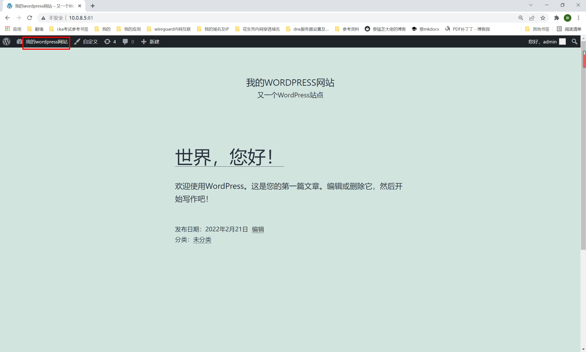

##1. 介绍
```shell
前面在lnmp环境搭建过wordpress，下面使用docker搭建wordpress，简单易用！
```
##2. 拉取镜像
```shell
root@4c16g:~# docker pull wordpress
```
##3. 运行
```shell
docker run -d --name wordpress -p 81:80 --restart always wordpress:latest
```
##4. 查看
```shell
docker ps |grep wordpress
```
```shell
root@4c16g:~# docker run -d --name wordpress -p 81:80 --restart always wordpress:latest
13855e5a3b747d553544b02cc9a605698c7f379efce94eedf3e621d52a68739e
root@4c16g:~#
root@4c16g:~# docker ps |grep word
13855e5a3b74   wordpress:latest                                      "docker-entrypoint.s…"   6 seconds ago   Up 5 seconds          0.0.0.0:81->80/tcp, :::81->80/tcp                                                                                                 wordpress
root@4c16g:~#

```
##5. 创建wordpress数据库及用户
```shell
#1.root登录
mysql -uroot -p123456

#2.创建数据库、用户
create database wordpress;
grant all on wordpress.* to wordpress@'%' identified by 'cpu123456';
flush privileges;
```
##6. 浏览器访问
```shell
# 10.0.8.5:81
```

```shell
1.选择语言，下一步
2.输入数据库信息
```

```shell
3.输入网站相关信息
```

```shell
4.输入上一步设置的用户名核密码即可登录到后台了！
```

```shell
5.点击左上角，即可看到当前的网站了
```


```shell
6.再次点击左上角回到后台，然后可以在文章栏，写自己的博客了！还可以设置主题等
```