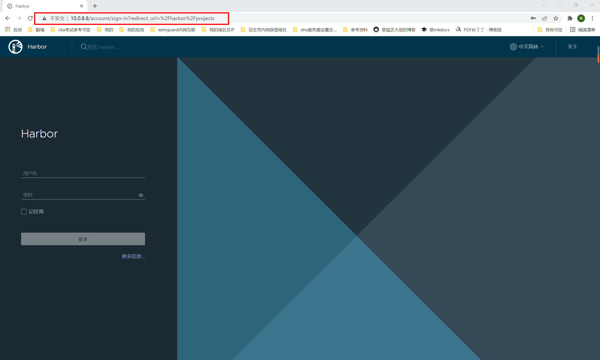

##1. 环境准备
```shell
# ubuntu20.04
# ip：10.0.8.8
```
##2. 安装
```shell
# ubuntu系统安装方法如下，yum安装也是简单的几步就能完成！
# 官方安装文档：https://caddyserver.com/docs/install#debian-ubuntu-raspbian
# 稳定版
sudo apt install -y debian-keyring debian-archive-keyring apt-transport-https
curl -1sLf 'https://dl.cloudsmith.io/public/caddy/stable/gpg.key' | sudo tee /etc/apt/trusted.gpg.d/caddy-stable.asc
curl -1sLf 'https://dl.cloudsmith.io/public/caddy/stable/debian.deb.txt' | sudo tee /etc/apt/sources.list.d/caddy-stable.list
sudo apt update
sudo apt install caddy

# 安装完成后默认开启！使用systemctl查看状态
systemctl status caddy
netstat -tunlp|grep caddy

# 此时可以访问80端口测试了！
```
##3. 查看配置文件
```shell
cat /etc/caddy/Caddyfile

root@baiduyun:/etc/caddy# cat /etc/caddy/Caddyfile
# The Caddyfile is an easy way to configure your Caddy web server.
#
# Unless the file starts with a global options block, the first
# uncommented line is always the address of your site.
#
# To use your own domain name (with automatic HTTPS), first make
# sure your domain's A/AAAA DNS records are properly pointed to
# this machine's public IP, then replace ":80" below with your
# domain name.

#1.这里设置域名及监听端口
:80 {
 # Set this path to your site's directory.
 #2.这里设置静态网站目录，可以将mkdocs生成的静态html部署到这里！
 root * /usr/share/caddy

 # Enable the static file server.
 #3.文件服务器
 file_server

 # Another common task is to set up a reverse proxy:
 #4.这里设置反向代理
 # reverse_proxy localhost:8080

 # Or serve a PHP site through php-fpm:
 #5.这里设置php接口
 # php_fastcgi localhost:9000
}

# Refer to the Caddy docs for more information:
# https://caddyserver.com/docs/caddyfile
```
##4. 反向代理
```shell
#1.备份
cd /etc/caddy
cp Caddyfile{,.bak}

#2.修改
vim Caddyfile
:80 {
 # root * /usr/share/caddy        # 注释这里

 file_server

 # Another common task is to set up a reverse proxy:
 reverse_proxy localhost:800    # 开启这里，反向代理到自己的服务上

 #3.浏览器访问测试
 # 我的800端口服务是habor，防火墙未开启800，通过80端口反向代理访问测试
``` 


##5. 与nginx对比
```shell
1.感觉配置文件比nginx易读简单
首先，开头直接设置域名和端口
然后静态网站则直接设置目录
反向代理则直接设置要代理的端口即可

2.感觉功能可能比nginx少一些？毕竟配置文件就这些内容，不过对于个人使用来说绝对够用！
毕竟比较小众，国内相关使用案例及文档比较少，只能参考官网，参考案例少，可能遇到问题不好解决

3.自动https，这个我还没测试，不过对于个人来说这样确实方便很多！

4. 想要了解更多可以查看官网内容！
```