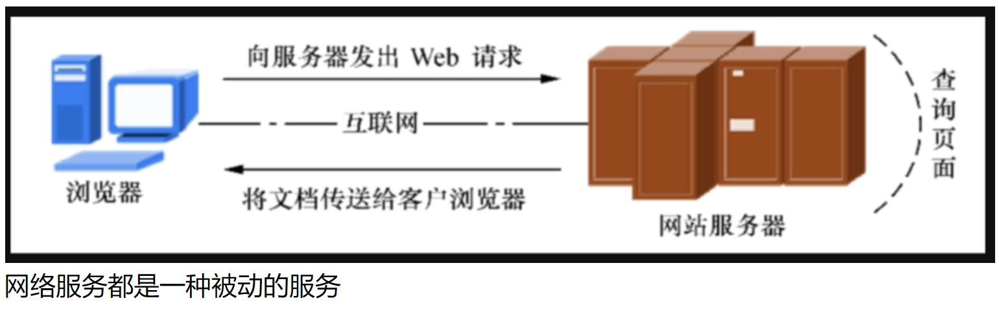

##1. web服务器介绍

```shell
web服务器主要用于提供网上信息浏览，是一种被动访问的服务程序。
只有接收到互联网中其他主机发出的请求后才会响应，通过http或https把请求的内容发送给用户。
```




##2. 常见web服务器
```shell
目前世界上主流的web服务器软件
apache
nginx
IIS   （windows平台，Internet Information Server）
lighttpd

Apache：国企用的多，技术栈要求不那么先进，没有大量的流量，只需要系统架构稳定
nginx：主流的互联网公司大部分选择使用nginx，轻量高性能
Lighttpd：性能非常接近nginx，主要是国外使用
Tomcat：应用服务器，做java程序解析
```
##3. web服务器排行榜
```shell
# web服务器排行榜
https://news.netcraft.com/archives/category/web-server-survey/

# 现在nginx已经是第一了！
```