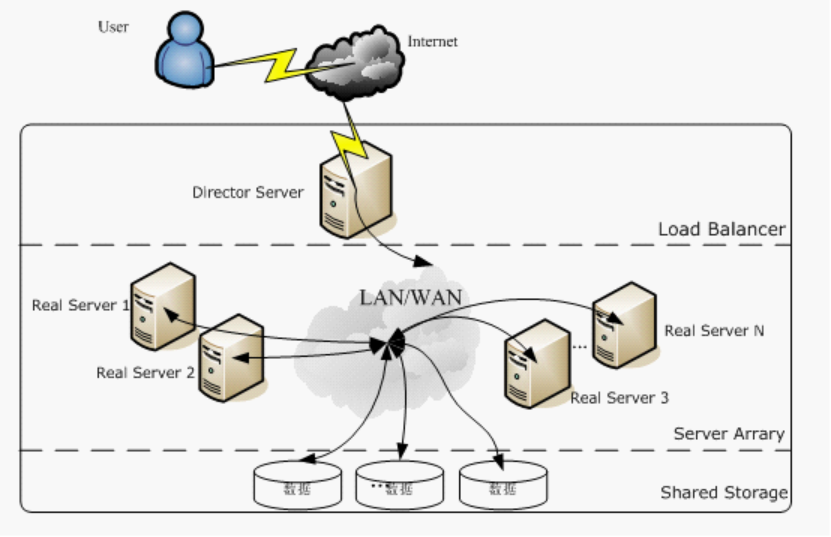

##一.LVS是什么？
```shell
LVS的英文全称是Linux Virtual Server，即Linux虚拟服务器。它是我们国家的章文嵩博士的一个开源项目。
在linux内存2.6中，它已经成为内核的一部分，在此之前的内核版本则需要重新编译内核。
```
##二.LVS能干什么？
```shell
LVS主要用于多服务器的负载均衡。它工作在网络层，可以实现高性能，高可用的服务器集群技术。
它廉价，可把许多低性能的服务器组合在一起形成一个超级服务器。
它易用，配置非常简单，且有多种负载均衡的方法。
它稳定可靠，即使在集群的服务器中某台服务器无法正常工作，也不影响整体效果。
另外可扩展性也非常好。
```
##三.工作原理

```shell
####如上图，LVS可分为三部分：

1.Load Balancer：这是LVS的核心部分，它好比我们网站MVC模型的Controller。
它负责将客户的请求按照一定的算法分发到下一层不同的服务器进行处理，自己本身不做具体业务的处理。
另外该层还可用监控下一层的状态，如果下一层的某台服务器不能正常工作了，它会自动把其剔除，恢复后又可用加上。
该层由一台或者几台Director Server组成。

2.Server Array：该层负责具体业务。可有WEB Server、mail Server、FTP Server、DNS Server等组成。
注意，其实上层的Director Server也可以当Real server用的。

3.Shared Storage：主要是提高上一层数据和为上一层保持数据一致。
```
##四.负载均衡机制
```shell
前面我们说了LVS是工作在网络层。
相对于其它负载均衡的解决办法，比如DNS域名轮流解析、应用层负载的调度、客户端的调度等，它的效率是非常高的。
LVS的通过控制IP来实现负载均衡。IPVS是其具体的实现模块。
IPVS的主要作用：安装在Director Server上面，在Director Server虚拟一个对外访问的IP（VIP）。
用户访问VIP，到达Director Server，Director Server根据一定的规则选择一个Real Server，
处理完成后然后返回给客户端数据。这些步骤产生了一些具体的问题，比如如何选择具体的Real Server，
Real Server如果返回给客户端数据等等。IPVS为此有三种机制：

1.VS/NAT(Virtual Server via Network Address Translation)，即网络地址翻转技术实现虚拟服务器。
当请求来到时，Diretor server上处理的程序将数据报文中的目标地址（即虚拟IP地址）改成具体的某台Real Server,
端口也改成Real Server的端口，然后把报文发给Real Server。Real Server处理完数据后，
需要返回给Diretor Server，然后Diretor server将数据包中的源地址和源端口改成VIP的地址和端口，
最后把数据发送出去。由此可以看出，用户的请求和返回都要经过Diretor Server，
如果数据过多，Diretor Server肯定会不堪重负。

2.VS/TUN（Virtual Server via IP Tunneling）,即IP隧道技术实现虚拟服务器。
它跟VS/NAT基本一样，但是Real server是直接返回数据给客户端，不需要经过Diretor server,
这大大降低了Diretor server的压力。

3.VS/DR（Virtual Server via Direct Routing），即用直接路由技术实现虚拟服务器。
跟前面两种方式，它的报文转发方法有所不同，VS/DR通过改写请求报文的MAC地址，将请求发送到Real Server，
而Real Server将响应直接返回给客户，免去了VS/TUN中的IP隧道开销。
这种方式是三种负载调度机制中性能最高最好的，
但是必须要求Director Server与Real Server都有一块网卡连在同一物理网段上。
```
##五.负载调度算法
```shell
前面我们都知道Director Server要选择不同的Real server，那么它具体的如果选择Real Server以达到负载均衡的呢，
IPVS实现了八种调度方法,具体算法可以查看官网或者百度，这里就不一一列出了。
官网：www.linuxvirtualserver.org。
```