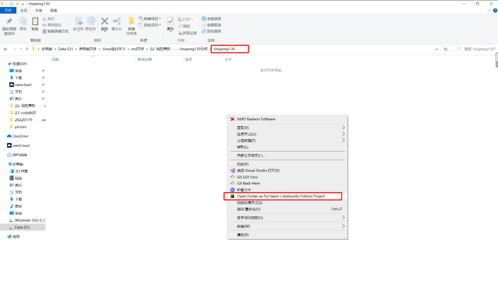
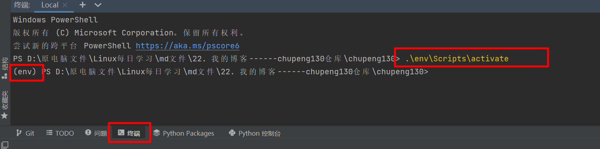
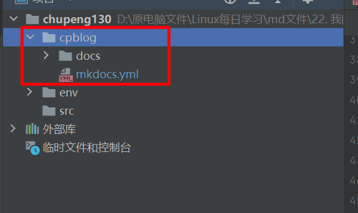

##1. 前提
```shell
# windows已安装pycharm及git
```
##2. windows本地新建目录chupeng130
##3. 在pycharm打开目录
```shell
#1.进入目录chupeng130
#2.鼠标右键空白处，然后选择在pycharm中打开
```


##4. 安装虚拟环境
```shell
#1. 打开命令行终端，输入
virtualenv env
#2.启动虚拟环境
env/scripts/activate
# 虚拟环境启动成功如下，命令行前带有（env）字样！
```

##5. 安装mkdocs
```shell
pip install mkdocs

# 安装成功后，可以使用mkdocs -h查看帮助信息
Usage: mkdocs [OPTIONS] COMMAND [ARGS]...

  MkDocs - Project documentation with Markdown.

Options:
  -V, --version  Show the version and exit.
  -q, --quiet    Silence warnings
  -v, --verbose  Enable verbose output
  -h, --help     Show this message and exit.

Commands:
  build      Build the MkDocs documentation
  gh-deploy  Deploy your documentation to GitHub Pages
  new        Create a new MkDocs project
  serve      Run the builtin development server
```
##6. 创建项目cpblog
```shell
mkdocs new cpblog
# 执行命令后，生成cpblog目录，其中包含
一个docs目录：存放md文件
一个yml文件：配置文件
```

##7. 启动测试
```shell
# 使用如下命令，可以启动测试，注意：此命令必须在yml配置文件目录下执行！！！
cd cpblog
mkdocs serve
```
##8. 安装主题
```shell
pip install mkdocs-material
# 还有许多主题可以使用，具体见官网
```
##9. 修改配置文件
```shell
配置文件最重要的2部分是主题和导航！
主题就是你网站的外观，选择一个适合自己的
导航就是你本篇博客涉及的目录导航，每次添加修改内容基本都需要在这里操作！
# 详细配置可参考网址：https://squidfunk.github.io/mkdocs-material
```
```shell
目前我的配置文件内容如下：
# 详细配置可参考网址：https://squidfunk.github.io/mkdocs-material

#1. 定义网站名称
site_name: 楚鹏的个人博客
# 本网站一些内容说明
site_description: 'Linux相关知识'
site_author: 'chupeng'
# 本博客的url
site_url: 'http://chupeng.site'

#2.使用material主题
theme:
  name: material
  # 更改语言为中文
  language: 'zh'
  # 将导航从左侧竖着变成上方横着！默认是左侧竖着显示。
  features:
    - navigation.tabs
    - navigation.tabs.sticky
  # 更改页面颜色，indigo：湛蓝色，可以根据自己喜好修改！
#  palette:
#    scheme: default
#    primary: 'brown'
#    accent: 'indigo'
  # 添加主题调色板切换按钮
  palette:
    - scheme: default
      primary: 'green'
      toggle:
        icon: material/toggle-switch-off-outline
#        name: Switch to dark mode
        name: 切换夜间模式
    - scheme: slate
      primary: 'green'
      toggle:
        icon: material/toggle-switch
#        name: Switch to light mode
        name: 切换日间模式
  # 更改字体
  font:
    text: 'Roboto'
    code: 'Roboto Mono'
#  # 更改网址图标
#  logo: 'static/imgs/cp.png'
#  # 也可以自己写css代码更改主题样式
#  palette:
#    scheme: youtube
#extra_css:
#  - stylesheets/extra.css


#3. 网站内容导航，(其他配置基本上配置完就不必再动了，而这里只要新增内容，基本就要在这里添加修改！！！）
nav:
  # 合并简介和更新日志，并使用 ”空“ 当导航栏标题，减少占用的导航空间！
  - "": index.md
#  - 简介:
#    - 本博客介绍: index.md
#    - 更新日志: update/index.md
  # Linux命令相关
  - 命令:
    - 引言: command/index.md
    - 基础命令:
      - 常用命令:
        - 1. 介绍: command/src/1.base-cmd.md
      - 帮助命令:
        - 1. 介绍: command/src/2.help-cmd.md
      - 磁盘管理命令:
        - 1. 介绍: command/src/3.disk-cmd.md
      - 压缩解压命令:
        - 1. 介绍: command/src/4.compress-cmd.md
      - 进程管理命令:
        - 1. 介绍: command/src/5.process-cmd.md
      - 权限管理命令:
        - 1. 介绍: command/src/6.authority-cmd.md
      - 网络命令:
        - 1. 介绍: command/src/7.network-cmd.md
      - 安装命令:
        - 1. 介绍: command/src/8.install-cmd.md
      - 系统管理命令:
        - 1. 介绍: command/src/9.sys-cmd.md
      - 用户管理命令:
        - 1. 介绍: command/src/10.user-cmd.md
      - 定时任务命令:
        - 1. 介绍: command/src/11.time-cmd.md

    - 三剑客（重点！）:
      - grep:
        - 1. 介绍: command/grep/index.md
        - 2. 案例: command/grep/grep.md
      - sed:
        - 1. 介绍: command/sed/index.md
        - 2. 案例: command/sed/sed.md
      - awk:
        - 1. 介绍: command/awk/index.md
        - 2. 案例: command/awk/awk.md

  # Linux基础知识
  - 基础:
    - 引言: service/index.md
    - ftp:
      - 1. 介绍: service/src/1.ftp.md
    - dns:
      - 1. 介绍: service/src/1.ftp.md
    - raid:
      - 1. 介绍: service/src/1.ftp.md
    - 定时任务:
      - 1. 介绍: service/src/1.ftp.md
    - 网络知识:
      - 1. 介绍: service/src/1.ftp.md

  # web服务，重点！
  - web服务:
    - 引言: web-service/index.md
    - nginx:
      - 1. 介绍: web-service/nginx/index.md
      - 2. 安装: web-service/nginx/1.install.md
      - 3. 配置文件: web-service/nginx/2.conf.md
      - 4. nginx基本命令: web-service/nginx/3.使用.md
      - 5. lnmp搭建: web-service/nginx/5.lnmp-yum.md
      - 6. http状态码: web-service/nginx/6.http-status-code.md
      - 7. 反向代理和负载均衡: web-service/nginx/7.upstream.md
      - 8. 虚拟主机配置: web-service/nginx/8.nginx虚拟主机配置.md
      - 9. location匹配: web-service/nginx/9.location匹配.md
      - 10. 日志格式设置: web-service/nginx/10.日志格式.md
      - 11. 错误日志: web-service/nginx/11.错误日志.md
      - 12. 日志切割: web-service/nginx/12.日志切割.md
      - 13. 目录浏览功能: web-service/nginx/13.目录浏览功能.md
      - 14. 状态页功能: web-service/nginx/14.状态页功能.md
      - 15. url地址重写: web-service/nginx/15.url地址重写.md
      - 16. 访问认证: web-service/nginx/16.访问认证.md
      - 17. 热部署: web-service/nginx/17.nginx热部署.md
    - LVS:
      - 1. 介绍: web-service/lvs/index.md
      - 2. 安装: web-service/lvs/2.LVS部署.md
      - 3. 原理: web-service/lvs/3.lvs原理.md
    - keepalived:
      - 1. 介绍: web-service/keepalived/index.md
      - 2. 单主配置: web-service/keepalived/2.install-single.md
      - 3. 双主配置: web-service/keepalived/3.install-double.md
    - apache:
      - 1. 介绍: web-service/apache/index.md
      - 2. 安装: web-service/apache/2.install.md
      - 3. 使用: web-service/apache/3.use.md
      - 4. LAMP搭建: web-service/apache/4.lamp-yum.md
      - 5. discuz论坛搭建: web-service/apache/5.discuz.md
    - tomcat:
      - 1. 介绍: web-service/tomcat/index.md
      - 2. tomcat部署: web-service/tomcat/2. tomcat部署实践.md
      - 3. jpress部署: web-service/tomcat/3.jpress部署.md
      - 4. tomcat负载均衡: web-service/tomcat/4.tomcat负载均衡.md
    - caddy:
      - 1. 介绍: web-service/caddy/index.md
      - 2. 安装: web-service/caddy/2.install.md
      # 博客软件，个人网盘软件，个人笔记软件
    - 个人论坛博客:
        - 介绍: web-service/blog/index.md
        - wordpress:
            - 1. 介绍: web-service/blog/wordpress/index.md
            - 2. docker部署: web-service/blog/wordpress/2.docker部署wordpress.md
        - discuz:
            - 1. 介绍: web-service/blog/discuz/index.md
            - 2. docker部署: web-service/blog/discuz/2.docker部署discuz.md
        - halo:
            - 1. 介绍: web-service/blog/halo/index.md
            - 2. docker部署: web-service/blog/halo/2.docker部署halo.md
        - flask:
            - 1. 介绍: web-service/blog/flask/index.md
        - django:
            - 1. 介绍: web-service/blog/django/index.md
    - 个人网盘:
      - owncloud:
        - 1.owncloud部署: web-service/other/1. 使用docker部署owncloud——自己的云盘.md
      - 可道云:
        - 1.kodexplorer部署: web-service/other/2. kodexplorer容器网盘快速部署.md
    - 个人在线笔记:
      - leanote:
        - 1.leanote部署: web-service/other/3. leanote的docker镜像部署.md
    - 本博客搭建工具:
      - mkdocs:
        - 1.介绍: web-service/mkdocs/index.md
        - 2.介绍: web-service/mkdocs/index.md
        - 3.介绍: web-service/mkdocs/index.md
  # 文件系统
  - 文件系统:
    - 引言: filesystem/index.md
    - nfs:
      - 1. 介绍: filesystem/nfs/index.md
      - 2. centos安装nfs: filesystem/nfs/2. nfs安装.md
      - 3. ubuntu安装nfs: filesystem/nfs/3. Ubuntu 20.04 中配置NFS服务.md
    - hadoop:
      - 1. 介绍: filesystem/hadoop/index.md
      - 2. 本地搭建: filesystem/hadoop/1. hadoop本地搭建.md
      - 3. 伪分布式搭建: filesystem/hadoop/2. hadoop伪分布式搭建.md
      - 4. 完全分布式搭建: filesystem/hadoop/3. hadoop完全分布式搭建.md
      - 5. 改进部署: filesystem/hadoop/4. xcall.sh和xsync.sh脚本——改进部署.md
      - 6. 脚本：一键切换模式: filesystem/hadoop/5. 创建change.sh脚本——实现一键修改hadoop模式.md
      - 7. 拓展：最高最低气温统计: filesystem/hadoop/6. 拓展-最高最低气温统计.md
    - ceph:
      - 1. 介绍: filesystem/ceph/index.md
    - glusterfs:
      - 1. 介绍: filesystem/glusterfs/index.md
    - nas:
      - 1. 介绍: filesystem/nas/index.md
      - 2. trueNAS-core安装: filesystem/nas/1.trueNAS-core安装.md
  # 内网穿透，安全相关
  - vpn:
    - 引言: vpn/index.md
    - openvpn:
      - 1. 介绍: vpn/openvpn/index.md
      - 2. docker安装: vpn/openvpn/1. 使用docker搭建openvpn实现内网穿透.md
    - wireguard:
      - 1. 介绍: vpn/wireguard/index.md
      - 2. 云服务器安装wireguard: vpn/wireguard/2. 使用WireGuard实现不同云服务器内网互联.md
      - 3. windows客户端安装设置: vpn/wireguard/3.win10使用wireguard搭建vpn访问内网.md
    - 花生壳内网穿透:
      - 1. 介绍: vpn/hsk/index.md
      - 2. 安装: vpn/hsk/1.花生壳内网穿透阿里云服务器.md
    - 翻墙:
      - 1. 介绍: vpn/fq/index.md
      - 2. shadowsocks: vpn/fq/2.shadowsocks.md
      - 3. v2ray: vpn/fq/3.v2ray.md
  # 跳板机
  - 堡垒机:
    - 引言: jumpserver/index.md
    - jumpserver:
      - 1. 安装: jumpserver/src/1. 使用官方文档的一键部署jumpserver.md
      - 2. 基本设置: jumpserver/src/2. jumpserver基本设置.md
      - 3. 邮箱设置: jumpserver/src/3. jumpserver邮箱设置.md
      - 4. 企业微信认证: jumpserver/src/4. jumpserver企业微信认证.md
      - 5. 创建系统用户: jumpserver/src/5. jumpserver创建系统用户和普通用户.md
      - 6. 创建资产: jumpserver/src/6. jumpserver创建资产.md
      - 7. 创建用户: jumpserver/src/7. jumpserver创建用户组和用户.md
      - 8. 资产授权: jumpserver/src/8. jumpserver资产授权.md
      - 9. MySQL应用管理: jumpserver/src/9. jumpserver创建MySQL数据库应用管理.md
      - 10. k8s应用管理: jumpserver/src/10. jumpserver创建kubernetes应用管理.md
      - 11. 设置企业微信登录: jumpserver/src/11. jumpserver设置使用企业微信登录jumpserver.md
  # 脚本相关
  - 脚本:
    - 引言: scripts/index.md
    - shell脚本:
      - 1. 介绍: scripts/shell/0.index.md
      - 2. shebang: scripts/shell/1. 脚本执行方式.md
      - 3. source与sh区别: scripts/shell/2. source与sh执行脚本的区别.md
      - 4. history命令: scripts/shell/3. history命令.md
      - 5. 环境变量: scripts/shell/4. 环境变量.md
      - 6. 引号区别: scripts/shell/5.变量中单引号、双引号、反引号的区别.md
      - 7. 特殊参数变量: scripts/shell/6. 特殊参数变量------$0,$n,$#,$,$@.md
      - 8. 特殊状态变量: scripts/shell/7. 特殊状态变量------$,$$,$!,$_.md
      - 9. 内置命令: scripts/shell/8. 内置命令------echo,eval,exec,export,read,shift.md
      - 10. shell子串用法: scripts/shell/9. shell子串的用法-----及统计变量长度的方法.md
      - 11. 变量匹配: scripts/shell/10. 变量匹配删除和匹配替换.md
      - 12. 批量修改文件名: scripts/shell/11. 批量修改文件名.md
      - 13. shell扩展变量: scripts/shell/12. shell扩展变量.md
      - 14. 删除7天前文件: scripts/shell/12.1 删除7天前的MySQL备份文件.md
      - 15. 父子进程: scripts/shell/13 shell父子进程.md
      - 16. type命令: scripts/shell/14. 如何查看是内置命令还是外置命令-----type.md
      - 17. 算术运算: scripts/shell/15. 算术运算.md
      - 18. 脚本：nginx服务检测: scripts/shell/15.1 nginx服务检测脚本.md
      - 19. 脚本：判断文件后缀: scripts/shell/15.2 判断文件后缀名脚本.md
      - 20. 脚本：判断单词长度: scripts/shell/15.3 判断单词长度小于5的脚本.md
      - 21. 脚本：算术运算: scripts/shell/15.4 算术运算脚本.md
      - 22. 条件语法: scripts/shell/16. 条件语法.md
      - 23. 脚本：控制输入: scripts/shell/16.1 只能输入1or2的脚本.md
      - 24. 脚本：安装lnmp: scripts/shell/16.2 安装lnmplamp脚本.md
      - 25. if语法: scripts/shell/17. if语法.md
      - 26. 脚本：剩余内存检测: scripts/shell/17.1 剩余内存检测脚本.md
      - 27. 脚本：数字比较: scripts/shell/17.2 俩数比较脚本.md
      - 28. 脚本：MySQL服务检测: scripts/shell/17.3 MySQL服务检测脚本.md
      - 29. 脚本：rsync服务启停: scripts/shell/17.4 rsync服务启停脚本.md
      - 30. 函数: scripts/shell/18. 函数.md
      - 31. 脚本：网站存活: scripts/shell/18.1 网站存活检测脚本及美化.md
      - 32. 脚本：rsync管理: scripts/shell/18.2 rsync管理脚本.md
      - 33. case用法: scripts/shell/19. case用法.md
      - 34. 脚本：猜数字: scripts/shell/19.1 猜数字游戏.md
      - 35. 脚本：菜单: scripts/shell/19.2 水果菜单脚本.md
      - 36. while循环: scripts/shell/20. while循环.md
      - 37. 后台执行脚本: scripts/shell/20.1 脚本放入后台执行及拉回前台执行.md
      - 38. 脚本：循环打印数字: scripts/shell/20.2 循环打印数字脚本.md
      - 39. 脚本：模拟seq命令: scripts/shell/20.3 模拟seq脚本.md
      - 40. until用法: scripts/shell/20.4 until用法.md
      - 41. 脚本：监控网站: scripts/shell/20.5 监控网站脚本.md
      - 42. 脚本：检测url: scripts/shell/20.6 检测多个url脚本.md
      - 43. 脚本：分析nginx日志: scripts/shell/20.7 分析nginx日志脚本.md
      - 44. 脚本：防ddos攻击: scripts/shell/20.8 防ddos攻击脚本.md
      - 45. for循环: scripts/shell/21. for循环.md
      - 46. for循环写法: scripts/shell/21.1 for循环写法.md
      - 47. 脚本：获取所有文件名: scripts/shell/21.2 获取当前目录及子目录所有文件名脚本.md
      - 48. 脚本：批量重命名: scripts/shell/21.3 批量重命名脚本.md
      - 49. 脚本：99乘法表: scripts/shell/21.4 99乘法表脚本.md
      - 50. 脚本：MySQL分库备份: scripts/shell/21.5 mysql分库备份脚本.md
      - 51. 脚本：批量创建账号: scripts/shell/21.6 面试题：批量创建系统账号密码脚本.md
      - 52. 脚本: scripts/shell/22 企业面试题.md
      - 53. 脚本：批量生产随机字符文件: scripts/shell/22.1批量生成随机字符文件名脚本.md
      - 54. 脚本：批量改名: scripts/shell/22.2 批量改名脚本.md
      - 55. 脚本：批量创建特殊要求用户: scripts/shell/22.3 批量创建特殊要求用户.md
      - 56. 脚本：扫描存活主机: scripts/shell/22.4 扫描网络内的存活主机脚本.md
      - 57. 脚本：mysql分库备份: scripts/shell/22.5 mysql数据库分库备份.md
      - 58. 脚本：mysql分库分表备份: scripts/shell/22.6 mysql数据库分库分表备份.md
      - 59. 脚本：ssh免密批量分发文件: scripts/shell/22.7 ssh免密钥批量分发文件专业脚本.md
      - 60. 脚本：破解random随机数: scripts/shell/22.8 破解random随机数脚本.md
      - 61. 脚本：批量检查多个网站: scripts/shell/22.9 批量检查多个网站地址脚本.md
      - 62. 脚本：解决ddos攻击: scripts/shell/22.10 解决ddos攻击脚本.md
      - 63. 脚本：MySQL服务启停: scripts/shell/22.11 MySQL服务启停脚本.md
      - 64. 脚本：单词及字母去重排序: scripts/shell/22.12 单词及字母去重排序(排序去重面试非常常见！！！).md
    - python脚本:
      - 1. 介绍: scripts/python/index.md
      - 2. 使用paramiko连接linux: scripts/python/1. paramiko模块ssh登录Linux服务器.md
      - 3. 上传文件到服务器: scripts/python/2. paramiko模块上传文件到Linux服务器.md
      - 4. 计时器py脚本: scripts/python/3. 计时器功能.md
      - 5. 从服务器下载文件: scripts/python/4. 下载Linux服务器文件到本地.md
      - 6. nginx检测自启脚本: scripts/python/5. nginx自动检测重启py脚本.md
      - 7. 获取CPU信息脚本: scripts/python/6. 获取cpu信息py脚本.md
#      - 8. 获取系统负载脚本: scripts/python/7.获取系统负载信息py脚本.md
      - 9. 获取内存信息脚本: scripts/python/8. 获取内存信息py脚本.md
      - 10. 获取网络接口使用情况脚本: scripts/python/9. 获取网络接口使用情况信息py脚本.md
  # 监控相关
  - 监控:
    - 引言: monitor/index.md
    - zabbix:
      - 1. 介绍: monitor/zabbix/index.md
      - 2. 安装: monitor/zabbix/1. Ubuntu20.04安装zabbix5.0.md
      - 3. 添加监控主机: monitor/zabbix/2. zabbix-agent设置及添加监控主机.md
      - 4. 邮件报警: monitor/zabbix/3. 设置zabbix邮件报警.md
      - 5. 钉钉报警: monitor/zabbix/4. Zabbix设置钉钉报警.md
      - 6. 微信报警: monitor/zabbix/5. Zabbix设置微信报警.md
      - 7. 监控ssh登录人数: monitor/zabbix/6. 监控ssh登录人数.md
      - 8. 监控服务进程: monitor/zabbix/7. 监控服务进程.md
    - prometheus:
      - 1. 介绍: monitor/prometheus/index.md
      - 2. 部署prometheus: monitor/prometheus/2.prometheus部署.md
    - nightingale:
      - 1. 介绍: monitor/nightingale/index.md
      - 2. docker快速部署: monitor/nightingale/官网资料：1使用Docker Compose快速部署夜莺监控系统.md
      - 3. 单机版启动: monitor/nightingale/官网资料：2快速在生产环境部署启动单机版.md
      - 4. telegraf采集数据: monitor/nightingale/官网资料：3使用Telegraf采集监控数据.md
      - 5. 监控linux系统: monitor/nightingale/官网资料：4监控Linux操作系统.md
    - wgcloud:
      - 1. 介绍: monitor/wgcloud/index.md
      - 2. 运行环境: monitor/wgcloud/1. 运行环境说明.md
      - 3. 安装包解压: monitor/wgcloud/2 安装包解压和说明.md
      - 4. 导入sql: monitor/wgcloud/3 导入sql脚本.md
      - 5. server配置: monitor/wgcloud/4 server配置文件说明（修改后需重启server生效，不用重启agent）.md
      - 6. agent配置: monitor/wgcloud/5 agent配置文件说明（修改后需重启agent生效）.md
      - 7. 启动服务: monitor/wgcloud/6. 启动服务.md
  # 版本管理工具
  - git:
    - 引言: git/index.md
    - git:
      - 1. 介绍: git/git/1.index.md
      - 2. 安装: git/git/2. git安装.md
      - 3. 配置用户信息: git/git/3. 配置git用户信息.md
      - 4. 配置git管理仓库: git/git/4. 配置git管理仓库.md
      - 5. git版本提交流程: git/git/5. git版本提交流程.md
      - 6. 提交日志查看: git/git/6. 查看提交日志.md
      - 7. git生命周期: git/git/7. git生命周期.md
      - 8. git版本控制: git/git/8. git版本控制.md
      - 9. git缓冲区: git/git/9. git缓存区stash.md
      - 10. git分支: git/git/10. git分支.md
      - 11. git分支冲突: git/git/11. git分支冲突.md
      - 12. git标签: git/git/12. git标签.md
    - gitee和github介绍:
      - 1. 介绍: git/github-gitee/1.index.md
    - gitlab:
      - 1. 介绍: git/gitlab/1.index.md
      - 2. 安装: git/gitlab/2. gitlab搭建.md
      - 3. 使用: git/gitlab/3. gitlab使用.md
  # 自动化工具
  - 自动化:
    - 引言: auto/index.md
    - ansible:
      - 1. 介绍: auto/ansible/index.md
      - 2. centos7部署ansible: auto/ansible/1. centos7部署ansible.md
      - 3. ubuntu20.04部署ansible: auto/ansible/2. ubuntu20.04部署ansible.md
      - 4. command模块: auto/ansible/3. command模块.md
      - 5. shell模块: auto/ansible/4. shell模块.md
      - 6. script模块: auto/ansible/5. script模块.md
      - 7. copy模块: auto/ansible/6. copy模块.md
      - 8. file模块: auto/ansible/7. file模块.md
      - 9. yum模块: auto/ansible/8. yum模块.md
      - 10. systemd模块: auto/ansible/9. systemd模块.md
      - 11. cron模块: auto/ansible/10. cron模块.md
      - 12. ansible模块: auto/ansible/11. ansible的剧本模式.md
    - jenkins:
      - 1. 介绍: auto/jenkins/index.md
      - 1. 介绍: auto/jenkins/2. jenkins部署.md
      - 1. 介绍: auto/jenkins/3. jenkins使用.md
  # 关系数据库和非关系数据库
  - 数据库:
    - 引言: database/index.md
    - mysql:
#      - 1. MySQL5.6安装: database/mysql/1. MySQL5.6.36安装启动.md
#      - 1. 多实例配置: database/mysql/2. mysql5.6多实例配置.md
      - 1. MySQL5.7二进制安装: database/mysql/3. MySQL5.7.20二进制包安装.md
      - 2. MySQL5.7源码安装: database/mysql/4.MySQL5.7.20源码包编译安装.md
      - 3. MySQL忘记密码处理: database/mysql/5. MySQL忘记密码处理.md
      - 4. mysqld服务程序构成: database/mysql/6. mysqld服务程序构成.md
#      - 1. 介绍: database/mysql/7. MySQL5.6.38多实例配置.md
      - 5. DDL,DCL,DML: database/mysql/8. DDL、DCL、DML.md
      - 6. information_schema应用: database/mysql/9. information_schema应用.md
      - 7. 索引: database/mysql/10. 索引.md
      - 8. 压力测试: database/mysql/11. 压力测试脚本及测试结果.md
      - 9. 存储引擎: database/mysql/12. 存储引擎.md
      - 10. 事务: database/mysql/13. 事务.md
      - 11. 日志: database/mysql/14. 错误日志、二进制日志、慢日志.md
      - 12. 备份恢复: database/mysql/15. 备份恢复------mysqldump.md
      - 13. 备份恢复案例: database/mysql/16. mysqldump+binlog故障恢复案例模拟.md
      - 14. xtrabackup安装: database/mysql/17. 0 xtrabackup-2.4.22安装使用 - 整理版.md
#      - 1. 介绍: database/mysql/17. xtrabackup-2.4.22安装使用.md
#      - 1. 介绍: database/mysql/17.1 XBK全备+增量故障案例模拟(空白）.md
#      - 1. 介绍: database/mysql/17.2 xbk二进制包使用方法.md
      - 15. MySQL5.7多实例配置: database/mysql/18.1 mysql5.7.20多实例配置------没有mysqld_safe命令-使用mysqld命令.md
      - 16. 主从复制: database/mysql/18. 主从复制搭建.md
      - 17. 主从复制原理: database/mysql/19. 主从复制原理.md
      - 18. 监控状态: database/mysql/20. 主从复制-监控状态.md
      - 19. io线程故障: database/mysql/21. 主从复制-io线程故障.md
      - 20. SQL线程故障: database/mysql/22. 主从复制-SQL线程故障.md
      - 21. 延时从库: database/mysql/23. 主从复制-延时从库.md
      - 22. 半同步复制: database/mysql/24. 主从复制-半同步复制.md
      - 23. 过滤复制: database/mysql/25. 主从复制-过滤复制.md
      - 24. 架构扩展准备: database/mysql/26.主从复制-架构扩展准备.md
      - 25. GTID搭建: database/mysql/27. 主从复制-gtid搭建.md
      - 26. 高性能-高可用架构举例: database/mysql/28. 高性能架构-高可用架构举例.md
      - 27. MHA环境准备: database/mysql/29. MHA准备工作.md
      - 28. MHA搭建: database/mysql/30. MHA搭建.md
      - 29. MHA故障模拟: database/mysql/31. MHA-故障模拟.md
      - 30. MHA-VIP飘移: database/mysql/32. MHA-vip漂移.md
      - 31. MHA原理: database/mysql/33. MHA工作原理.md
      - 32. MHA-binlog server引用: database/mysql/34. MHA-binlog server应用.md
      - 33. 读写分离-ATlas: database/mysql/35. 读写分离-Atlas搭建.md
      - 34. Atlas基本管理: database/mysql/36. Atlas基本管理.md
      - 35. Atlas自动分表: database/mysql/37. Atlas-自动分表（扩展）.md
      - 36. mycat环境准备: database/mysql/38. mycat多实例环境准备- MySQL5.7.20二进制包版（未实践）.md
#      - 1. 介绍: database/mysql/38.1 mycat多实例环境准备 - Mysql5.7.20cmake安装版.md
      - 37. mycat主从: database/mysql/38.2 mycat主从复制搭建.md
      - 38. mycat安装: database/mysql/39. mycat安装.md
      - 39. mycat读写分离: database/mysql/40. mycat读写分离配置.md
      - 40. mycat高可用: database/mysql/41. mycat高可用配置.md
      - 41. mycat参数: database/mysql/42. mycat参数介绍.md
      - 42. mycat垂直分表: database/mysql/43. mycat垂直分表.md
      - 43. mycat范围分片: database/mysql/44. mycat范围分片.md
      - 44. mycat枚举分片: database/mysql/45. mycat枚举分片.md
      - 45. 全局表和ER表: database/mysql/46. mycat全局表和ER表.md
      - 46. mycat基本管理: database/mysql/47. mycat基本管理.md
      - 47. mycat基本管理: database/mysql/48. MySQL数据库优化.md
    - redis:
      - 1. redis介绍: database/redis/1. redis介绍.md
      - 2. 安装: database/redis/2. redis安装.md
      - 3. 数据持久化: database/redis/3. redis数据持久化.md
      - 4. 数据类型: database/redis/4. redis数据类型.md
      - 5. 发布订阅及事务: database/redis/5. redis发布订阅及事务.md
      - 6. 服务管理命令: database/redis/6. redis服务器管理命令.md
      - 7. 主从复制: database/redis/7. redis主从复制原理及实现.md
      - 8. 哨兵配置: database/redis/8. redis-sentinel配置.md
      - 9. 集群搭建: database/redis/9. redis集群搭建及管理.md
    - mongo:
      - 1. 介绍及安装: database/mongo/1. mongodb介绍及安装.md
      - 2. 命令: database/mongo/2. mongodb命令.md
      - 3. 用户管理: database/mongo/3. mongodb用户管理.md
      - 4. 复制集: database/mongo/4. mongodb复制集.md
      - 5. 分片集群: database/mongo/5. mongodb分片集群.md
      - 6. 备份恢复-mongoexport: database/mongo/6. mongodb备份恢复-mongoexport.md
      - 7. 数据迁移: database/mongo/7. mongodb-MySQL数据迁移到mongodb.md
      - 8. 备份恢复-mongodump: database/mongo/8. mongodb备份恢复-mongodump.md
      - 9. 备份恢复-oplog: database/mongo/9. mongodb备份恢复-oplog.md
      - 10. 监控工具: database/mongo/10. mongodb-基本监控工具.md
    - oracle:
#      - 1. redhat安装oracle11g: database/oracle/1. oracle11g安装（需要redhat操作系统）.md
      - 1. centos7安装oracle11g-xe: database/oracle/2. oracle-xe-11.2.0-1.0安装使用.md
      - 2. 基本操作: database/oracle/3. oracle基本操作.md
      - 3. 备份恢复: database/oracle/4. oracle备份恢复.md
  # 容器技术
  - docker:
    - 引言: docker/index.md
    - 1. 安装:
      - 1. centos安装: docker/src/1. docker安装-centos.md
      - 2. ubuntu安装: docker/src/2. docker安装-ubuntu.md
      - 3. 一键安装脚本: docker/src/3. docker一键安装脚本.md
      - 4. centos一键安装脚本: docker/src/4. CentOS一键安装Docker.md
    - 2. 镜像加速: docker/src/5. docker镜像加速.md
    - 3. docker使用: docker/src/6. docker使用.md
  # 容器编排技术
  - k8s:
    - 引言: k8s/index.md
  # 日志采集可视化相关
  - elk:
    - 引言: elk/index.md
    - 1.下载软件包: elk/src/2. 下载elk相关deb包.md
    - 2.安装filebeat: elk/src/3. ubuntu使用dpkg安装filebeat.md
    - 3.安装elasticsearch: elk/src/4. ubuntu使用dpkg安装elasticsearch.md
    - 4.修改es的使用内存为2G: elk/src/5. 修改elasticsearch的使用内存为2G.md
    - 5.安装kibana: elk/src/6. 安装kibana.md
    - 6.filebeat日志过滤: elk/src/7. filebeat日志过滤.md
    - 7.自定义索引名: elk/src/8. 自定义filebeat在elasticsearch中的索引名称.md
    - 8.kibana汉化: elk/src/9. kibana汉化设置.md
    - 9.监控apache访问日志: elk/src/10. 使用filebeat监控apache访问日志 - 10.0.8.1.md
    - 10.监控nginx访问日志: elk/src/11. 使用filebeat监控nginx访问日志-10.0.8.4.md
    - 11.添加所有索引: elk/src/12. kibana添加所有索引.md
    - 12.MySQL开启慢日志: elk/src/13. 开启MySQL慢日志.md
    - 13.安装logstash: elk/src/14. 安装logstash.md
    - 14.监控慢日志: elk/src/15. 配置filebeat监控mysql慢日志并发送给logstash.md
    - 15.filebeat多行日志合并: elk/src/16. 设置filebeat将多行日志合并.md
    - 16.logstash格式化日志: elk/src/17. 使用logstash的grok插件格式化日志.md
    - 17.慢日志收集: elk/src/18. 设置kibana测试慢日志收集.md
    - 18.安装kafka: elk/src/19. kafka服务器安装kafka消息队列-----10.0.8.2.md
    - 19.发送日志到kafka: elk/src/20. 业务机：部署logstash收集tomcat访问日志并发送到kafka服务器------10.0.8.3.md
    - 20.接收kafka日志: elk/src/21. es服务器：配置logstash接收kafka服务器的消息然后发送到es服务器------10.0.8.5.md

  # 消息队列
  - 消息队列:
    - 引言: mq/index.md
    - memcached:
      - 1. 介绍: mq/memcached/index.md
      - 2. 安装: mq/memcached/1.memcached.md
    - redis:
      - 1. redis介绍: mq/redis/1. redis介绍.md
      - 2. 安装: mq/redis/2. redis安装.md
      - 3. 数据持久化: mq/redis/3. redis数据持久化.md
      - 4. 数据类型: mq/redis/4. redis数据类型.md
      - 5. 发布订阅及事务: mq/redis/5. redis发布订阅及事务.md
      - 6. 服务管理命令: mq/redis/6. redis服务器管理命令.md
      - 7. 主从复制: mq/redis/7. redis主从复制原理及实现.md
      - 8. 哨兵配置: mq/redis/8. redis-sentinel配置.md
      - 9. 集群搭建: mq/redis/9. redis集群搭建及管理.md

    - kafka:
      - 1. 介绍: mq/kafka/index.md
      - 2. kafka安装: mq/kafka/1. kafka安装.md
      - 3. 简单使用: mq/kafka/2. kafka简单命令使用.md
    - rabbitmq:
      - 1. 介绍: mq/rabbitmq/index.md
      - 2. 安装: mq/rabbitmq/1.rabbitmq.md
  # 云计算技术
  - 云计算:
    - 引言: openstack/index.md
    - openstack:
      - 1. openstack介绍: openstack/src/1. 云计算和openstack介绍.md
      - 2. 虚拟机安装openstack: openstack/src/2. openstack虚拟机安装.md
      - 3. 安装基础服务: openstack/src/3. 安装openstack基础服务.md
      - 4. 安装认证服务keystone: openstack/src/4. 安装认证服务keystone.md
      - 5. 安装镜像服务glance: openstack/src/5. 安装镜像服务glance.md
      - 6. 安装计算服务nova: openstack/src/6. 安装计算服务nova.md
      - 7. 安装网络服务neutron: openstack/src/7. 安装网络服务neutron.md
      - 8. 安装仪表盘服务horizon: openstack/src/8. 安装仪表盘服务horizon.md
      - 9. 启动第一个实例: openstack/src/9. 启动第一个openstack实例.md
      - 10. 增加计算节点: openstack/src/10. 增加一个计算节点.md
      - 11. 创建项目和角色: openstack/src/11. openstack用户项目和角色的关系.md
      - 12. 迁移镜像服务: openstack/src/12. 迁移glance镜像服务.md
      - 13. 安装块存储服务cinder-控制节点: openstack/src/13. 安装块存储服务cinder------控制节点.md
      - 14. 安装块存储服务cinder-存储节点: openstack/src/14. 安装块存储服务cinder——存储节点.md
      - 15. 增加flat类型网络: openstack/src/15. 增加一个flat类型的网络.md
  # 云服务器相关
  - 云服务器:
    - 引言: ecs/index.md
  # 运维开发
  - 运维开发:
    - 引言: devops/index.md
    - 新技术: new-teck/index.md
  # 最近在学的新技术，这里显示不出来了，也可以，就当隐藏文件夹了，哈哈
  - 新技术:
    - 引言: new-teck/index.md
#4. 添加右上角仓库超链接跳转
# Repository
repo_name: '我的gitee'
#repo_url: 'http://chupeng.site'
repo_url: 'https://chupeng130.gitee.io/'


#5. 添加底部版权说明（一般备案后，都会要求在页面上展示备案号！）
# Copyright
copyright: 'Copyright &copy; 2020 - 2021 chupeng 鲁ICP备2021005545号-3'


#6. 添加额外内容
# Customization
extra:
#  # 这一部分貌似评论相关？？？
#  utteranc:
#    repo: ansible
#    issueTerm: pathname
#    theme: github-light
  # 去除左下角的博客生成器说明
  generator: false
  # 添加右下角跳转
  social:
      #1.twitter
    - icon: fontawesome/brands/twitter
      link: https://twitter.com/squidfunk
      #2.docker
    - icon: fontawesome/brands/docker
      link: https://hub.docker.com
      #3.github
    - icon: fontawesome/brands/github
      link: https://github.com
      #4....可以使用图标设置自己的链接
    - icon: fontawesome/brands/pied-piper-alt
      link: https://chupeng.site
#  # 添加语言选择
#  alternate:
#    - name: English
#      link: /en/
#      lang: en
#    - name: Deutsch
#      link: /de/
#      lang: de
#    - name: Chinese
#      link: /zh/
#      lang: zh


#7. 添加md扩展，不必修改（直接从官网拿过来用的）
markdown_extensions:
  - admonition
  - abbr
  - attr_list
  - def_list
  - footnotes
  - meta
  - toc:
      permalink: true
  - pymdownx.arithmatex:
      generic: true
  - pymdownx.betterem:
      smart_enable: all
  - pymdownx.caret
  - pymdownx.critic
  - pymdownx.details
  - pymdownx.emoji:
      emoji_index: !!python/name:pymdownx.emoji.twemoji
      emoji_generator: !!python/name:pymdownx.emoji.to_svg
  - pymdownx.highlight:
  - pymdownx.inlinehilite
  - pymdownx.keys
  - pymdownx.magiclink:
      repo_url_shorthand: true
      user: caimz
      repo: ansible
  - pymdownx.mark
  - pymdownx.smartsymbols
  - pymdownx.snippets:
      check_paths: true
  - pymdownx.superfences
  - pymdownx.tasklist:
      custom_checkbox: true
  - pymdownx.tilde
  - pymdownx.tabbed

# 还有许多其他内容可以添加，比如评论系统，如果会JavaScript也可以添加！详细配置见官网：https://squidfunk.github.io/mkdocs-material
extra_javascript:
#- 'static/js/lbl.js'

# 添加插件
plugins:
  # 在每个页面左下角添加编辑时间，前提：需要项目使用git管理！
  # 需要安装插件：pip install mkdocs-git-revision-date-localized-plugin
  - git-revision-date-localized:
      type: iso_datetime
  # 搜索相关插件设置，搜索是内置插件，详细配置见官网！
#  - search
#  - minify:
#      minify_html: true
```
##10. 生成html
```shell
mkdocs build
# 执行此命令后，就会产生site目录，其中就是通过md文件生成的html静态网站，可以直接使用nginx等发布了！
```
