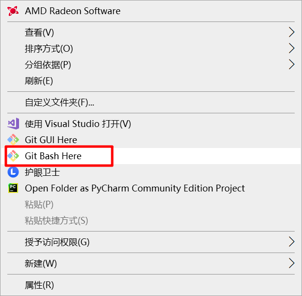
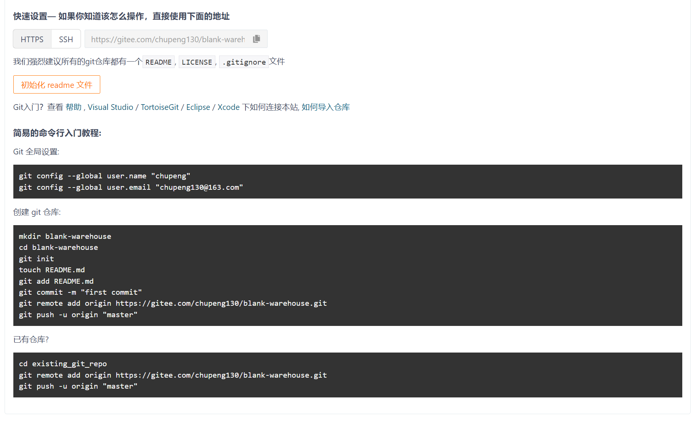
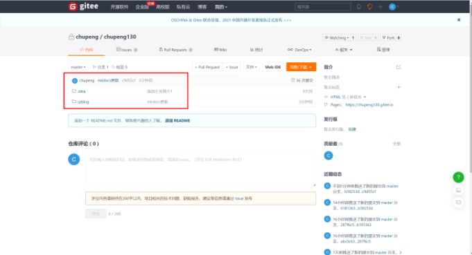
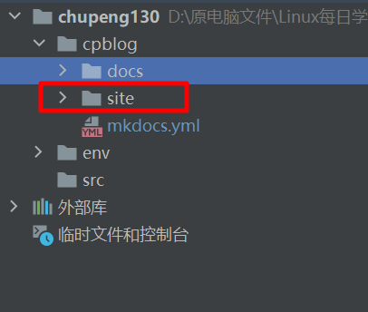
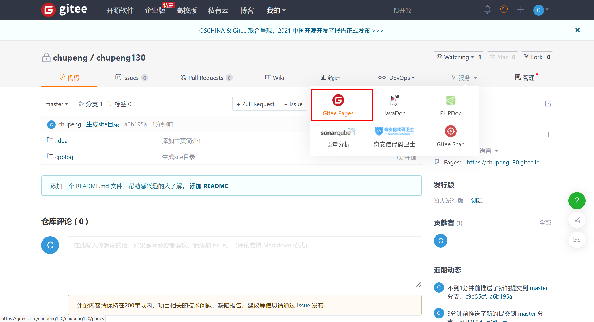
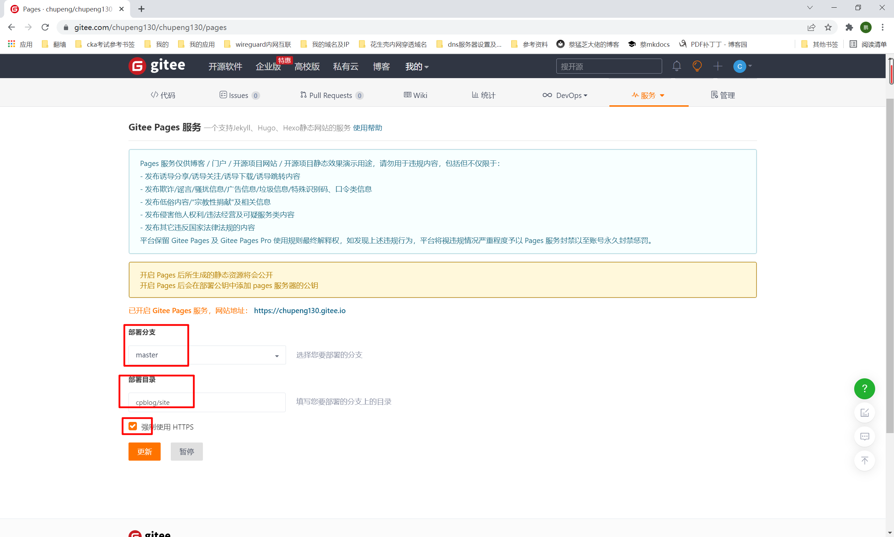

##1. 创建gitee仓库
```shell
# gitee.com
登录gitee，新建仓库，名称随便，我起的是chupeng130与主页一致，方便后面gitee pages部署！
```
##2. 根据提示将本地与gitee仓库绑定
```shell
# 新建空白仓库后，页面会有提示，根据提示操作即可!

# 前提：windows需要安装git

#1. 进入windows本地创建的chupeng130项目目录，右键打开命令行
```

```shell
输入以下内容
git init
git config --global user.name "chupeng"
git config --global user.email "chupeng130@163.com"

#2. 本地提交项目
git add .
git commit -am 'mkdocs更新'

#3. 上传本地项目到gitee
git remote add origin https://gitee.com/chupeng130/chupeng130.git
git push -u origin "master"



上传完成后，刷新gitee仓库页面即可看到！
```


##3. 本地生成site静态站点
```shell
mkdocs build
# 命令执行后，会生成site目录，此目录就是生成的静态html站点
```

##4. 再次上传gitee
```shell
git add .
git commit -am '生成site目录'
git push -u origin
```
##5. 开启git pages功能
```shell
# 浏览器打开gitee，进入chupeng130仓库
1.点击右上角的服务，然后点击gitee pages
```

```shell
2.第一次使用需要输入自己的身份证等信息，等待24小时即可开通！
开通后，选择site目录，开启功能，等待几分钟后，就会出现访问网站url

我的是： https://chupeng130.gitee.io
```
