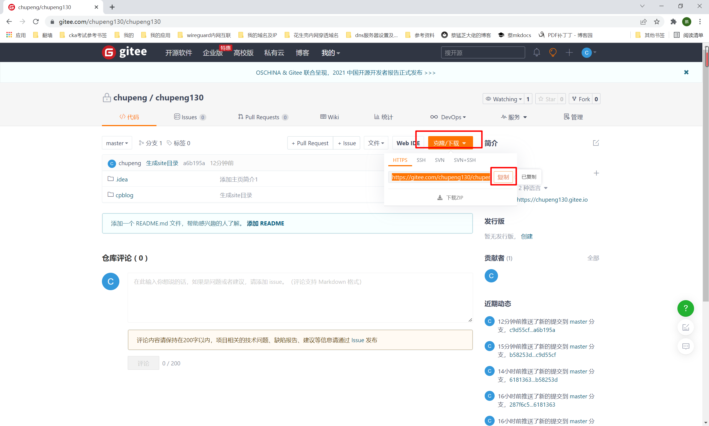
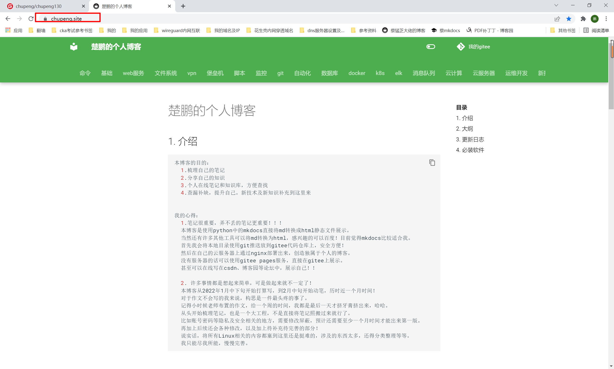

##1. 前提
```shell
1. 有自己的云服务器
10.0.8.2
2.最好还有自己的域名
chupeng.site
没有域名的话，还可以使用花生壳内网穿透，详见vpn章节
```
##2. 创建目录
```shell
# 10.0.8.2
mkdir -p /service/chupeng130
cd /service/chupeng130
```
##3. 创建虚拟环境
```shell
virtualenv env 
source env/bin/activate
```
##4. 拉取gitee代码
```shell
1.查看并复制仓库地址
```

```shell
2.拉取项目代码

git clone https://gitee.com/chupeng130/chupeng130.git 

输入账号密码即可拉取代码！
```
##5. 安装web服务
```shell
# 我的这个服务器由于安装的zabbix，所以使用的apache服务
```
##6. 修改配置文件
####1. 修改主配置文件
```shell
cd /etc/apache2/
cp apache2.conf{,.bak}
vim apache2.conf
# 添加可访问的站点目录
<Directory /service/>
        Options Indexes FollowSymLinks
        AllowOverride None
        Require all granted
</Directory>
```
####2. 修改80端口的配置文件
```shell
cd /etc/apache2/sites-enabled
cp 000-default.conf{,.bak}
vim 000-default.conf
# 修改站点目录为site目录
DocumentRoot /service/chupeng130/chupeng130/cpblog/site

<VirtualHost *:80>
        # The ServerName directive sets the request scheme, hostname and port that
        # the server uses to identify itself. This is used when creating
        # redirection URLs. In the context of virtual hosts, the ServerName
        # specifies what hostname must appear in the request's Host: header to
        # match this virtual host. For the default virtual host (this file) this
        # value is not decisive as it is used as a last resort host regardless.
        # However, you must set it for any further virtual host explicitly.
        #ServerName www.example.com

        ServerAdmin webmaster@localhost
        #DocumentRoot /service/mkdocs/demo/site
        DocumentRoot /service/chupeng130/chupeng130/cpblog/site

        # Available loglevels: trace8, ..., trace1, debug, info, notice, warn,
        # error, crit, alert, emerg.
        # It is also possible to configure the loglevel for particular
        # modules, e.g.
        #LogLevel info ssl:warn

        ErrorLog ${APACHE_LOG_DIR}/error.log
        CustomLog ${APACHE_LOG_DIR}/mkdocs_access.log apache_json

        # For most configuration files from conf-available/, which are
        # enabled or disabled at a global level, it is possible to
        # include a line for only one particular virtual host. For example the
        # following line enables the CGI configuration for this host only
        # after it has been globally disabled with "a2disconf".
        #Include conf-available/serve-cgi-bin.conf
</VirtualHost>

# vim: syntax=apache ts=4 sw=4 sts=4 sr noet
```
####3.修改443端口的配置修改
```shell
# 如果有ssl证书，则需要配置如下
vim ssl.conf
<IfModule mod_ssl.c>
        <VirtualHost _default_:443>
                ServerAdmin webmaster@localhost
                ServerName chupeng.site
                #DocumentRoot /service/mkdocs/demo/site
                #1.监听443端口，修改站点目录
                DocumentRoot /service/chupeng130/chupeng130/cpblog/site

                ErrorLog ${APACHE_LOG_DIR}/error.log
                CustomLog ${APACHE_LOG_DIR}/mkdocs_access.log apache_json

                SSLEngine on  
                #2.上传ssl证书，配置文件中指定证书位置
                SSLCertificateFile      /etc/apache2/ssl/full_chain.pem
                SSLCertificateKeyFile /etc/apache2/ssl/private.key
```                
##7. 重启apache2
```shell
systemctl restart apache2
```
##8. 访问测试
```shell
chupeng.site
```


##9. 后续可以使用jenkins自动构建！
