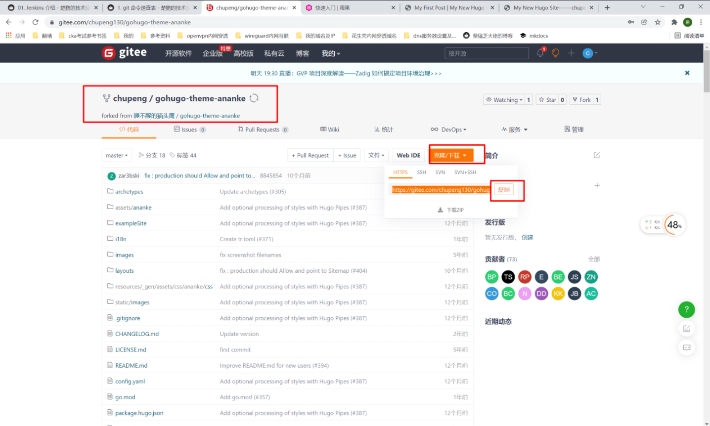

##1. 官网资料
```shell
# https://gohugo.io/getting-started/quick-start/
```
##2. 安装hugo
```shell
apt install hugo -y
```
##3. 创建hugo站点目录
```shell
#1.进入要创建站点的目录
cd /service
ls

#2.创建hugo站点
hugo new site hugo

#3.查看站点目录
ls
```
```shell
root@ali:~# cd /service/
root@ali:/service# ls
mkdocs
root@ali:/service#
root@ali:/service# hugo new site hugo
Congratulations! Your new Hugo site is created in /service/hugo.

Just a few more steps and you're ready to go:

1. Download a theme into the same-named folder.
   Choose a theme from https://themes.gohugo.io/ or
   create your own with the "hugo new theme <THEMENAME>" command.
2. Perhaps you want to add some content. You can add single files
   with "hugo new <SECTIONNAME>/<FILENAME>.<FORMAT>".
3. Start the built-in live server via "hugo server".

Visit https://gohugo.io/ for quickstart guide and full documentation.
root@ali:/service# ls
hugo  mkdocs
```
##4. 初始化
```shell
#1.进入刚才创建的站点目录
cd hugo

#2.git初始化
git init
```
##5. 下载主题
```shell
#2.下载主题
git submodule add https://github.com/theNewDynamic/gohugo-theme-ananke.git themes/ananke                               
# 国内速度比较慢，可以使用如下方法加速！
```
####1. 复制github地址
```shell
# https://github.com/theNewDynamic/gohugo-theme-ananke.git
```
####2. 打开gitee
```shell
# 点击右上角的+，可以看到从github导入仓库，点击它
```


####3. 从github导入gitee仓库
```shell
# 将github地址粘贴到url栏，如果其他人导入过，则可以直接点击访问，然后fork！
```


####4. 使用gitee仓库下载主题
```shell
#1. 获取gitee仓库地址：    https://gitee.com/chupeng130/gohugo-theme-ananke.git
```


```shell
#2. 下载
git submodule add https://gitee.com/chupeng130/gohugo-theme-ananke.git themes/ananke

# 速度飞快！
#1.使用github地址下载失败！
root@ali:/service/hugo# git submodule add https://github.com/theNewDynamic/gohugo-theme-ananke.git themes/ananke
Cloning into '/service/hugo/themes/ananke'...
fatal: unable to access 'https://github.com/theNewDynamic/gohugo-theme-ananke.git/': Failed to conne                                                                                                          ct to github.com port 443: Connection timed out
fatal: clone of 'https://github.com/theNewDynamic/gohugo-theme-ananke.git' into submodule path '/ser                                                                                                          vice/hugo/themes/ananke' failed

#2. 使用gitee地址下载成功
root@ali:/service/hugo# git submodule add https://gitee.com/chupeng130/gohugo-theme-ananke.git  themes/ananke
Cloning into '/service/hugo/themes/ananke'...
remote: Enumerating objects: 1959, done.
remote: Counting objects: 100% (1959/1959), done.
remote: Compressing objects: 100% (823/823), done.
remote: Total 1959 (delta 1074), reused 1959 (delta 1074), pack-reused 0
Receiving objects: 100% (1959/1959), 4.39 MiB | 1.34 MiB/s, done.
Resolving deltas: 100% (1074/1074), done.

#3. 查看主题目录
root@ali:/service/hugo# ls themes/
ananke
root@ali:/service/hugo#
root@ali:/service/hugo#
root@ali:/service/hugo# ls themes/ananke/
archetypes    config.yaml  i18n     LICENSE.md         README.md      static
assets        exampleSite  images   package.hugo.json  resources      theme.toml
CHANGELOG.md  go.mod       layouts  package.json       stackbit.yaml
```
####5. 使用主题
```shell
# 配置文件中指定主题
echo theme = \"ananke\" >> config.toml

root@ali:/service/hugo# cat config.toml
baseURL = "http://example.org/"
languageCode = "en-us"
title = "My New Hugo Site"
root@ali:/service/hugo#
root@ali:/service/hugo# echo theme = \"ananke\" >> config.toml
root@ali:/service/hugo#
root@ali:/service/hugo# cat config.toml
baseURL = "http://example.org/"
languageCode = "en-us"
title = "My New Hugo Site"
theme = "ananke"
root@ali:/service/hugo#
```
##6. 创建第一个页面
```shell
hugo new posts/my-first-post.md
```
```shell
root@ali:/service/hugo# hugo new posts/my-first-post.md
/service/hugo/content/posts/my-first-post.md created
root@ali:/service/hugo#
root@ali:/service/hugo# ls
archetypes  config.toml  content  data  layouts  resources  static  themes
root@ali:/service/hugo#
root@ali:/service/hugo# ls content/posts/
my-first-post.md
root@ali:/service/hugo#
root@ali:/service/hugo# cat content/posts/my-first-post.md
---
title: "My First Post"
date: 2022-01-18T14:48:22+08:00
draft: true
---
```
##7. 测试
```shell
# 注意：此命令必须在站点根目录下执行！！！
hugo server -D
```
```
root@ali:/service/hugo# hugo server -D

                   | EN
-------------------+-----
  Pages            | 10
  Paginator pages  |  0
  Non-page files   |  0
  Static files     |  1
  Processed images |  0
  Aliases          |  1
  Sitemaps         |  1
  Cleaned          |  0

Built in 48 ms
Watching for changes in /service/hugo/{archetypes,content,data,layouts,static,themes}
Watching for config changes in /service/hugo/config.toml, /service/hugo/themes/ananke/config.yaml
Environment: "development"
Serving pages from memory
Running in Fast Render Mode. For full rebuilds on change: hugo server --disableFastRender
Web Server is available at http://localhost:1313/ (bind address 127.0.0.1)
Press Ctrl+C to stop
```
####1. 访问测试
```shell
# 使用curl命令
curl localhost:1313
# 注意：只能使用上面的命令测试！curl 172.19.23.181:1313      curl 10.0.8.1:1313     curl内网都不行！！！
```
##8. 生成静态目录
```shell
hugo -D
# 会生成public目录！然后使用nginx或者apache将此静态目录部署即可！
```
```shell
root@ali:/service/hugo# hugo  -D

                   | EN
-------------------+-----
  Pages            | 10
  Paginator pages  |  0
  Non-page files   |  0
  Static files     |  1
  Processed images |  0
  Aliases          |  1
  Sitemaps         |  1
  Cleaned          |  0

Total in 94 ms
root@ali:/service/hugo#
root@ali:/service/hugo# ls
archetypes  config.toml  content  data  layouts  public  resources  static  themes
```
##9. 配置nginx
```shell
cd /etc/nginx/conf.d
vim hugo-81.conf
server {
    listen         81;      #1.监听81端口
    server_name    _;
    charset UTF-8;
    access_log      /var/log/nginx/hugo_access.log main_json;
    error_log       /var/log/nginx/hugo_error.log;
    client_max_body_size 75M;
    location /  {
        root /service/hugo/public;  #2. 修改站点目录
    }
}
```
##10. 重启nginx
```shell
nginx -t 
nginx -s reload
```
##11. 浏览器访问测试
```shell
# 10.0.8.1:81
```


##12. 简单修改配置文件
```shell
cd /service/hugo
vim config.toml
#1.修改站点url，不设置的话，点击后会报错
baseURL = "http://10.0.8.1:81"  #1.站点url
languageCode = "en-us"
title = "My New Hugo Site------chupeng test"    #2.标题
theme = "ananke"    
```