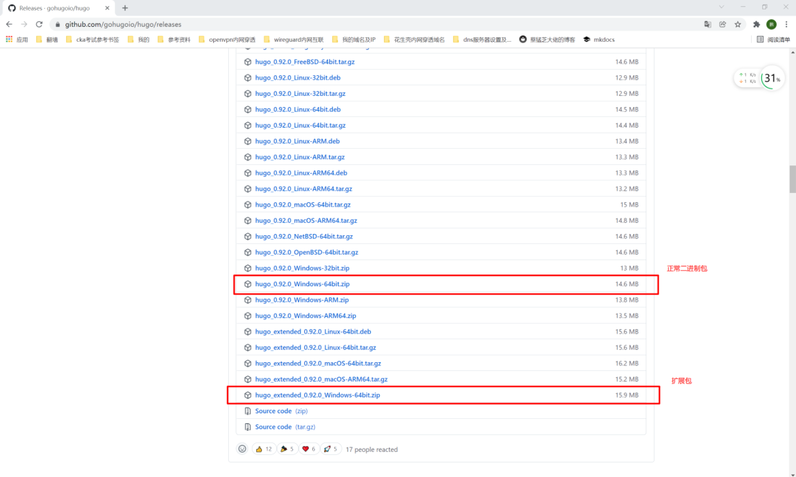
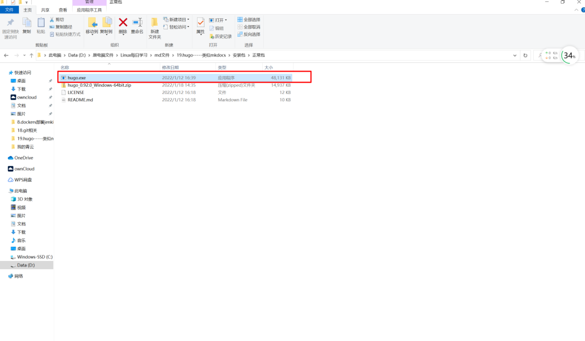
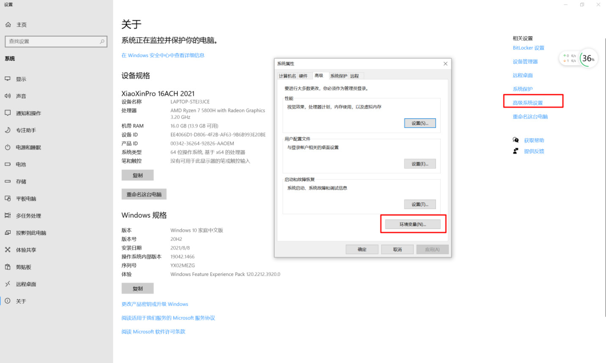
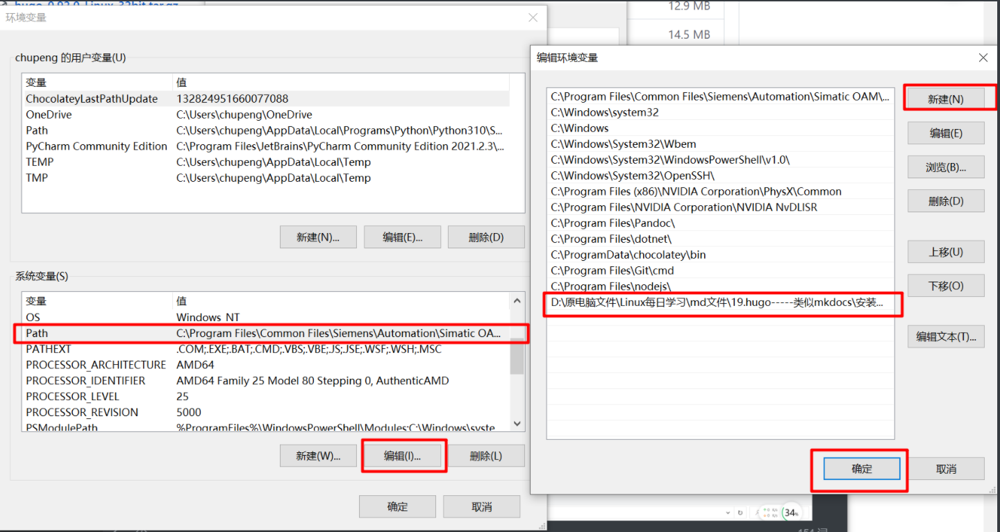
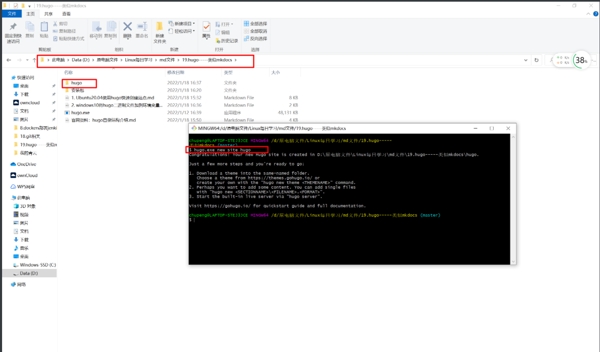

##1. 下载二进制包
```shell
# https://github.com/gohugoio/hugo/releases
# 目前最新0.92
```


##2. 解压缩
```shell
# D:\原电脑文件\Linux每日学习\md文件\19.hugo-----类似mkdocs\安装包\正常包
```


##3. 添加环境变量
```shell
# 打开设置，点击右上角的高级系统设置，然后弹出的对话框中点击环境变量
```


```shell
#1.在系统变量中找到Path
#2.点击下方的编辑
#3.弹出的对话框中点击新建
#4.将解压缩后的exe文件所在的目录添加进来
#5.点击确定即可

# 若要使用扩展包，同样的操作即可，把当前的删掉改成扩展包
```


##4. 测试命令
```shell
# 在命令行终端输入如下命令，返回版本，则说明成功！
hugo.exe version

hugo v0.92.0-B3549403 windows/amd64 BuildDate=2022-01-12T08:23:18Z VendorInfo=gohugoio

# 进入存放站点的目录，打开git命令行
# 执行如下命令，则会生成站点目录
hugo.exe new site hugo
```
