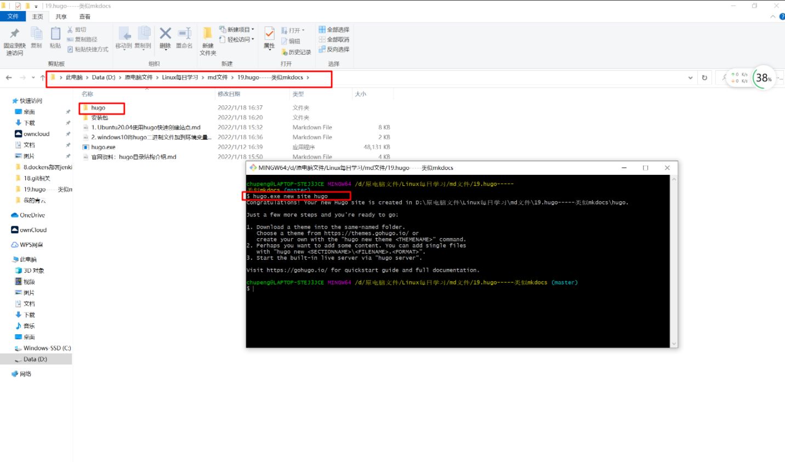
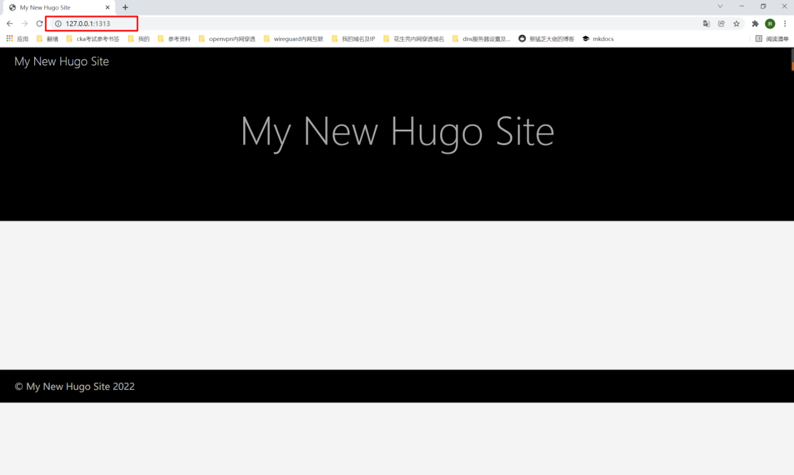

##1. 创建站点目录
```shell
# 进入存放站点的目录，打开git命令行
# 执行如下命令，则会生成站点目录文件夹hugo
hugo.exe new site hugo
```


##2. 进入站点目录后git初始化
```shell
cd hugo

git init

chupeng@LAPTOP-STEJ3JCE MINGW64 /d/原电脑文件/Linux每日学习/md文件/19.hugo-----类似mkdocs (master)
$ cd hugo

chupeng@LAPTOP-STEJ3JCE MINGW64 /d/原电脑文件/Linux每日学习/md文件/19.hugo-----类似mkdocs/hugo (master)
$ git init
Initialized empty Git repository in D:/原电脑文件/Linux每日学习/md文件/19.hugo-----类似mkdocs/hugo/.git/
```
##3. 下载ananke主题
```shell
git submodule add https://gitee.com/chupeng130/gohugo-theme-ananke.git themes/ananke
```
##4. 配置文件中加入主题
```shell
# 编辑config.toml，添加最后一行的主题
baseURL = 'http://example.org/'
languageCode = 'en-us'
title = 'My New Hugo Site'
theme='ananke'
```
##5. 启动测试
```shell
hugo.exe server -D
```
##6. 浏览器访问
```shell
# 127.0.0.1:1313
```


##7. 本地git仓库提交


git add .
git commit -am "init"
```
