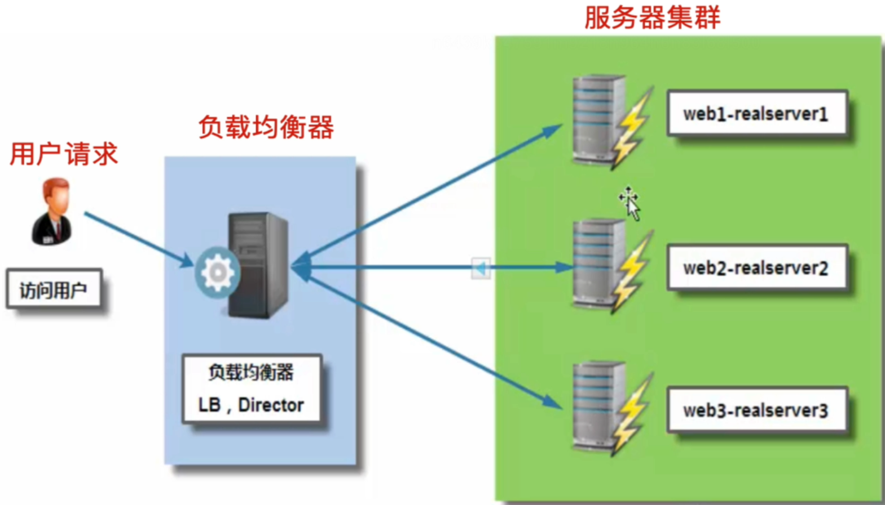
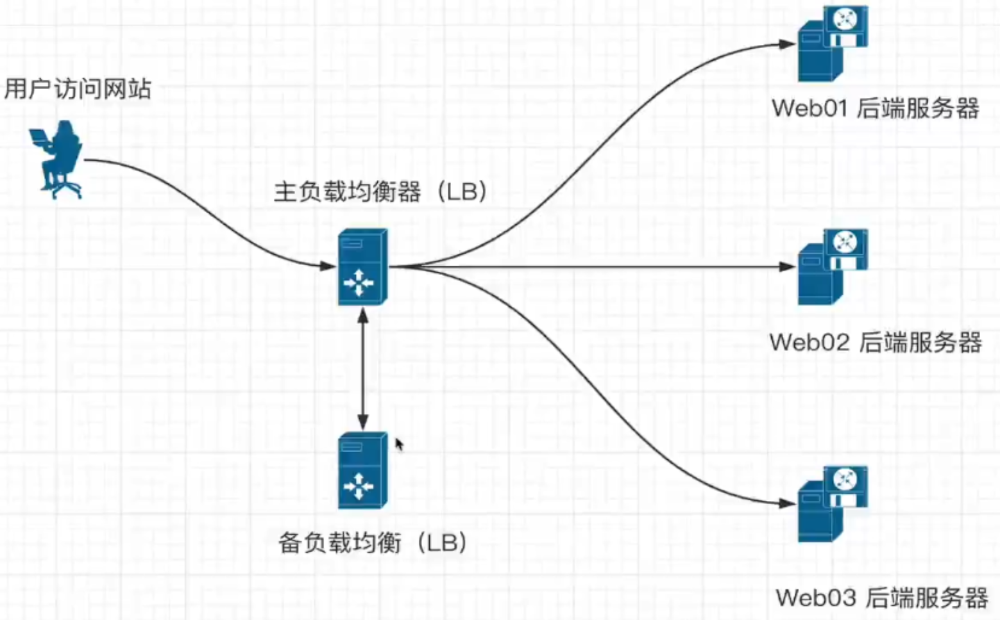
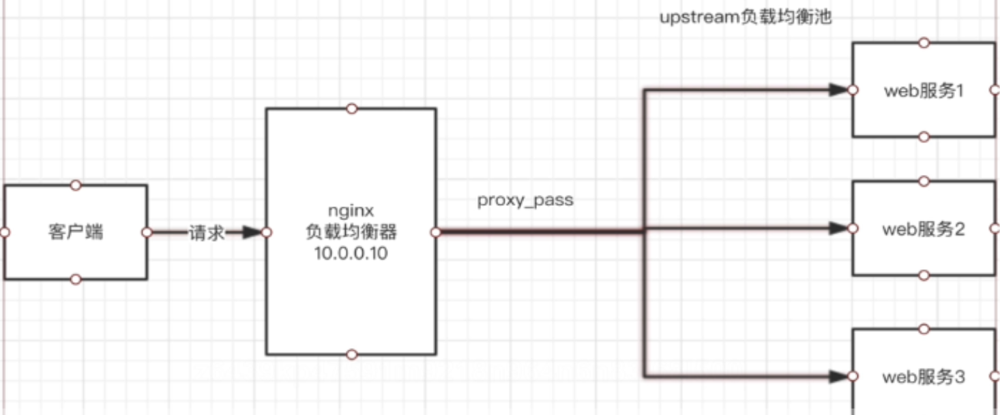

##1. 介绍
```shell
负载-----压力
均衡-----分摊，分流

计算机集群按照功能分类：
  -负载均衡集群
  -高可用性集群
  -高性能计算集群
  -网格计算

负载均衡
把很多客户集中的访问请求压力平均分给后面的多台服务器，解决单点服务器压力状况
每个节点承受一定的流量压力，实现请求在多个节点间动态分配

互联网企业常用的软件有
  nginx
  lvs
  haproxy
  keepalived
  heartbeat
```



##企业常用的商业集群硬件有
```shell
  f5
  netscaler
  radware
  A10
```


```shell
# 产品选择
当企业业务重要、技术力量有欠缺，希望能够出钱购买产品得到优质服务的情况，可以直接购买硬件负载均衡设备，
如银行、证券、金融、汽车等非互联网大型行业。
对于门户网站来说，大部分企业选择使用软硬件结合的方式，来分担单一产品的风险
对于中小型企业，考虑成本问题，更希望通过运维人员使用软件技术解决集群问题

比较而言，软件、硬件的区别：
硬件负载均衡成本高、性能强、安全性高、更稳定，但是不易于二次开发、扩展
软件负载均衡对运维人员技术能力要求高

# 如何选择开源负载均衡产品？
中小型互联网公司的服务器，在用户并发量和总访问量不是很大的情况下，建议首选nginx负载均衡，理由是：
  nginx负载均衡配置简单
  使用方便
  安全稳定
  社区活跃
  使用人多
  在淘宝公司的大流量业务得到了验证

haproxy同样很优秀，但是社区不如nginx活跃。

当考虑使用nginx负载均衡时，对其要进行高可用性设计，建议使用keepalived，同样因为配置简单、使用方便、安全稳定。

如果是大型互联网企业，负载均衡还会用lvs+keepalived在网站前端做4层转发，后端再用nginx/haproxy做7层转发，
最后是应用服务器
```
##2. nginx负载均衡
```shell
nginx负载均衡是通过反向代理实现的

web服务器直接面向用户，往往要承载大量并发请求，单台服务器难以负荷，使用多台web服务器组成集群，
前端使用nginx负载均衡，将请求分散的打到后端服务器集群中实现负载的分发，提高系统的吞吐量、请求性能、高容灾。
```
##3. 负载均衡、反向代理的区别
```shell
普通的负载均衡软件，如lvs，其功能知识对请求数据包转发、传递，其DR模式功能是：
  从负载均衡后面的节点上看，接收到的请求是真实客户端的信息
而反向代理是，在接收到用户的请求后，再代理用户向节点服务器发送请求，
  从负载均衡后面的节点上看，接收到的是代理服务器的信息，而非真实客户端的信息。

lvs等负载均衡仅仅是转发用户的请求
nginx反向代理是接收到用户请求后，重新向后端节点发送新请求
```
##4. nginx负载均衡模块
####1. 反向代理模块
```shell
ngx_http_proxy_module     # proxy代理模块，用于把请求抛给后端的服务器节点或者upstream池

案例1：当请求的url是：127.0.0.1/name时，请求转发给127.0.0.1/remote
location /name/ {
  proxy_pass http://127.0.0.1/remote/;
}

案例2：以php结尾的url请求
locationn  ~.*\.php$ {
  proxy_pass http://127.0.0.1$request_uri;
  proxy_set_header Host $proxy_host;
  proxy_set_header X-Forwarded-For $remote_addr;
}

参数解释
proxy_set_header    # 设置反向代理向后端发送的http请求头信息，如添加host主机头部字段，让后端服务器能
获取到真实客户端信息
client_body_buffer_size # 指定客户端请求主体缓冲区大小
proxy_connect_timeout   # 反向代理和后端节点连接的超时时间，也是建立握手后等待响应的时间
proxy_send_timeout      # 代理后端服务器数据回传时间，在规定时间内数据未传完，nginx会断开连接
proxy_read_timeout      # 设置nginx从代理服务器获取数据的超时时间
proxy_buffer            # 设置缓冲区的大小
```
####2. 负载均衡模块
```shell
ngx_http_upstream_module  # 负载均衡模块，实现服务器的负载均衡配置以及健康检查，该模块支持的代理形式如下：
  proxy_pass # 转发http请求
  fastcgi_pass 
  uwsgi_pass # 和python后台结合
  memcached_pass 
  ...

upstream参数解释：
upstream my_web {
  server 192.168.178.140 weight=1 max_fails=1 fail_timeout=10s backup;
  server backend1.chupeng.com:8000 weight=2;
}

server    # 后面跟服务器ip或者主机名、域名，默认是80端口，也可以指定端口转发
weight    # 定义权重，数字越大，权重越高，优先分发请求
max_fails # nginx尝试连接该节点的失败次数，根据情况调整
backup    # 当其他非backup的机器宕掉或者繁忙的时候，请求才会转发给backup机器，备用机效果
fail_timeout  # 连接节点失败后的时间间隔
down      # 剔除功能，暂停当前节点的请求解析，不参与负载均衡

server后面除了跟ip+port，还可以使用域名或者unix套接字！
nginx请求转发的目的地有2类：
  网络中的机器，可以填写ip，域名，端口 
  本地的进程，可以使用socket套接字纪念钞通信文件转发
upstream my_back {
  server backup1.com;
  server backup2.com:8080;
  server unix:/tmp/backend3.sock;
}

upstream模块调度算法：(感兴趣可百度)
  rr轮询（round-robin）（默认）
  wrr权重轮询
  ip_hash
  url_hash
  ...
```

###3.nginx基于多域名的负载均衡
####1. 环境准备
```shell
# 需要4台服务器
192.168.178.130   lb01    主负载均衡服务器
192.168.178.131   lb02    备负载均衡服务器（防止主节点故障）
192.168.178.140   web01   主web服务器
192.168.178.141   web02   备web服务器（防止主节点故障）

# 软件准备
4台服务器均安装nginx即可！
```
####2. 负载均衡服务器配置
```shell
# 192.168.178.130 192.168.178.131
# 先不考虑高可用性，配置负载均衡服务器lb01，lb02
# 在http{}中添加upstream池,直接在conf.d文件中添加即可！
cd /etc/nginx/conf.d
vim upstream.conf
# 通过关键字upstream定义负载均衡地址池
upstream my_web {
  server 192.168.178.140;
  server 192.168.178.141;
}
# 虚拟主机反向代理，实现请求转发给上面的负载均衡池
server {
  listen 80;
  server_name _;
  location / {
    proxy_pass http://my_web;
  }
}


nginx -t 
nginx -s reload
```
####3. 后端web服务器配置
```shell
# 192.168.178.140 192.168.178.141
cd /etc/nginx/conf.d
vim web.conf
# 设置2个基于域名的虚拟主机
server {
  listen 80;
  server_name mp3.chupeng.com;
  charset utf-8;
  location / {
    root /www/html/mp3;
    index index.html index.htm;
  }
}

server {
  listen 80;
  server_name mp4.chupeng.com;
  charset utf-8;
  location / {
    root /www/html/mp4;
    index index.html index.htm;
  }
}

nginx -t 
nginx -s reload
```
####4. 设置index.html内容
```shell
# web01 web02
mkdir -p /www/html/mp{3,4}
# web01
echo "web01-mp3" > /www/html/mp3/index.html
echo "web01-mp4" > /www/html/mp4/index.html
# web02
echo "web02-mp3" > /www/html/mp3/index.html
echo "web02-mp4" > /www/html/mp4/index.html
```
####9. windows上设置hosts解析
```shell
192.168.178.140 mp3.chupeng.com
192.168.178.140 mp4.chupeng.com

192.168.178.141 mp3.chupeng.com
192.168.178.141 mp4.chupeng.com

192.168.178.130 lb.chupeng.com
#192.168.178.131 lb.chupeng.com

#192.168.178.130 mp3.chupeng.com
#192.168.178.131 mp4.chupeng.com
```
####5. 浏览器访问测试
```shell
lb.chupeng.com
发现：一直访问的都是mp3，没有访问到mp4
```
####6. 负载均衡服务器配置修改
```shell
cd /etc/nginx/conf.d
vim upstream.conf
# 通过关键字upstream定义负载均衡地址池
upstream my_web {
  server 192.168.178.140;
  server 192.168.178.141;
}
# 虚拟主机反向代理，实现请求转发给上面的负载均衡池
server {
  listen 80;
  server_name _;
  location / {
    proxy_pass http://my_web;
    # 添加如下一行，nginx转发请求时，添加头部信息
    proxy_set_header Host $host;
  }
}


nginx -t 
nginx -s reload
```
####7. 修改hosts文件
```shell
192.168.178.130 lb.chupeng.com
192.168.178.130 mp3.chupeng.com
192.168.178.130 mp4.chupeng.com
```
####8. 浏览器访问测试
```shell
mp3.chupeng.com     # web01,web02轮询！
mp4.chupeng.com     # web01，web02轮询！
```
##5.nginx捕捉客户端真实IP
```shell
X-Forwarded-For参数
在反向代理请求后端节点服务器时，在请求头中添加获取客户端ip的字段信息，
然后在后端节点上可以再次通过程序接收X-Forwarded-For参数传来的用户真实ip

#1.修改lb01反向代理服务器配置文件
server {
  listen 80;
  server_name lb.chupeng.com;
  access_log logs/access-lb01.log;
  location / {
    proxy_pass http://my_web;
    proxy_set_header Host $host;
    proxy_set_header X-Forwarded-For $remote_addr;
  }
}

nginx -t 
nginx -s reload

# 如果想在web服务器中记录客户端真实ip，需要修改日志格式,添加 $http_x_forwarded_for
log_format main '$remote_addr - ..... $http_x_forwarded_for'
```
##6.nginx动静分离
####1.要求
```shell
1.当用户访问www.chupeng.com这种形式的url，就走默认服务器组
2.当用户访问www.chupeng.com/upload/xxx这种形式的url，代理服务器把请求转发给上传服务器组
3.当用户访问www.chupeng.com/static/xxx这种形式的url，代理服务器把请求转发给静态文件服务器组
```
####2. 环境准备
```shell
# 4台机器
lb01      # 负载均衡
web01     # 解析static
web02     # 解析upload
web03     # 解析默认的动态url

# 需要修改windows本地hosts文件，添加 lb01的IP与www.chupeng.com 映射关系
```
####3. lb01配置文件修改
```shell
# lb01
cd /etc/nginx/conf.d
vim upstream.conf
#1.静态服务器组
upstream static_pools {
  server 192.168.178.140;
}
#2.上传服务器组
upstream upload_pools {
  server 192.168.178.141;
}
#3.动态服务器组
upstream default_pools {
  server 192.168.178.151;
}

#4.location
location /static/ {
  proxy_pass http://static_pools;
  include proxy.conf;
}
location /upload/ {
  proxy_pass http://upload_pools;
  include proxy.conf;
}
location / {
  proxy_pass http://default_pools;
  include proxy.conf;
}
```
#####写法2
```shell
if ($request_url ~* "^/static/(.*)$")
{
  proxy_pass http://static_pools/$1;
}

if ($request_url ~* "^/upload/(.*)$")
{
  proxy_pass http://upload_pools/$1;
}

location / {
  proxy_pass http://default_pools;
  include proxy.conf;
}
```
#####代理参数优化配置文件
```shell
# 常见的生产使用的代理参数
vim proxy.conf
proxy_set_header Host $host;
proxy_set_header X-Forwarded-For $remote_addr;
proxy_connect_timeout 60;
proxy_send_timeout 60;
proxy_read_timeout 60;
proxy_buffer_size 4k;
proxy_buffers 4 32k;
proxy_busy_buffers_size 64k;
proxy_temp_file_write_size 64k;
```
####4. web服务器index.html文件
```shell
# web01
echo static > index.html

# web02
echo upload > index.html

# web03
echo default > index.html
```
####5. 访问测试
```shell
www.chupeng.com
www.chupeng.com/static/
www.chupeng.com/upload/
```
##7.nginx根据客户端转发
####1. 实现
```shell
# 通过判断 http_user_agent
```
####2. 客户端
```shell
# 通过访问日志查看各客户端
1.curl命令客户端
2.safari客户端
3.chrome客户端
...
```
####3. 利用shell语句进行逻辑判断
```shell
location / {
  if ($http_user_agent ~* "MSIE")
  {
    #proxy_pass http://static_pools;
    return 401;
  }

  if ($http_user_agent ~* "Chrome")
  {
    return 402;
  }

  if ($http_user_agent ~* "Safari")
  {
    return 403;
  }

  if ($http_user_agent ~* "curl")
  {
    return 404;
  }

    if ($http_user_agent ~* "android")
  {
    return 501;
  }

    if ($http_user_agent ~* "iphone")
  {
    return 502;
  }
}
```
####4. 补充：vim技巧-批量注释
```shell
# vim中批量注释内容的操作
1. Ctrl+v
2. 使用上下键选中内容
3. Shift+I
4. 输入：#
5. 按esc，使所有选中行添加#注释
6. 再次按esc，保存退出
```
##8.nginx通过文件扩展名转发
```shell
待补充
```
##9.nginx通过请求扩展名转发
```shell
# tbd
```