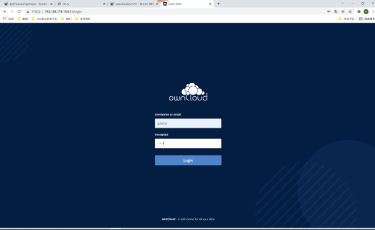
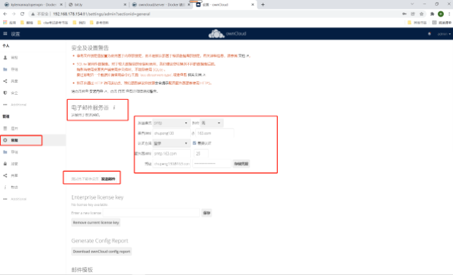

##1. 拉取镜像
```shell
docker pull owncloud/server
```
##2. 创建数据挂载目录
```shell
mkdir /mnt/owncloud-data
```
##3. 拉取镜像
```shell
docker pull owncloud/server
```
##4. 运行镜像
```shell
docker run -d -p 81:8080 -v /mnt/owncloud-data:/mnt/data --name owncloud --restart=always owncloud/server
```
##5. 访问
```shell
# 192.168.178.154:81
# 第一次登录需要设置密码：admin：admin
```


##6. 电子邮件设置
```shell
#1.点击常规，然后输入以下信息
    # 发送模式：smtp
    # 加密：无
    # 来自：chupeng130， @：163.com
    # 认证方法：登录， 勾选需要认证
    # 服务器地址：smtp.163.com 25
    # 凭据：chupeng130@163.com 授权码

#2.点击存储凭据
#3.点击发送邮件
```


