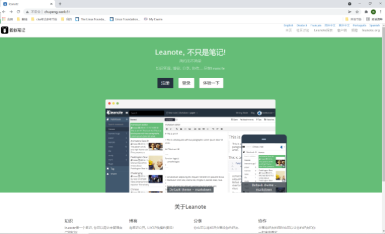

##1. 步骤介绍
```shell
#1.搜索镜像
docker search leanote
#2.拉取第一个镜像
docker pull axboy/leanote
#3.运行镜像
docker run -d -p 81:9000 --name=leanote axboy/leanote

#4.浏览器测试
10.0.8.1:81
```
##2. 将数据挂载出来
```shell
## 创建目录
mkdir /leanote

## 运行镜像
docker run -d -p 81:9000 --name=leanote -v /leanote:/data axboy/leanote

## 登录
chupeng.work:81
```


